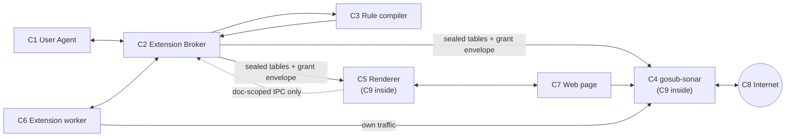
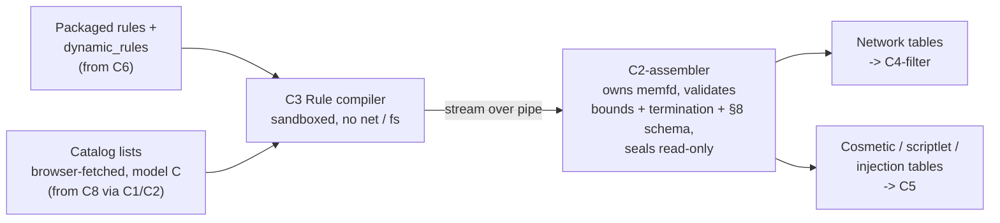
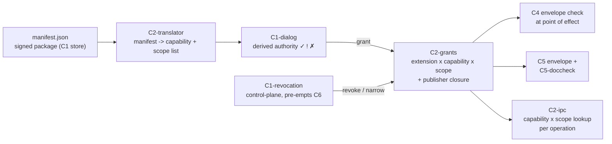
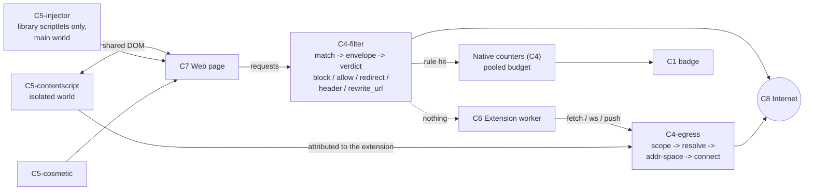
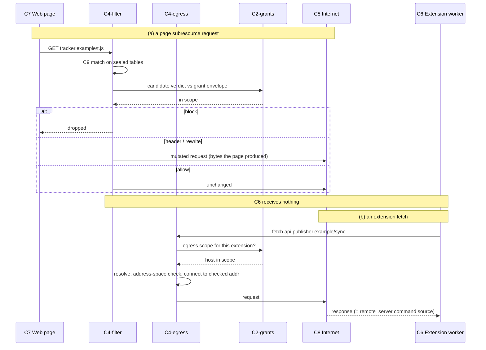

# Gosub extension architecture (per capability model v2.1.10)

Every component has a fixed ID. The same ID is used in every diagram and in the text, so "C6" always means the extension worker, no matter which diagram you are looking at. Sub-parts (the filter engine, the assembler, ...) carry their parent's ID in brackets.

## 0. Component list

| ID | Component | What it is | Lives where |
|----|-----------|------------|-------------|
| C1 | User Agent | Install/update dialogs, revocation UI, badges, store & signing. Decides and renders, never enforces. | Browser UI process |
| C2 | Extension Broker | Privileged. Holds the grant table, translates manifests, owns the assembler that validates & seals rule tables, mediates all extension IPC. Assumes C6 is compromised. | Own process |
| C3 | Rule compiler | Turns ABP/uBO/DNR rules into Baleen tables. Sandboxed (no network, no filesystem, seccomp). Assumed compromised. | Own utility process |
| C4 | gosub-sonar | The network stack. Contains the filter engine (C9 as a library), the egress policy, the header engine and `rewrite_url`. | Own process |
| C5 | Renderer | Per-site page process. Contains the cosmetic engine, the scriptlet injector, injected content scripts, and the document-identity check. | Per site |
| C6 | Extension worker | The extension's own code. Own origin, event-driven, no request data. Talks to C2 over IPC and to C4 for its own network traffic. | Own process per extension |
| C7 | Web page | Page JS + DOM. Untrusted. | Inside C5 |
| C8 | Internet | Remote servers, list mirrors, the publisher's API, trackers. | Outside |
| C9 | gosub-baleen | The matching core. Not a process: a library linked into C4 (network verdict tables), C5 (cosmetic / scriptlet / injection tables) and C2 (grant table, egress scope table). Same core, different namespaced tables. | Inside C2, C4, C5 |

Smaller parts referred to below: C1-dialog, C1-revocation, C2-translator, C2-grants, C2-assembler, C2-ipc, C4-filter (the filter engine), C4-egress, C4-headers, C5-cosmetic, C5-injector, C5-contentscript, C5-doccheck.

## 1. Component map

Who talks to whom.

- C2 is the centre: it holds the grant table and is the only thing that hands authority to anyone.
- C9 (baleen) is not a box of its own; it is inside C2, C4 and C5.
- C6 never sits on the request path. Page traffic goes C7 → C4 → C8 without touching C6.

## 2. How rules get in

Rules never carry authority. They go through C3, get validated and sealed by C2-assembler, and are installed as read-only tables in C4 and C5.

- C3 is assumed compromised: it never holds the writable descriptor, and C2-assembler enforces the §2 budgets while reading its output.
- C3 reports *residue*: rules that would need a capability the grant doesn't have.

## 3. How authority gets in

The grant table (C2-grants) is produced from the manifest, approved by the user in C1, and then *copied as an envelope* to every place an effect happens. Tables are candidates; the envelope decides.

- Update = diff the effective sets, recompute the closure, show the delta in C1-dialog; the old version of C6 keeps running until approved.
- Revocation goes over a high-priority channel from C1 to C2 and re-evaluates live documents in C5 immediately.

## 4. Runtime: who can reach what

- Page traffic: C7 → C4-filter → C8, never C6. The only feedback is the counter, and reading it is a budgeted capability.
- Extension traffic (C6 *and* C5-contentscript): C4-egress keyed on the extension, never the filter tables.
- Renderer-side effects (C5-cosmetic, C5-injector, C5-contentscript) reach C7; C5 re-checks document identity and scriptlet structure itself.
- C5-contentscript's IPC endpoint into C2 is renderer-trust: document-scoped operations only. Egress, cookies, tabs, `dynamic_rules` go through C6.

## 5. Two requests, step by step

