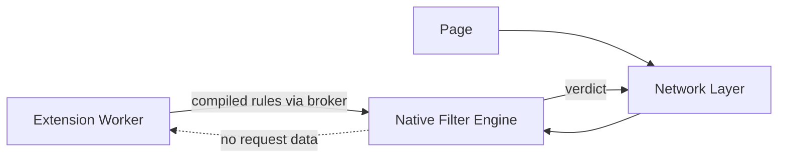
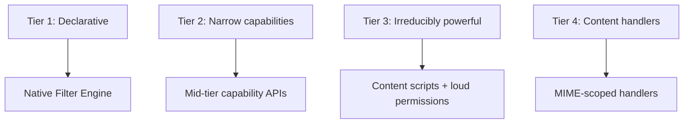
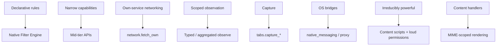

# Gosub Extension Capability Model

**Version 2.0 — August 2026**

This revision incorporates two external design reviews. The largest changes: capabilities are now parameterized by scopes rather than treating host patterns as capabilities; a capability *composition* model replaces per-capability risk assessment; the observe/control separation is restated as a hardened engineering property rather than an absolute one; redirect targets are static-only; remote rulesets are treated as remotely supplied policy; the grant lifecycle (pinning, update diffs, revocation) is defined; and the broker, compiler, and Sonar integration now carry explicit threat models. A changelog is at the end.

## Overview

Browser extensions today inherit their security model from a decade of accretion. MV2 granted too much: an ad blocker required the ability to observe and modify every request. MV3 fixed some of this but conflated security architecture with product policy: rule limits, service worker lifetimes, and API removals arrived as one bundle, and powerful filtering became collateral damage.

Gosub's model rests on one thesis:

> **Powerful extensions do not require powerful extension code.**

The browser provides powerful, trusted primitives — filtering, matching, statistics, form filling, command handling. Extensions select and configure those primitives. Extension code itself holds as little authority as possible, and the authority it holds is explicit, scoped, composable-with-care, and revocable.

Manifest versions are input formats, not the security architecture (§18). The security architecture is the capability model.

---

# Part I — Principles

## 1. Separate Extension Code from Filtering

The filter engine is browser code. It runs in the network layer (network filtering) and the renderer (cosmetic filtering). Extensions supply *rules*; they do not execute during matching, do not sit on the request path, and do not receive the requests they affect.



Consequences:

- Filtering performance and limits are engineering questions, not permission questions.
- A compromised extension worker cannot see traffic it was never given.
- The filtering machinery is shared, testable, and benchmarkable browser code.

## 2. Filtering Should Be Powerful — Within Budgets

Gosub imposes no product-policy rule limits. It does impose engineering budgets, and these are design commitments, not open questions:

```text
Compile-time budget    rulesets exceeding compile cost or artifact
                       size are rejected at compile time
Match-time bound       worst-case per-request matching cost is
                       bounded; regex rules use a linear-time
                       engine (RE2-class), eliminating
                       catastrophic backtracking by construction
Memory cap             per-extension resident budget for compiled
                       tables; enforced at install and update
```

"Effectively unlimited" means: a full EasyList + EasyPrivacy + regional-list load is far inside every budget. A malicious ten-million-rule list is rejected, not slowly executed.

## 3. Capabilities and Scopes

A **capability** names an operation class. A **scope** parameterizes where it applies. These are different things and the model never conflates them:

```text
capability(scope)

content_script(["*.example.com"])
network.fetch_public(["api.sponsorblock.example"])
filtering.block(subresource, ["<all>"])
content_handler(["application/json"])
```

Host patterns, MIME types, and request classes are scopes. A host pattern is never itself a capability. Translation from WebExtension manifests (§18) is therefore *contextual*: a host permission acquires meaning only in combination with the API that uses it.

Scopes narrow monotonically: a grant may be reduced (per-site revocation) without touching the capability; a capability may be revoked without enumerating scopes.

## 4. Security Dimensions of a Capability

Every capability is classified along four axes:

```text
C  Confidentiality   what can the extension learn?
I  Integrity         what can it change?
A  Availability      what can it prevent?
U  User intent       can it cause actions normally requiring
                     explicit user interaction?
```

Examples:

```text
filtering.block (subresource)     C:low   I:med   A:high  U:low
filtering.redirect (main_frame)   C:low   I:crit  A:high  U:high
content_script                    C:crit  I:crit  A:med   U:med
input.raw_keys                    C:crit  I:low   A:low   U:low
system.native_messaging           depends on host; potentially critical
```

Earlier versions of this document scored capabilities almost entirely on confidentiality. Blocking and redirection are integrity and availability powers; a model that only asks "can it read?" mis-tiers them.

## 5. Capability Composition

**Risk(capability set) ≠ max(Risk(each capability)).**

The security-relevant object is the *closure* of the granted set. The model therefore labels every capability with:

```text
source label   what information it can acquire
               none | aggregate | tab_urls | page_content |
               keystrokes | pixels | credentials

sink label     whether it can move information out
               none | own_hosts | arbitrary_network |
               native_host | user_scripts
```

Derived authority is computed as source × sink over the granted set:

```text
page_content  × any sink   ->  page.exfiltration
tab_urls      × any sink   ->  history.exfiltration
keystrokes    × any sink   ->  keystroke.exfiltration
pixels        × any sink   ->  capture.exfiltration
credentials   × any sink   ->  credential.exfiltration
```

Derived authority drives both policy and the installation dialog. The dialog for `content_script` + `network.fetch_public(api.foo.example)` does not read "can read pages; talks to api.foo.example." It reads:

> **Can send the contents of pages you visit to api.foo.example.**

Rule-mutation capabilities participate too: `filtering.dynamic_rules` and `filtering.remote_rulesets` are *probe sinks* — they degrade what `stats.read` may return (§7) and are named in derived warnings.

Enumerated pairs (as above) are test cases; the mechanism is the label closure, so capabilities added later compose correctly without updating a pair table.

---

# Part II — The Model

## 6. Separate Observing Traffic from Controlling Traffic

An extension that can *block* `||tracker.example^` does not thereby learn that `https://tracker.example/foo?id=123` was requested. Control and observation are separate capabilities, and almost every extension needs only control.

The engineering statement of this property:

> **Direct request observation is prevented. Control primitives and feedback channels are constrained to minimize indirect observation.**

This is deliberately weaker than "control implies no observation," because control leaks through side effects unless constrained. The constraints:

**Redirect targets are static.** A redirect rule may only target a resource from the extension's fixed, enumerated packaged set (its declared `web_accessible_resources`). No rule-derived components: no regex substitution into targets, no fragments, no query propagation. A rule cannot encode what it matched into where it points.

**Packaged-resource loads are unobservable.** Serving an extension's packaged resource to a page produces no event visible to the extension: no fetch event in its worker, no load notification. The resource is served by the browser from the sealed package.

**Redirect targets are classed.** A passive resource (image, empty response, static text) and a script surrogate are not security-equivalent: a surrogate executes in the page and could, unconstrained, phone home. Script surrogates therefore execute under a no-network CSP — they may satisfy the page's API expectations but may not initiate requests. Extensions needing surrogates beyond the browser's built-in surrogate library ship them in the package, subject to the same constraint.

**Injected CSS and declarative actions are feedback-audited.** Any primitive that can cause a page to load a resource or perform an action is reviewed as a potential feedback channel before being added to the registry.

## 7. Statistics and Feedback Channels

The filter engine knows what it blocked. Extensions want to show this. Rendering and reading are different capabilities:

> **Rendering a statistic is free. Reading a statistic is a capability.**

**`stats.display` (silent).** The extension declares that its badge or panel shows a native counter; the browser renders it; extension code never receives the value. This covers the ad-blocker badge with zero information flow, and it is the tier to lean on.

**`stats.read` (standard).** Aggregates only — and hardened against oracle use:

```text
quantization        counts rounded; small deltas indistinguishable
time windows        values update on coarse, batched schedules
minimum aggregation no value scoped narrower than all-sites/all-rules
no baseline reset   the extension cannot zero counters
decorrelation       reads are not orderable against the extension's
                    own ruleset changes within a window
```

Composition rule: when the same extension holds any rule-mutation capability (`filtering.dynamic_rules`, `filtering.remote_rulesets`), `stats.read` degrades further (wider quantization, longer windows) or is denied. A mutable rule targeting one site plus a readable counter is a browsing-history oracle; the label system (§5) marks this pair as derived observation.

**`stats.per_rule` (loud).** Per-rule hit counts are a history logger one rule away. They carry the observation-tier dialog, or are exported only through explicit user action (e.g. a "copy diagnostics" button in browser UI).

## 8. Native Cosmetic Filtering

Element hiding is a browser primitive. Generic and per-site cosmetic rules compile into the renderer-side cosmetic engine; extensions do not need page access to hide elements.

**Procedural filters are a closed DSL.** Filters like `##div:has-text(x):upward(2)` are data that *describes execution* — a gray area unless bounded. The bound:

> **Remote data may select and parameterize browser-implemented operators. It may never introduce new operators.**

The procedural operator set (`:has`, `:has-text`, `:upward`, `:matches-css`, …) is fixed, non-Turing, implemented natively, and cost-bounded per operator at compile time. Filter lists choose from it; they cannot extend it. Scriptlets that amount to general-purpose code remain outside this boundary and require `content_script` (§19).

## 9. Remote Rulesets Are Remote Policy

A remotely fetched filter list is not inert data: it is a program in the policy language of §6–8. Compromise of a list server changes browser behavior remotely, and a server can serve different rules to different users — which would silently reintroduce per-user targeted policy and defeat the packaged-rules assumption behind §7's composition analysis.

Remote lists therefore go through the browser, not the extension:

```text
filtering.remote_rulesets:
    sources:  declared HTTPS URLs, fixed at install
    fetcher:  the browser — no extension cookies, no
              extension-controlled headers, no redirects
              off the declared origin
    limits:   size and compile budgets of §2
    schedule: browser-controlled, jittered across users
    optional: publisher signatures / content hashes
```

Extension JS needs no network access to keep EasyList current. An extension that instead fetches rules itself and installs them via `dynamic_rules` is doing per-user policy: the composition model treats that `fetch × dynamic_rules` pair accordingly.

## 10. No Remotely Hosted Executable Code

Restated semantically, since the enforcement is not a file-extension check:

> **Remote data must not be usable to introduce general-purpose executable logic into a privileged extension context.**

Enforced by the execution environment, which is part of the model:

```text
Extension origin      each extension is its own origin, isolated
                      from pages and from other extensions
Extension CSP         browser-owned minimum policy on extension
                      pages and workers: no remote scripts, no
                      eval / new Function, declared-package
                      WASM only
Workers & iframes     same policy; sandboxed extension pages
                      available for untrusted content display
Cross-extension       no ambient access; externally_connectable
                      requires mutual declaration
user_scripts          the one deliberate exception — gated (§19),
                      and extension code may not silently turn
                      fetched network content into a user script;
                      user scripts originate from an explicit,
                      user-visible workflow
```

The `fetch × user_scripts` composition is the canonical remote-code bypass; the label system flags it, and the workflow requirement blocks it.

## 11. Human-Readable Permissions

The installation dialog shows, in order: derived authority (§5) first, then capabilities with their scopes, then what the extension *cannot* do when the contrast is informative.

```text
uBlock Origin wants to:
    ✓ Block and hide ads and trackers on all sites
    ✓ Show a blocked counter on its icon
    ✓ Run its element picker on a page when you click its icon
    ✗ It cannot see the addresses you visit
    ✗ It cannot read page contents

GrammarClone wants to:
    ! Send the text you type on any site to api.grammarclone.example
```

The second dialog is one line because the derived warning *is* the honest summary; itemizing "reads inputs" and "talks to its API" separately would obscure it.

## 12. Extension Workers and Private Browsing

Extension code runs in event-driven workers: started for events, stopped when idle. Because Gosub owns the runtime, MV3's worst ergonomics are avoided: broker-managed durable state survives worker restarts, and lifetimes are generous enough that keepalive hacks are pointless.

**Private browsing is a boundary, not a process detail.**

```text
extension.private_browsing:  denied | spanning | isolated

denied     default — the extension does not run in private
           windows and receives no events from them
isolated   preferred opt-in — a separate worker instance with
           memory-only storage serves private windows; no
           channel exists between the private and regular
           instances; the private instance's state ends with
           the private session
spanning   discouraged; requires a loud grant, since it lets
           one worker correlate private and regular browsing
```

Chromium's `incognito: split` translates to `isolated`, not to nothing. Regular-instance grants do not imply private-instance grants; private access is granted separately.

## 13. Grant Lifecycle

**Install: translation is pinned.** Whatever the manifest says, install-time translation (§18) resolves to an explicit capability(scope) list, and *that list* is the grant. No wildcard namespaces exist in grants; capabilities added to Gosub later can never flow into an old grant.

**Update: diff the effective sets.**

```text
old effective capabilities
        ↓
   capability diff
        ↓
new effective capabilities
```

Any expansion — including removal of a narrowing `gosub` manifest key with the standard permissions unchanged — suspends the extension until the user approves the delta. Reductions apply silently.

**Revocation is a table update.** Grants compile into Baleen tables (§14); revoking a capability or narrowing a scope is a table broadcast, the same mechanism as a filter-list update. Semantics:

```text
effect       matching rules and injections stop; state is
             disabled, not deleted — re-grant restores it
persistence  revocations survive extension updates
notification the extension receives a lifecycle event; privileged
             operations under a revoked grant fail closed
granularity  per-site now; per-tab is UI, not model
```

**Grants bind to documents, not tabs.** Site and activeTab grants are held against an unforgeable identity:

```text
(tab_id, frame_id, document_id, navigation_epoch, origin)
```

and revalidated at the final privileged operation, eliminating the grant-then-navigate TOCTOU. For `content_script.active_tab`: the grant is minted by an explicit user gesture, covers the current document, survives same-document navigation (pushState), and ends at any cross-document navigation. (Chromium persists across same-origin document changes; Gosub's stricter choice is deliberate and documented as a compat difference.)

---

# Part III — Architecture

## 14. Baleen: The Matching Core

Baleen (`gosub_baleen`) is not an ad-blocking component; it is the engine's URL-dispatch primitive. One matching core, many namespaced tables, generic over verdict:

```text
Consumers                        Table namespace
network filtering (Sonar)        block/redirect/header verdicts
content-script injection         extension × match-pattern
cosmetic filtering (renderer)    hostname -> selector sets
fetch scope checks (Sonar)       extension × declared hosts
per-site grants (broker)         capability × scope
stats attribution                rule id -> extension counter
```

Structure:

```text
Core           hostname sets (right-to-left label walk),
               rarest-token index for patterns, linear-time
               regex bucket, exception tables consulted only
               after a hit
Frontends      ABP/uBO semantics; WebExtension match patterns;
               grant scopes. Precedence resolution lives in the
               frontend; the core returns candidate sets
Artifact       flat, offset-based, position-independent,
               mmap-able read-only
```

**The artifact is untrusted input.** Consumers never mmap-cast the blob into structs. Every artifact is validated on receipt — bounds-checked offsets, verified table integrity — against the assumption that the compiler that produced it was compromised.

**Handover is sealed.** On Linux:

```text
memfd_create -> write artifact -> validate ->
F_SEAL_SHRINK | F_SEAL_GROW | F_SEAL_WRITE | F_SEAL_SEAL ->
map read-only in the consumer
```

No writable descriptor survives sealing; validate-then-use races are closed by construction. This reuses the multi-process POC's tile-passing infrastructure.

Phase 0 embeds `adblock-rust` behind the Sonar hooks as a correctness oracle and performance baseline; the end state is the Baleen core with ABP semantics as one frontend. Targets: <10 µs p99 per request decision, <50 MB resident for default lists, ruleset install = one sealed mmap.

## 15. Sonar Integration

The network filter engine is a library inside Sonar's process. Per-request IPC to an external filter process would cost a round-trip per fetch; Chrome (DNR in the network service) and Brave (Shields) both match in-process. The broker installs sealed compiled tables into Sonar; extension code stays out.

**Hook points** in the request lifecycle:

```text
pre-connect        URL/origin match -> allow | block | redirect
pre-send           request-header modification
response-headers   response-header modification, CSP injection
```

**Matching scope is enumerated:** request URL, request class (main_frame / subresource / type), party (first/third), initiator origin, request headers, response headers. **Never response bodies.** Header access here is trusted engine code, not extension observation — but it is privileged position, stated explicitly.

**Protected traffic.** Extension filtering never applies to: browser and extension update checks, certificate validation (OCSP/CRL), browser-internal services, or `gosub://` URLs.

**Header modification is not a generic map.** The engine owns a protected-header list; `filtering.headers.*` capabilities (§19) expose only safe operations. `Cookie`, `Authorization`, `Host`, `Origin`, `Sec-Fetch-*`, `Set-Cookie`, `Strict-Transport-Security`, `Content-Length`, and CORS headers are engine-controlled; rules cannot rewrite a site's security policy wholesale.

**Destination policy is re-applied per hop.** For extension-initiated fetches (`network.fetch_*`), Sonar re-checks the resolved destination at every DNS resolution and redirect hop. A host that resolves publicly at grant time and to `127.0.0.1`, RFC 1918 space, or link-local metadata addresses later is an SSRF attempt, not a fetch:

```text
network.fetch_public           public address space only
network.fetch_private_network  RFC 1918 / ULA — loud grant
network.fetch_loopback         gated
```

Sonar enforces this, not the broker: the check must sit where the connection is made.

## 16. The Extension Broker

A dedicated broker process mediates all extension authority. Its threat model assumes a fully compromised extension worker; the question is what that worker can reach.

**Identity is channel-bound.** An extension never names itself in a message. The broker creates each IPC endpoint and permanently binds it to an extension identity; authority derives from the connection. Renderer-side identity (frame, document, origin) likewise comes from the browser's process topology, never from message fields. This closes the confused-deputy class outright.

**The broker is boring.** It does:

```text
deserialize small, typed IPC
identify the channel
check capability × scope (a Baleen grant-table lookup)
revalidate document identity (§13)
forward a typed operation
```

It does not contain: a JS runtime, a filter parser, network access, arbitrary filesystem access, DOM, or package parsing after install.

**Compilation is not the broker's job.** Rule and package compilation runs in a sandboxed, unprivileged utility process:

```text
extension worker -> broker -> rules compiler (sandboxed)
                                   ↓ sealed artifact
                              Sonar / renderer validates -> uses
```

A compromised compiler yields a hostile artifact — which every consumer validates (§14) — not a privileged process.

The IPC is designed so the broker can later split (network / page / OS capability brokers) without protocol changes.

## 17. Engine / User-Agent Split

> **The engine enforces; the user agent decides and renders.**

Engine: Baleen and the filter engines, capability model and translation, all enforcement, the broker, the extension runtime, grant storage, native counters. User agent: every pixel (dialogs, prompts, revocation UI, badges, attribution surfaces), grant policy and tier availability, distribution/signing/updates, and the UA-side effects of OS-touching capabilities (native messaging, proxy).

The embedder API stays minimal: `install(package) -> CapabilityRequest`, `grant(decision)`, `revoke(extension, scope)`, UI-surface registration, an event channel. An embedder that implements none of it has no extensions — correct for webviews.

The honest property (revised from v1, which overclaimed):

> **Once an effective grant set is established, the engine enforces it independently of the embedder.**

A user agent *can* build an insecure permission system — auto-granting everything is a UA policy choice. What no embedder can do is widen enforcement beyond the established grant, reach around the broker, or weaken the engine-side boundaries. Grant policy is UA trust; grant enforcement is engine guarantee.

**User-facing trust surfaces carry non-spoofable attribution.** New-tab override, notifications, omnibox ownership, active capture, proxy control, and debugger attachment all display browser-owned, extension-unreachable attribution (and restore controls rendered outside any extension-controlled surface):

> **Privileged extension effects on user trust surfaces must have non-spoofable, browser-owned attribution.**

---

# Part IV — Compatibility

## 18. Manifest Translation

`manifest.json` is an input dialect. Install-time translation resolves it to an explicit, pinned capability(scope) list (§13); the broker, dialogs, and revocation operate only on that list.

**Rule one: never translate to a wildcard.** No translation produces `filtering.*` or any `foo.*`. Expansion is explicit, so future capabilities never leak into old grants.

**Rule two: host patterns are scopes.** A host permission has no meaning alone; it scopes the APIs that use it:

```text
host_permissions + scripting            -> content_script(hosts)
host_permissions + webRequest[Blocking] -> network.observe(hosts)   [loud]
host_permissions + cookies              -> cookies.read/write(hosts)
host_permissions + extension fetch      -> network.fetch_public(hosts)
host_permissions + DNR redirect/headers -> filtering.redirect /
                                           filtering.headers.* (hosts)
```

**declarativeNetRequest expands explicitly**, mirroring Chrome's own distinctions:

```text
declarativeNetRequest        -> filtering.block(sub+main per rules)
                                filtering.allow
                                filtering.upgrade_scheme
redirect rules + host scope  -> filtering.redirect(scope)
modifyHeaders + host scope   -> filtering.headers.*(scope)
declarativeNetRequestFeedback-> stats.per_rule                [loud]
```

**Chromium translations that are not no-ops:** `incognito: "split"` -> `extension.private_browsing: isolated` (§12). `activeTab` -> `content_script.active_tab` with §13's document binding (a documented compat difference). Genuine no-ops: `offscreen`, `minimum_chrome_version`.

**The `gosub` key narrows.** An optional manifest key declares a tighter capability list; it may only narrow the translated set, never widen it. One package runs everywhere and gets an honest grant on Gosub. Removing the key in an update is an expansion and triggers §13 re-consent.

**Downgrade policy:** unknown permissions are ignored at install (Chrome-compatible); MV2 blocking-webRequest extensions are offered the declarative path — their lists run natively even where their JS observer cannot, or they install with the loud observation grant.

What to avoid: a Gosub-only manifest as the primary format. Safari tried; the ecosystem never came. Package format standard, manifest = syntax, capabilities = semantics.

## 19. Capability Registry (v0.2)

Tiers: `silent` (auto-granted) · `standard` (named in dialog) · `loud` (explicit consent, per-site revocable, derived warnings shown) · `gated` (settings/developer toggle). Every capability carries source/sink labels (§5); parenthesized parameters are scopes (§3).

```text
-- Filtering (control; source: none) --
filtering.block(class, hosts)         subresource: silent
                                      main_frame:  standard
filtering.allow(class, hosts)         silent
filtering.upgrade_scheme              silent
filtering.redirect(class, hosts)      subresource: standard
                                      main_frame:  loud
                                      static packaged targets only (§6)
filtering.headers.request.remove      standard   safe-listed headers
filtering.headers.request.set_safe    standard
filtering.headers.response.remove_safe standard
filtering.headers.response.set_safe   standard
filtering.cosmetic                    silent
filtering.procedural                  silent     closed DSL, cost-bounded (§8)
filtering.dynamic_rules               standard   sink: probe (§7)
filtering.remote_rulesets(urls)       standard   browser-fetched (§9)

-- Statistics --
stats.display                         silent     source: none
stats.read                            standard   source: aggregate; degraded
                                                 or denied with probe sinks
stats.per_rule                        loud       source: history

-- Networking (sinks) --
network.fetch_public(hosts)           standard   sink: own_hosts
network.fetch_private_network(hosts)  loud
network.fetch_loopback(hosts)         gated
network.observe(hosts, types)         loud       source: history/page
network.observe_aggregate             loud       source: aggregate-history
network.proxy_control                 gated      persistent indicator

-- Page access --
content_script(hosts)                 loud       source: page_content
content_script.active_tab             silent     document-bound (§13)
page.main_world_inject(hosts)         loud       bidirectional trust risk:
                                                 the page can tamper with
                                                 the injected API; requires
                                                 its own hardening analysis
dom.declarative_actions(hosts)        standard   never generates user
                                                 activation; navigation and
                                                 form submission constrained
styles.inject(hosts)                  standard
styles.read(hosts)                    standard   source: page-derived
forms.detect_credentials              standard
forms.fill                            standard   browser-mediated flow:
                                                 browser detects field, asks
                                                 extension for candidates,
                                                 user picks in browser UI,
                                                 secret moves via privileged
                                                 channel to exact origin —
                                                 extension code never holds
                                                 the filled page's inputs
forms.read(hosts)                     loud       source: credentials
input.commands                        standard   mediated key chords only:
                                                 no text, disabled in
                                                 editable fields by default,
                                                 always in password fields,
                                                 no IME/clipboard data
input.raw_keys(hosts)                 loud       source: keystrokes
content_handler(mime_types)           standard   top-level navigations only;
                                                 never fetch/subresources;
                                                 nosniff and
                                                 Content-Disposition
                                                 respected; origin boundary
                                                 preserved

-- Capture (sources) --
capture.tab_pixels                    loud       persistent indicator
capture.tab_video                     loud       persistent indicator
(mic/camera: web permission model, not extension capabilities)

-- Tabs & downloads --
tabs.snapshot                         standard   gesture-scoped read of the
                                                 current tab set (OneTab);
                                                 source: tab_urls
tabs.events                           loud       continuous navigation
                                                 events = live history;
                                                 source: tab_urls
tabs.control                          standard   open/close/move/group
downloads                             standard

-- Storage --
storage.private                       silent
storage.managed                       gated

-- Browser UI (attribution per §17) --
ui.toolbar, ui.commands,
ui.context_menu                       silent
ui.notifications, ui.omnibox,
ui.devtools_panel                     standard
ui.newtab_override                    standard   browser-rendered attribution
                                                 + restore, outside extension
                                                 reach

-- System & lifecycle --
system.native_messaging(hosts)        gated      sink: native_host
system.user_scripts                   gated      sink: user_scripts; fetched
                                                 content may not become a
                                                 user script (§10)
extension.private_browsing            see §12    isolated preferred
scheduling                            silent
```

Registry deltas from v0.1, all review-driven: request-class splits for block/redirect; header primitives with a protected list; `input.global_keys` replaced by `input.commands` + loud `raw_keys`; `forms.autofill` split into detect/fill/read with a mediated fill flow; `tabs.metadata` split into gesture-scoped `snapshot` and loud `events`; fetch split by address space; `remote_rulesets` added; `procedural` named; private-browsing mode added.

---

## Open Questions (v2)

```text
Resolved since v1 (by review):
  composition model, scope parameterization, update diffs,
  revocation semantics, private-browsing semantics, header
  safety, redirect target constraints, resource budgets as
  commitments, broker threat model, matching scope.

Still open:
  O1  Baleen build-vs-embed endgame: adblock-rust is phase-0
      baseline and permanent oracle; the own-core decision
      waits on benchmark data.
  O2  Exhaustive WebExtension API surface list and priority
      (method fixed in §18; the list is work).
  O3  Procedural DSL operator set: exactly which uBO operators
      are in the closed set at launch.
  O4  Privileged / first-party extensions: whether any exist,
      and how their extra authority is displayed.
  O5  stats.read privacy-budget parameters (quantization
      granularity, window sizes) — needs empirical tuning.
  O6  Signing / trust mechanism (a UA concern per §17, tracked
      here for completeness).
```

## Design Goal

A user installing an ad blocker, a password manager, or a tab organizer should be able to read the installation dialog and have it be *true* — not a legal fiction covering the worst case of a bundled grant. Most extensions should hold only declarative rules, one narrow scoped capability, or a channel to their own service. Broad power should be rare, loud, honestly described, and revocable — and the sum of granted capabilities, not any one of them, is what the model accounts for.

## Changelog: v1 → v2

Driven by two external reviews (ChatGPT, DeepSeek), accepted near-wholesale:

1. Capability composition via source×sink labels; derived warnings (both reviews' central finding, generalized from enumerated pairs).
2. Scopes split from capabilities; contextual host-permission translation; no wildcard translations; pinned grants.
3. Observe/control restated as hardened property; static-only redirect targets (regexSubstitution/fragment attack); unobservable packaged-resource loads; surrogate no-network CSP.
4. stats.read oracle hardening + probe-sink composition rule.
5. Remote rulesets as browser-fetched remote policy.
6. Procedural cosmetic filters as closed native DSL.
7. Execution environment defined (origin isolation, CSP, eval/WASM policy, user-scripts workflow rule).
8. Grant lifecycle: update capability diffs with re-consent, revocation semantics, document/epoch-bound grants (TOCTOU).
9. Private browsing: denied/isolated/spanning; incognito-split mistranslation fixed.
10. Registry v0.2 tier corrections: main-frame control, header safety, input.commands, forms split with mediated fill, tabs split, address-space fetch split, main_world_inject bidirectional-risk note, content_handler navigation constraints.
11. Sonar: enumerated matching scope, protected traffic, per-hop SSRF policy.
12. Broker threat model: channel-bound identity, minimization, sandboxed compiler, sealed and validated artifacts.
13. Engine/UA property corrected: enforcement is embedder-independent; grant policy is not.
14. Attribution principle for user trust surfaces.
15. Resource budgets promoted from open question to design commitment; linear-time regex.

---

# Appendices

Appendices A–C are carried from v1 as the empirical grounding for the model. Capability names and tiers referenced within map to registry v0.2 (section 19); where v1 names appear (e.g. `tabs.metadata`, `input.global_keys`, `network.fetch_own`), read their v0.2 successors (`tabs.snapshot`/`tabs.events`, `input.commands`/`input.raw_keys`, `network.fetch_public`).

## Appendix A: Capability Test Suite

The following ten real-world extensions are deliberately chosen to vary functionality as much as possible. Together they act as a test suite for the capability model: a design that handles all ten has covered most of the extension ecosystem.

| # | Extension | Capability axis stressed |
|---|-----------|--------------------------|
| 1 | uBlock Origin | Declarative network + cosmetic filtering |
| 2 | Bitwarden | Secret storage, form detection, autofill |
| 3 | Consent-O-Matic | Active DOM interaction (clicking cookie banners) |
| 4 | Dark Reader | Global style rewriting, reading computed styles |
| 5 | Tampermonkey | Arbitrary user-supplied script injection |
| 6 | Grammarly | Reads all text input, sends contents to remote servers |
| 7 | JSON Formatter | Response rendering / content-type takeover |
| 8 | Vimium | Global keyboard capture + overlay UI, no network access |
| 9 | OneTab | Tab metadata and session state only |
| 10 | MetaMask | Injects API into page JS world, key custody, permission prompts |

### Tier 1: Fits the Restricted Model Cleanly

**uBlock Origin (1)** is the happy path: declarative rules evaluated by the native filter engine, browser-rendered statistics, no page access required for core functionality.

**OneTab (9)** is the minimal profile: tab metadata and private storage, zero page content access. It demonstrates that `tabs.metadata` should be a distinct capability from `tabs.content`.

**Consent-O-Matic (3)** splits in two. Hiding cookie banners is ordinary cosmetic filtering. Automatically clicking "reject all" is not expressible as filtering — it requires either a new declarative primitive (declarative DOM actions) or a content script. This is a genuine design question:

```text
dom.declarative_actions   click / select matching elements
                          per compiled rules, no script access
```

### Tier 2: Broad Access, Narrow Purpose

**Bitwarden (2)**, **Dark Reader (4)**, and **Vimium (8)** all need access to every page, but each for one narrow purpose. They test whether Gosub can define mid-tier capabilities instead of falling back to "content scripts everywhere":

```text
forms.autofill       detect and fill credential fields
styles.inject        install page-wide stylesheets
styles.read          read computed styles
input.global_keys    capture keyboard input, render overlay UI
```

Each of these is far less dangerous than arbitrary content scripts, and each can be described honestly in an install dialog.

### Tier 3: Irreducibly Powerful

**Tampermonkey (5)** is arbitrary code execution by design. **Grammarly (6)** is "read everything the user types and transmit it" by design. **MetaMask (10)** injects an API into the page's JavaScript world and custodies signing keys.

The capability model cannot neuter these. What it can do is:

- make their power legible in the installation dialog;
- make it revocable per-site;
- ensure that *other* extensions do not need equivalent power.

```text
This extension can read and modify everything on all pages,
and can send what it reads to remote servers.
```

A user who accepts that sentence for Grammarly has made an informed choice. The failure mode of MV2 was that an ad blocker required the same sentence.

### Tier 4: Missing Category

**JSON Formatter (7)** exposes a category the model above does not cover: response rendering. The extension takes over display of a response instead of the browser's default handling.

A natural fit is a content-handler capability scoped by MIME type:

```text
content_handler:
    types: ["application/json"]
```

Scoping by MIME type keeps this narrow: a JSON viewer registered for `application/json` never sees HTML pages.

### Additional Cases Worth Tracking

```text
SingleFile      full-page capture: entire DOM + subresources
Screenshot      tab pixel capture (a capability nothing above needs)
LocalCDN        redirect-to-packaged-resource only; fits the
                constrained-redirect rule exactly
Stylus          user CSS; declarative subset of Dark Reader
```

### Summary



The design goal restated through this lens:

> **Most extensions should live in Tiers 1, 2, and 4. Tier 3 should be rare, loud, and honest.**

---

## Appendix B: Extended Extension Survey

Twenty-five additional popular extensions, extending the test suite. Tier numbers refer to the taxonomy in Appendix A.

| # | Extension | Requires | Tier |
|---|-----------|----------|------|
| 11 | Google Translate | Selection context menu, page text rewrite | 2 |
| 12 | Honey / Rakuten | Read checkout pages, inject UI, fetch coupon data | 3 |
| 13 | Momentum | New-tab page override | 2 |
| 14 | Pocket / Raindrop | Send URL + title to service, OAuth | 2 |
| 15 | Notion Web Clipper | Page content capture, OAuth | 2–3 |
| 16 | React DevTools | DevTools panel, inspect page JS state | 3 (dev) |
| 17 | Wappalyzer / BuiltWith | Read DOM + response headers | 3 |
| 18 | NoScript | Per-site script blocking | 1 |
| 19 | Privacy Badger | Learns trackers from observed traffic | conflict |
| 20 | Ghostery | Tracker blocking + per-site reporting | 1 + stats |
| 21 | Decentraleyes | Redirect CDN requests to packaged resources | 1 |
| 22 | User-Agent Switcher | Request header rewrite | 1 |
| 23 | ModHeader | Arbitrary header add/remove per rules | 1 |
| 24 | Redirector | User-defined URL redirects | 1 |
| 25 | SponsorBlock | Video player control, crowdsourced segment data | 2–3 |
| 26 | Return YouTube Dislike | DOM injection + fetch from own API | 2–3 |
| 27 | Video DownloadHelper | Sniff media requests, downloads API | conflict |
| 28 | GoFullPage / Awesome Screenshot | Tab pixel capture | 2 (new) |
| 29 | Loom | Tab/screen + microphone recording | 2 (new) |
| 30 | ColorZilla | Pixel eyedropper, clipboard write | 2 (new) |
| 31 | Read Aloud / Speechify | Page text extraction, TTS | 2 |
| 32 | Mercury / Reader View | Extract article, re-render page | 4 |
| 33 | Zotero Connector | Page scraping + native messaging to desktop app | 3 (new) |
| 34 | FoxyProxy / VPN extensions | Proxy settings control | new |
| 35 | Checker Plus for Gmail | OAuth, notifications, alarms, badge | 2 |

Notable result: NoScript — long considered one of the most powerful extensions — reduces to Tier 1 under this model. Per-site script blocking is expressible entirely as filtering rules. Ghostery's per-site dashboards are the aggregate `stats.read` case from the statistics section.

### New Capability Gaps

This survey surfaces five capability categories the first ten extensions did not:

#### 1. Own-Service Networking

Honey, SponsorBlock, Return YouTube Dislike, and Pocket all need to make requests to **their own backend services**. This is entirely different from observing page traffic, yet traditional host permissions bundle the two together.

```text
network.fetch_own:
    hosts: ["api.sponsorblock.example"]
```

The install dialog can then distinguish:

> This extension talks to sponsorblock.example.

from:

> This extension watches your browsing.

#### 2. Scoped Observation

Video DownloadHelper and Privacy Badger genuinely cannot function without observing traffic. But neither needs full observation:

```text
network.observe:
    types: ["media"]          # Video DownloadHelper

network.observe_aggregate:
    granularity: "etld+1"     # Privacy Badger
    strip: ["path", "query"]
```

Observation should not be binary. Type-scoped and aggregated observation can rescue legitimate use cases without granting a full request logger.

**Privacy Badger is stated plainly (v2):** Gosub does not support heuristic tracker learning at any silent or standard tier. Privacy Badger's learning mode works exactly as well as its observation grant, which is loud — aggregated eTLD-level observation may narrow that grant, but the incompatibility below the loud tier is a deliberate trade of this architecture, not an open compromise.

#### 3. Capture

Screenshot tools, Loom, and ColorZilla need tab pixel data:

```text
tabs.capture_pixels
tabs.capture_video
media.microphone
```

These are inherently loud, easy to describe honestly, and needed by nothing in Tiers 1 or 4.

#### 4. Out-of-Browser Bridges

Native messaging (Zotero, password manager desktop apps) and proxy control (FoxyProxy, VPN extensions) punch through the browser boundary into the OS or network configuration:

```text
native_messaging:
    hosts: ["org.zotero.connector"]

network.proxy_control
```

These are Tier-3-adjacent regardless of design. The model's contribution is making them separate, named, individually-granted permissions rather than implicit bundles.

#### 5. Browser-UI Surfaces

New-tab override, DevTools panels, context menus, notifications, omnibox keywords. Low risk; primarily API surface to implement over time:

```text
ui.newtab_override
ui.devtools_panel
ui.context_menu
ui.notifications
ui.omnibox
```

### Revised Summary



The pattern across all 35 extensions: the overwhelming majority need either declarative rules, one narrow capability, or their own backend — not arbitrary access. Full-page content scripts remain necessary for a minority, and full traffic observation for almost none.

---

## Appendix C: Worked Translation Example — uBlock Origin Lite

A concrete test of the translation model in §14, using the live uBO Lite chromium manifest (MV3, v2026.804.1652, 421 lines). The question: what must change to run it on Gosub?

**Answer: nothing.** The manifest installs via translation alone. An optional `gosub` key can narrow the grant further.

### Keys That Translate Cleanly

```text
declarative_net_request        ->  filtering.*
  (55 packaged rulesets:           Rulesets compile directly into
   ublock-filters, easylist,       the native filter engine. These
   easyprivacy, regional lists)    packaged JSON files are already
                                   the compiled-ruleset artifact
                                   that the broker installs into
                                   the network layer.

action (popup, icons)          ->  ui.toolbar
commands (zapper, picker)      ->  ui.commands
storage + unlimitedStorage     ->  storage.private
                                   ("unlimited" becomes resource
                                   management, not a permission)
alarms                         ->  scheduling
background.service_worker      ->  event-driven extension worker
```

### activeTab: Worth Adopting As-Is

`activeTab` grants temporary, user-gesture-scoped access to a single tab. It is how uBO Lite's element zapper and picker work without permanent page access.

This maps naturally onto the capability model as a first-class temporal capability:

```text
content_script.active_tab:
    scope:    single tab
    trigger:  explicit user gesture
    lifetime: until navigation
```

### Chrome-isms That Translate to Nothing

```text
offscreen                aid for service-worker DOM limitations;
                         unnecessary if the Gosub worker runtime
                         provides what workers actually need
incognito: "split"       -> extension.private_browsing: isolated (see section 12)
minimum_chrome_version   not applicable
```

### The Interesting Cases

**`host_permissions: ["<all_urls>"]` + `scripting`.** This pair is why even the declarative uBO needs broad grants on Chrome: cosmetic filters and scriptlets are injected through the scripting API. Under this model the pair collapses:

- generic cosmetic rules -> native cosmetic engine (no page access);
- scriptlets and procedural filters -> `content_script`, per-site revocable.

The broad host grant disappears from the install dialog entirely.

**`userScripts`.** uBO Lite uses this for custom user filters that require injection. This confirms the gated user-scripts capability is not only for userscript managers — uBO itself is a customer.

**`web_accessible_resources`.** The packaged surrogate list — `noop.js`, `googletagservices_gpt.js`, `google-analytics_ga.js`, `1x1.gif`, and several dozen more — is exactly the constrained-redirect target set required by the observe/control separation. The security rule falls out of an existing manifest key:

> **`filtering.redirect` may only target resources declared in `web_accessible_resources`.**

This constrains redirect targets using an existing manifest concept; combined with the static-target and unobservable-load rules of section 6, it closes the redirect feedback channel.

### The Narrowed Gosub Grant

```json
"gosub": {
  "capabilities": [
    "filtering.block",
    "filtering.redirect",
    "filtering.cosmetic",
    "filtering.modify_headers",
    "storage.private",
    "ui.toolbar",
    "ui.commands",
    "stats.display",
    "content_script"
  ],
  "redirect_resources": "web_accessible_resources"
}
```

### Net Result vs Chrome

```text
Removed:   <all_urls> host permissions
Gained:    stats.display — the blocked-count badge that Chrome
           requires a local build with an extra permission to show
Remaining: one loud grant (content_script), scoped to scriptlets,
           revocable per site
```

The installation dialog changes from:

> Read and change all your data on all websites.

to an honest description of what an ad blocker does.
